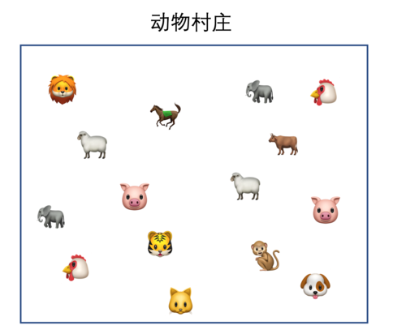
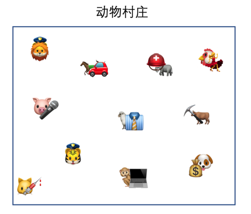
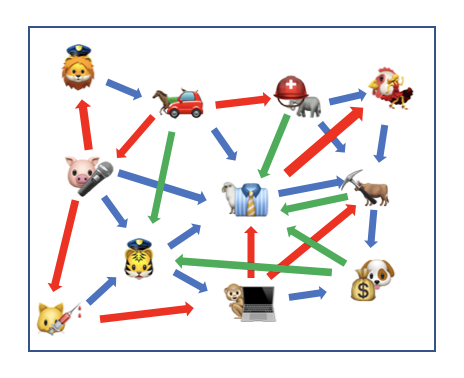
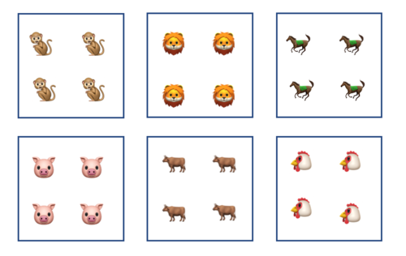
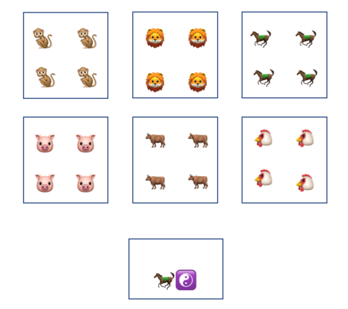
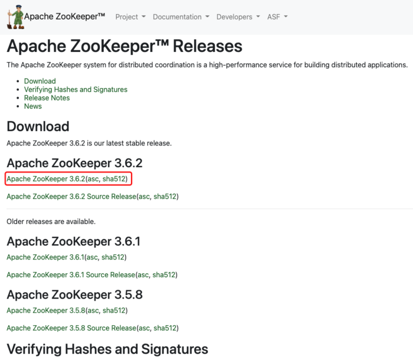

# 欢迎来到 ZooKeeper 动物世界


<p align="center">本文作者：HelloGitHub-<strong>老荀</strong></p>

Hi，这里是 HelloGitHub 推出的 HelloZooKeeper 系列，**免费有趣、入门级的 ZooKeeper 开源教程**，面向有编程基础的新手。

> ZooKeeper 是 Apache 软件基金会的一个软件项目，它为大型分布式计算提供开源的分布式配置服务、同步服务和命名注册。 ZooKeeper 曾经是 Hadoop 的一个子项目，但现在是一个顶级独立的开源项目。

ZK 在实际开发工作中经常会用到，算的上是吃饭的家伙了，那可得玩透、用的趁手，要不怎么进阶和升职加薪呢？来和 HelloGitHub 一起学起来吧～

本系列教程是**从零开始**讲解 ZooKeeper，内容从**最基础的安装使用到背后原理和源码的讲解**，整个系列希望通过有趣文字、诙谐的气氛中让 ZK 的知识“钻”进你聪明的大脑。本教程是开放式：开源、协作，所以不管你是新手还是老司机，我们都希望你可以**加入到本教程的贡献中，一起让这个教程变得更好**：

- 新手：参与修改文中的错字、病句、拼写、排版等问题
- 使用者：参与到内容的讨论和问题解答、帮助其他人的事情
- 老司机：参与到文章的编写中，让你的名字出现在作者一栏

> 项目地址：https://github.com/HelloGitHub-Team/HelloZooKeeper


接下来是和 ZooKeeper 的初次见面～你好，ZooKeeper


## 一、介绍

在开始介绍 ZooKeeper（以下简称 ZK）之前，我先来给大家讲一个小故事（故事中的人物，纯属虚构，请勿对号入座，如有雷同，纯属巧合）。

### 1.1 动物村小故事

在很久很久以前，有一个动物星球，上面有一个动物村，村里面住着好多小动物，好不热闹。



大家都各司其职，做着自己喜欢的事情



一开始邻里之间都是互帮互助，互敬互爱，一切都很和谐，谁家发生了啥事，大家都能知道。

随着村庄里的小动物越来越多，整个村庄的邻里关系也变成了一张巨大的网，而且由于不同动物之间的生活习性和饮食习惯的差异，导致了原本友爱的村庄，邻里之间也渐渐产生了矛盾。



动物们也渐渐意识到了，整个村庄需要从一个大集体向小集体去发展了，不同的动物都自发聚集在了一起生活，建立了自己的小社区。



但是大家分开后就有一个问题，原来大家都住一起，鸡家长马家短大家都是能知道的。现在**鸡太美**刚刚完成练习两年半的舞蹈视频，想分享给大家，但是现在大家的小区都分开了，而且还不能串门，可急死人了啊。

于是村委会紧急召开会议，听取了各个村民业主代表的意见，发现大家都有类似的诉求，所以决定在动物星球成立一个公共办事处，并且找了村里资历最老 69 岁的**马果果**担任办事处的负责人。



现在开始只要村民有诉求都可以去办事处登记，**马果果**负责记录，并且根据不同的事宜通知其他想了解此事情的村民。

现在**鸡太美**就可以去办事处登记了，**马果果**拿了纸和笔记了下来：

```
鸡太美上传了舞蹈视频
```

而隔壁的小狗**坤坤**一直暗恋**鸡太美**，三天两头就往办事处跑，问**马果果**怎么**鸡太美**还不更新？不跳舞打篮球也行啊！被一直这么问**马果果**觉得好烦，就跟**坤坤**说：“你把你感兴趣的，告诉我，我也记下来，以后不用你一直来问了，有新情况的时候我会通知你的！”，**坤坤**听后也可高兴了，毕竟出趟门还是很麻烦的。

于是**马果果**又拿纸和笔记了下来：

```
鸡太美更新了视频得通知坤坤
```

之后当**鸡太美**有了任何视频更新的登记，**马果果**都会直接打电话给**坤坤**通知他。

陆陆续续有更多的村民跑来登记，**马果果**每次都会记下来。

```
鸡太美上传了舞蹈视频
鸡太美上传了篮球视频
马小云最近有点飘
马小腾发表了充值才能变得更强的论文
...
```

村民还能去登记自己感兴趣的事情

```
马小云投资了小狗东东的杂货铺得通知马小腾
马小腾最新迷恋上什么游戏得通知马小云
鸡太美更新了视频得通知坤坤
...
```


有了办事处，动物村又恢复了以往的热闹，**马果果**觉得退休了还能发挥余热，实在是太好啦！

之后**马果果**又和村委会的人提了：“这个办事处还没有名字呢？”。村委会一致决定，既然我们是动物村，那办事处就叫 ZooKeeper 吧！

---

小故事讲（chui niu）完了，但是动物村的故事还远远没有结束，尽情期待噢～

## 1.2 正题开始

之后的 ZK 的知识点重点讲解服务端，偶尔会涉及到客户端，客户端也是以 Apache 官方的 Java 客户端为例子，如果你是别的编程语言的开发者，也不用担心，我会尽量以不讲代码的方式来讲解 ZK 背后的原理。

下面开始用猿话来翻译下，动物村原来的大集体就和以前单应用是一样的，所有的业务都写在一个应用（进程）里，不管什么业务更新，整个应用都要发布，所以慢慢就有了分布式的架构（小集体），把不同的业务逻辑部署在不同的应用里，这样每一个业务更新，都不会影响到其他的业务，但是分布式的架构会导致原本在一个进程里共享内存的两个对象，现在要通过网络才能实现通信，所以急需要引入一个脱离于应用的第三方组件来承担起这个跨进程共享数据或者通信的任务，在本系列文章里，这个组件就是 ZK。如果你从来没用过 ZK 或者说根本没听说过的话，那你就可以把 ZK 类比成为数据库，也是一个独立存放数据的地方，也能对数据进行增删改查，只不过用的不是 SQL，而且 ZK 还支持回调通知。什么？你说你数据库也没用过？（Orz，这真的就很难解释了...你可以直接留言给我们，我慢慢跟你解释）

下面给出 ZK 的百度百科定义：

> ZooKeeper 是一个**分布式**的，开放源码的分布式应用程序协调服务，是 Google 的 Chubby 一个**开源**的实现，是 Hadoop 和 Hbase 的重要组件。它是一个为分布式应用提供**一致性**服务的软件，提供的功能包括：配置维护、域名服务、分布式同步、组服务等。

是不是完全看不懂？看不懂就对了。上面这段话有几个重点的关键字：开源、分布式、协调、一致性。

- **开源**意味着源码可以免费下载学习。
- **分布式**有两重含义，第一个是给分布式的架构应用去使用，第二是 ZK 自身也是支持分布式部署实现高可用的。
- **协调**的意思是，ZK 说到底只是一个协调的框架或者服务，他提供了一些在分布式环境下的通知或者存储的手段，但是具体怎么用到业务中，还是需要使用者自己去选择和评估的。
- **一致性**在 ZK 中是**最终一致性**，ZK 无法保证实时的强一致性，有一个时间窗口，但是最终 ZK 集群中的数据都会是一样的。


## 二、安装

### 2.1 二进制包安装

既然 ZK 是一个服务，自然是需要部署安装的，ZK 官网提供了二进制包的下载 [下载页面 https://zookeeper.apache.org/releases.html](https://zookeeper.apache.org/releases.html) 选择一个合适的版本下载就行。



下载下来后是一个压缩包，解压后得到目录如下：

```
lib/
docs/
conf/
bin/
README_packaging.md
README.md
NOTICE.txt
LICENSE.txt
```

使用者需要关注的就是 `bin` 目录和 `conf` 目录。我们先来看看 `bin` 

```bash
.
├── README.txt
├── zkCleanup.sh
├── zkCli.cmd
├── zkCli.sh
├── zkEnv.cmd
├── zkEnv.sh
├── zkServer-initialize.sh
├── zkServer.cmd
├── zkServer.sh
├── zkSnapShotToolkit.cmd
├── zkSnapShotToolkit.sh
├── zkTxnLogToolkit.cmd
└── zkTxnLogToolkit.sh
```

Windows 平台就选择 `cmd` 结尾的文件启动，Mac/Linux 平台选择 `sh` 结尾的文件启动。

这里我以 Mac 平台作为讲解，尝试将 ZK 启动，但是在启动之前，需要先将 `conf` 目录下的 `zoo_sample.cfg` 重命名为 `zoo.cfg` ，因为 ZK 启动程序默认找的就是 `zoo.cfg`，重命名完了就可以通过 `./zkServer.sh start-foreground` 在前台启动，或者 `./zkServer.sh start` 在后台启动，没有报错的话就是启动成功了。

之后再通过官方给出的 `zkCli.sh` 使用客户端去连接刚刚启动的服务端。

看到这个交互式的命令行界面就是连接成功了：

```bash
[zk: localhost:2181(CONNECTED) 0]
```

通过简单的 `ls /` 命令测试下，服务端正常返回了：

```bash
[zk: localhost:2181(CONNECTED) 0] ls /
[zookeeper]
```

### 2.2 Docker 安装

现在全面容器化的时代，自然少不了 Docker。先下载最新的镜像：

```bash
$ docker pull zookeeper
```

在 Docker 中启动一个 ZK 的容器非常简单，只需要一行命令，其中的 `new-zookeeper` 可以修改成任意的名字。

```bash
$ docker run -d -p 2181:2181 --name new-zookeeper zookeeper
```

然后通过 `docker exec` 命令进入容器

```bash
$ docker exec -it new-zookeeper bash
```

进入容器以后就是一个 Linux 环境了，之后连接服务端的方式和之前二进制的方式是一样的。

其实我们这里指定了 `-p 2181:2181` 所以不用进入容器也可以直接用客户端连宿主机的 2181 端口进入交互式的客户端，也和刚刚的方式一样，就不赘述了。

Docker 由于不是本系列文章的重点，所以这里就点到为止，有兴趣的自己再去研究下吧。


## 三、客户端介绍

由于刚刚客户端都是通过命令行去操作的，现实中，除了偶尔运维查看数据，几乎是用不到的，在生产环境中肯定是需要通过代码去操作 ZK 的，所以各个编程语言都有相对流行的 ZK 客户端的库，下面罗列出一些：

- Java
  -  zookeeper，GitHub 地址：[https://github.com/apache/zookeeper](https://github.com/apache/zookeeper)
  -  curator，GitHub 地址：[https://github.com/apache/curator](https://github.com/apache/curator)
- Python
  - kazoo，GitHub 地址：[https://github.com/python-zk/kazoo](https://github.com/python-zk/kazoo)
- Go
  - zk，GitHub 地址：[https://github.com/go-zookeeper/zk](https://github.com/go-zookeeper/zk)
- Node.js
  - node-zookeeper-client，GitHub 地址：[https://github.com/alexguan/node-zookeeper-client](https://github.com/alexguan/node-zookeeper-client)
  - node-zookeeper，GitHub 地址：[https://github.com/yfinkelstein/node-zookeeper](https://github.com/yfinkelstein/node-zookeeper)
- Ruby
  - zk，GitHub 地址：[https://github.com/zk-ruby/zk](https://github.com/zk-ruby/zk)
- .NET
  - ZooKeeperNetEx，GitHub 地址：[https://github.com/shayhatsor/zookeeper](https://github.com/shayhatsor/zookeeper)

你可以看到上面的客户端都是在开源社区 GitHub 上！这就是开源的力量！这就是社区的力量！


## 四、总结

本文作为系列的第一篇简单的介绍了 ZK 大致是什么，也简单的介绍了如何安装和运行服务端，并使用自带的命令行客户端去连接。下一篇，我会以 Java 官方的客户端作为讲解，演示下如何使用程序去进行一些基本的操作和进阶的操作。


