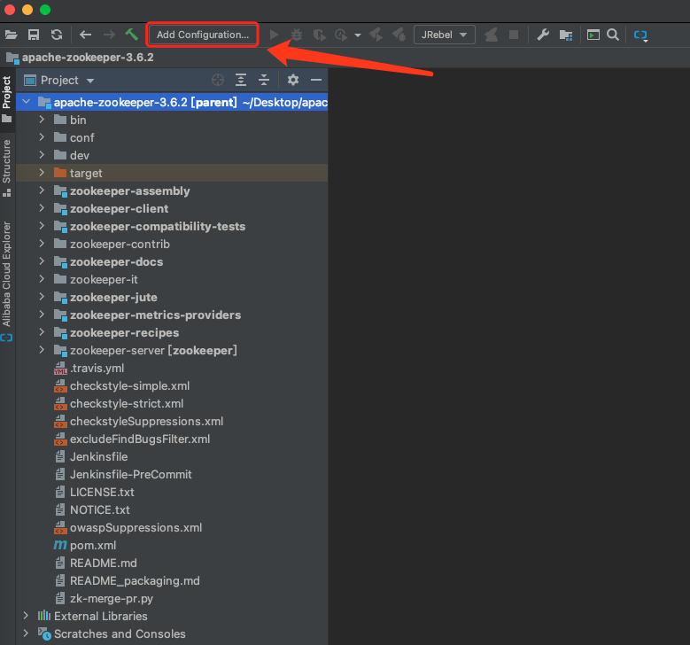
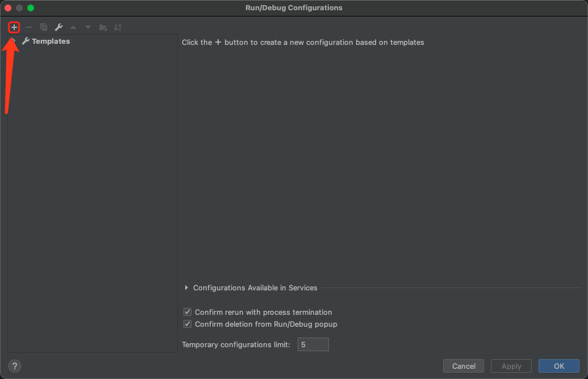
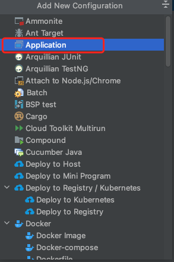
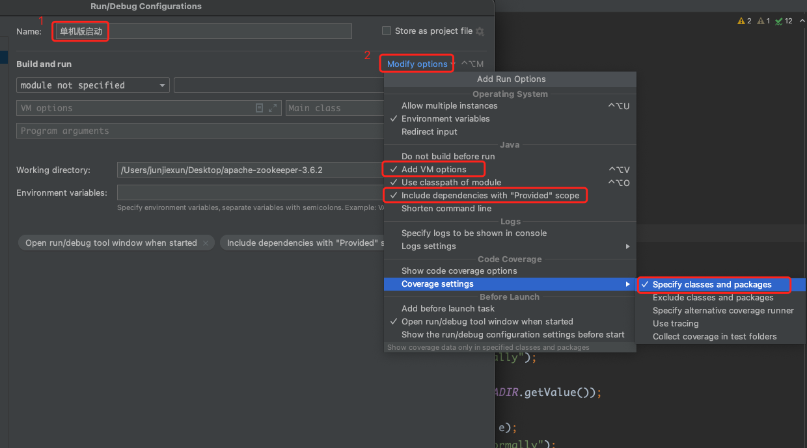
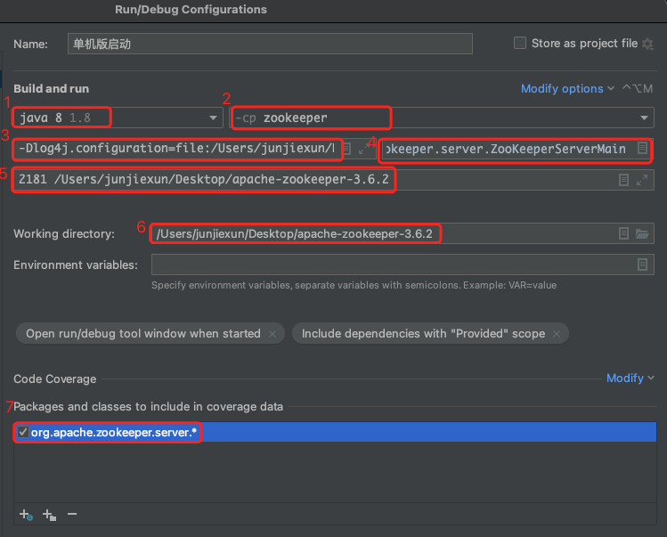
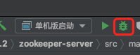
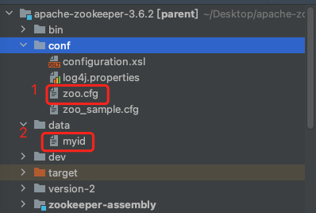
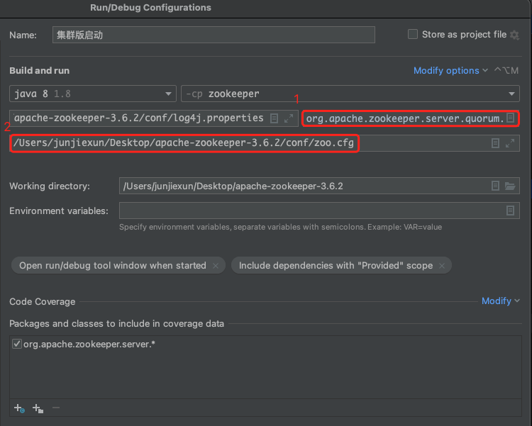

# 收藏向

Hi，这里是 HelloGitHub 推出的 HelloZooKeeper 系列，**免费开源、有趣、入门级的 ZooKeeper 教程**，面向有编程基础的新手。

> ZooKeeper 是 Apache 软件基金会的一个软件项目，它为大型分布式计算提供开源的分布式配置服务、同步服务和命名注册。 ZooKeeper 曾经是 Hadoop 的一个子项目，但现在是一个顶级独立的开源项目。

ZK 在实际开发工作中经常会用见到，算的上是吃饭的家伙了，那可得玩透、用的趁手，要不怎么进阶和升职加薪呢？来和 HelloGitHub 一起学起来吧～

本系列教程是**从零开始**讲解 ZooKeeper，内容从**最基础的安装使用到背后原理和源码的讲解**，整个系列希望通过有趣文字、诙谐的气氛中让 ZK 的知识“钻”进你聪明的大脑。本教程是开放式：开源、协作，所以不管你是新手还是老司机，我们都希望你可以**加入到本教程的贡献中，一起让这个教程变得更好**：

- 新手：参与修改文中的错字、病句、拼写、排版等问题
- 使用者：参与到内容的讨论和问题解答、帮助其他人的事情
- 老司机：参与到文章的编写中，让你的名字出现在作者一栏

> 项目地址：https://github.com/HelloGitHub-Team/HelloZooKeeper

今天我替大家整理下 ZK 相关的知识点，努力进入大家的收藏夹吃灰～

## 一、源码调试

> 授人以鱼不如授人以渔

我始终相信 “纸上得来终觉浅”，最终读者想要自己真正了解到 ZK 内部原理，阅读源码还是必不可少的，如果你们和我一样也拥有肉眼 Debug 的能力，那其实可以不用大费周章搭建源码调试环境，直接正面硬刚。


但是如果没有的话，把 ZK 源码下载下来，使用称手的 IDE 直接跑起来，然后在需要学习的地方直接打断点，岂不是美滋滋


### 1.1 下载源码

[ZooKeeper 3.6.2 源码下载页面](https://www.apache.org/dyn/closer.lua/zookeeper/zookeeper-3.6.2/apache-zookeeper-3.6.2.tar.gz)

上面的链接中随便选一个下载速度快的，点击下载压缩包即可，下载完成后解压缩就会得到如下的目录结构

```
.
├── zookeeper-server
├── zookeeper-recipes
├── zookeeper-metrics-providers
├── zookeeper-jute
├── zookeeper-it
├── zookeeper-docs
├── zookeeper-contrib
├── zookeeper-compatibility-tests
├── zookeeper-client
├── zookeeper-assembly
├── zk-merge-pr.py
├── pom.xml
├── owaspSuppressions.xml
├── excludeFindBugsFilter.xml
├── dev
├── conf
├── checkstyleSuppressions.xml
├── checkstyle-strict.xml
├── checkstyle-simple.xml
├── bin
├── README_packaging.md
├── README.md
├── NOTICE.txt
├── LICENSE.txt
├── Jenkinsfile-PreCommit
└── Jenkinsfile
```

目录中是有 `pom.xml` 所以 ZK 需要通过 maven 编译整个项目，先确保自己的 maven 是安装好的

```
$ mvn --version
Apache Maven 3.5.4 (1edded0938998edf8bf061f1ceb3cfdeccf443fe; 2018-06-18T02:33:14+08:00)
Maven home: /your/maven/home/apache-maven-3.5.4
Java version: 1.8.0_181, vendor: Oracle Corporation, runtime: /Library/Java/JavaVirtualMachines/jdk1.8.0_181.jdk/Contents/Home/jre
Default locale: zh_CN, platform encoding: UTF-8
OS name: "mac os x", version: "10.16", arch: "x86_64", family: "mac"
```

如果有这样的输出说明 maven 是安装成功的，具体安装过程我这里就略过了，如果你有困难的话，可以留言给我们

### 1.2 编译项目

进入和 `pom.xml` 同级目录中并输入

```
$ mvn install -DskipTests=true
```

就会看到项目在进行编译了，等到最后的输出 `BUILD SUCCESS`，就说明项目编译完成了

```
[INFO] Reactor Summary:
[INFO]
[INFO] Apache ZooKeeper 3.6.2 ............................. SUCCESS [  3.621 s]
[INFO] Apache ZooKeeper - Documentation ................... SUCCESS [  2.086 s]
[INFO] Apache ZooKeeper - Jute ............................ SUCCESS [ 10.633 s]
[INFO] Apache ZooKeeper - Server .......................... SUCCESS [ 19.246 s]
[INFO] Apache ZooKeeper - Metrics Providers ............... SUCCESS [  0.108 s]
[INFO] Apache ZooKeeper - Prometheus.io Metrics Provider .. SUCCESS [  1.286 s]
[INFO] Apache ZooKeeper - Client .......................... SUCCESS [  0.083 s]
[INFO] Apache ZooKeeper - Recipes ......................... SUCCESS [  0.092 s]
[INFO] Apache ZooKeeper - Recipes - Election .............. SUCCESS [  0.244 s]
[INFO] Apache ZooKeeper - Recipes - Lock .................. SUCCESS [  0.259 s]
[INFO] Apache ZooKeeper - Recipes - Queue ................. SUCCESS [  0.295 s]
[INFO] Apache ZooKeeper - Assembly ........................ SUCCESS [  5.425 s]
[INFO] Apache ZooKeeper - Compatibility Tests ............. SUCCESS [  0.072 s]
[INFO] Apache ZooKeeper - Compatibility Tests - Curator 3.6.2 SUCCESS [  0.432 s]
[INFO] ------------------------------------------------------------------------
[INFO] BUILD SUCCESS
[INFO] ------------------------------------------------------------------------
[INFO] Total time: 44.263 s
[INFO] Finished at: 2021-01-22T13:49:30+08:00
[INFO] ------------------------------------------------------------------------
```

### 1.3 打开并配置项目

之后就可以通过你的 IDE 打开这个目录了，我这里使用的是 idea


然后开始配置 `Run/Debug Configurations` 



点击 `+` 添加新的配置



选择 `Application`



#### 1.3.1 单机版启动配置 

然后配置按照下图去填写或选择



1. 先给这个配置起一个牛逼的名字
2. 选择 `Modify options` 打开子菜单
3. 确保图中菜单中的三个子选项都被选中（前面有 √）

然后我们看具体的配置



在我电脑上解压缩后的项目路径为 `/Users/junjiexun/Desktop/apache-zookeeper-3.6.2` 读者请根据自己情况修改

1. 选择你本地 jdk （我本地是 1.8 其他版本的不知道行不行，低版本肯定是不行，因为源码中用到了 1.8 的一些写法）
2. 选择 `zookeeper`
3. 配置 `VM options`，内容为 `-Dlog4j.configuration=file:/Users/junjiexun/Desktop/apache-zookeeper-3.6.2/conf/log4j.properties`，如果不配置的话，无法输出日志
4. 指定启动类 `org.apache.zookeeper.server.ZooKeeperServerMain`
5. 单机版启动需要命令行参数，内容为 `2181 /Users/junjiexun/Desktop/apache-zookeeper-3.6.2/data`
6. 这个应该是不用修改，自动就会填上的，反正内容就是 `/Users/junjiexun/Desktop/apache-zookeeper-3.6.2`
7. 点击中间的 `+` 添加包路径，内容为 `org.apache.zookeeper.server.*`

然后点击 `Apply` 以及 `OK` 完成保存。

然后点击这个小虫子就可以启动了



```
2021-01-22 15:12:16,319 [myid:] - INFO  [main:NIOServerCnxnFactory@674] - binding to port 0.0.0.0/0.0.0.0:2181
2021-01-22 15:12:16,413 [myid:] - INFO  [main:WatchManagerFactory@42] - Using org.apache.zookeeper.server.watch.WatchManager as watch manager
2021-01-22 15:12:16,413 [myid:] - INFO  [main:WatchManagerFactory@42] - Using org.apache.zookeeper.server.watch.WatchManager as watch manager
2021-01-22 15:12:16,413 [myid:] - INFO  [main:ZKDatabase@132] - zookeeper.snapshotSizeFactor = 0.33
2021-01-22 15:12:16,413 [myid:] - INFO  [main:ZKDatabase@152] - zookeeper.commitLogCount=500
2021-01-22 15:12:16,429 [myid:] - INFO  [main:SnapStream@61] - zookeeper.snapshot.compression.method = CHECKED
2021-01-22 15:12:16,432 [myid:] - INFO  [main:FileSnap@85] - Reading snapshot /Users/junjiexun/Desktop/apache-zookeeper-3.6.2/data/version-2/snapshot.2
2021-01-22 15:12:16,444 [myid:] - INFO  [main:DataTree@1737] - The digest value is empty in snapshot
2021-01-22 15:12:16,480 [myid:] - INFO  [main:ZKDatabase@289] - Snapshot loaded in 67 ms, highest zxid is 0x2, digest is 1371985504
2021-01-22 15:12:16,481 [myid:] - INFO  [main:FileTxnSnapLog@470] - Snapshotting: 0x2 to /Users/junjiexun/Desktop/apache-zookeeper-3.6.2/data/version-2/snapshot.2
2021-01-22 15:12:16,488 [myid:] - INFO  [main:ZooKeeperServer@529] - Snapshot taken in 6 ms
2021-01-22 15:12:16,544 [myid:] - INFO  [ProcessThread(sid:0 cport:2181)::PrepRequestProcessor@136] - PrepRequestProcessor (sid:0) started, reconfigEnabled=false
2021-01-22 15:12:16,546 [myid:] - INFO  [main:RequestThrottler@74] - zookeeper.request_throttler.shutdownTimeout = 10000
2021-01-22 15:12:16,623 [myid:] - INFO  [main:ContainerManager@83] - Using checkIntervalMs=60000 maxPerMinute=10000 maxNeverUsedIntervalMs=0
2021-01-22 15:12:16,628 [myid:] - INFO  [main:ZKAuditProvider@42] - ZooKeeper audit is disabled.
```

看到日志输出，如果没有报错的话就是成功了！

然后我们可以用客户端测试下

```java
ZooKeeper client = new ZooKeeper("127.0.0.1:2181", 3000, null);
List<String> children = client.getChildren("/", false);
System.out.println(children);
client.close();
```

输出为

```
[zookeeper]
```

单机版的搞定了！我们下面试试集群版

#### 1.3.2 集群版启动配置

我们有时候需要调试集群版 ZK 才有的逻辑，那之前的单机版就不够用了，并且我这里推荐将之前的源码压缩包，解压到两个不同的目录下，然后通过 IDE 分别打开这两个目录，去完全模拟两个不同的节点。集群版的和单机版配置是差不多的，我们来看看有哪些不一样的吧？我这里演示就启动两个节点 myid 分别是 1 和 2。



1. 首先将默认的 `zoo_sample.cfg` 复制并重命名成 `zoo.cfg`，也可以直接重命名
2. 新建 `data` 目录（如果没有的话），并在其下新建一个文本文件 myid 文本内容是 1

然后编辑下 `zoo.cfg`：

```bash
# 修改
dataDir=/Users/junjiexun/Desktop/apache-zookeeper-3.6.2/data
# 新增下面两行
server.1=127.0.0.1:2888:3888
server.2=127.0.0.1:2887:3887
```

具体的配置如下：



1. 启动类不同，集群的为 `org.apache.zookeeper.server.quorum.QuorumPeerMain`
2. 命令行参数不同，传入的是 `zoo.cfg` 路径，我的路径是 `/Users/junjiexun/Desktop/apache-zookeeper-3.6.2/conf/zoo.cfg`

然后是配置第二个节点，我这里假设第二个节点的项目目录是 `/Users/junjiexun/Desktop/apache-zookeeper-3.6.2-bak`

第二个节点把 myid 文件中的内容修改为 2

`zoo.cfg` 中内容是

```bash
# 修改
dataDir=/Users/junjiexun/Desktop/apache-zookeeper-3.6.2-bak/data
# 修改，因为我两个节点是在一台机器中的，所以端口是不能重复的
clientPort=2182
# 同样新增下面两行
server.1=127.0.0.1:2888:3888
server.2=127.0.0.1:2887:3887
```

命令行的参数是 `/Users/junjiexun/Desktop/apache-zookeeper-3.6.2-bak/conf/zoo.cfg`

其他我没提到的和节点 1 是一样的。

我们启动两个节点试试

```
2021-01-22 15:44:08,461 [myid:1] - INFO  [QuorumPeer[myid=1](plain=[0:0:0:0:0:0:0:0]:2181)(secure=disabled):WatchManagerFactory@42] - Using org.apache.zookeeper.server.watch.WatchManager as watch manager
2021-01-22 15:44:08,461 [myid:1] - INFO  [QuorumPeer[myid=1](plain=[0:0:0:0:0:0:0:0]:2181)(secure=disabled):WatchManagerFactory@42] - Using org.apache.zookeeper.server.watch.WatchManager as watch manager
2021-01-22 15:44:08,471 [myid:1] - INFO  [QuorumPeer[myid=1](plain=[0:0:0:0:0:0:0:0]:2181)(secure=disabled):Learner@677] - Learner received NEWLEADER message
2021-01-22 15:44:08,471 [myid:1] - INFO  [QuorumPeer[myid=1](plain=[0:0:0:0:0:0:0:0]:2181)(secure=disabled):QuorumPeer@1811] - Dynamic reconfig is disabled, we don't store the last seen config.
2021-01-22 15:44:08,471 [myid:1] - INFO  [QuorumPeer[myid=1](plain=[0:0:0:0:0:0:0:0]:2181)(secure=disabled):FileTxnSnapLog@470] - Snapshotting: 0x28100000001 to /Users/junjiexun/Desktop/apache-zookeeper-3.6.2/data/version-2/snapshot.28100000001
2021-01-22 15:44:08,472 [myid:1] - INFO  [QuorumPeer[myid=1](plain=[0:0:0:0:0:0:0:0]:2181)(secure=disabled):ZooKeeperServer@529] - Snapshot taken in 1 ms
2021-01-22 15:44:08,525 [myid:1] - INFO  [QuorumPeer[myid=1](plain=[0:0:0:0:0:0:0:0]:2181)(secure=disabled):Learner@661] - Learner received UPTODATE message
2021-01-22 15:44:08,525 [myid:1] - INFO  [QuorumPeer[myid=1](plain=[0:0:0:0:0:0:0:0]:2181)(secure=disabled):QuorumPeer@868] - Peer state changed: following - synchronization
2021-01-22 15:44:08,537 [myid:1] - INFO  [QuorumPeer[myid=1](plain=[0:0:0:0:0:0:0:0]:2181)(secure=disabled):CommitProcessor@476] - Configuring CommitProcessor with readBatchSize -1 commitBatchSize 1
2021-01-22 15:44:08,537 [myid:1] - INFO  [QuorumPeer[myid=1](plain=[0:0:0:0:0:0:0:0]:2181)(secure=disabled):CommitProcessor@438] - Configuring CommitProcessor with 4 worker threads.
2021-01-22 15:44:08,544 [myid:1] - INFO  [QuorumPeer[myid=1](plain=[0:0:0:0:0:0:0:0]:2181)(secure=disabled):RequestThrottler@74] - zookeeper.request_throttler.shutdownTimeout = 10000
2021-01-22 15:44:08,567 [myid:1] - INFO  [QuorumPeer[myid=1](plain=[0:0:0:0:0:0:0:0]:2181)(secure=disabled):QuorumPeer@863] - Peer state changed: following - broadcast
```

最后的 `Peer state changed` 代表选举完成了，贴出来的这个节点 1 是 Follower，大功告成！

之后当你想要学习源码的流程的时候，直接本地启动服务端即可，是不是美滋滋呢～

### 1.4 源码阅读指北

- 配置相关，`QuorumPeerConfig`
- 内存模型（小红本）`DataTree`
- 回调通知（小黄本）`IWatchManager`
- 选举 `FastLeaderElection`
- Leader 节点 `LeaderZooKeeperServer`
- Follower 节点 `FollowerZooKeeperServer`
- Observer 节点 `ObserverZooKeeperServer`
- 各个流水线员工 `RequestProcessor` 查看该接口的实现
- 持久化 log `FileTxnLog`，snapshot `FileSnap`
- 会话管理 `SessionImpl`
- 协议 `Record` 查看该接口的实现

### 1.5 小结

我用一些图文的篇幅介绍了如何在本地调试 ZK 源码，我本地的环境是 Mac，用的 IDE 是 idea，如果你的环境或者工具和我不一样，碰到了困难的话，也可以给我们留言哦～

## 二、配置大全

托大家的福，我把 ZK 的源码全部（爆肝）浏览了一遍，找到了至少 99% 的配置选项，ZK 的配置大致可以分为 3 种：

- 启动命令行传入的参数
- `zoo.cfg` 配置文件中的参数
- 当前环境变量中的参数


### 2.1 命令行参数

命令行参数很少，而且没有对应的配置名称，这里我简单介绍下：

单机版只支持两种形式的命令行传参

- 客户端监听端口加 data 目录，上一节源码调试中用的就是这一个形式，例如: `2181 /your/zk/data/path`
- 或者只传一个参数，`zoo.cfg` 的路径，例如：`/your/zoocfg/path`

集群版更简单只支持 `zoo.cfg` 的路径一个参数

### 2.2 zoo.cfg 文件中的配置

我仔细查看源码的时候发现有些配置实际作用时需要计算又或者是一鱼两吃，被多个地方使用，所以很难一步到位的讲清楚，所以下面的介绍仅供参考，配置项加星号（*）的是我未来打算开篇讲解的。

| 配置项                                  | 默认值（单位）                   | 介绍                                                       |
| --------------------------------------- | -------------------------------- | ---------------------------------------------------------- |
| dataDir                                 | /tmp/zookeeper                   | 存放 snapshot、myid 文件路径                               |
| clientPort                              | 2181                             | 监听客户端请求端口                                         |
| tickTime                                | 2000（毫秒）                     | 影响客户端会话检查间隔、服务端之间心跳间隔                 |
| syncLimit                               | 5                                | tickTime * syncLimit 决定了服务端心跳超时时间              |
| initLimit                               | 10                               | tickTime * initLimit 决定了 ACK 的超时时间                 |
| dataLogDir                              | 和 dataDir 一致                  | 存放 log 文件路径                                          |
| minSessionTimeout                       | tickTime * 2                     | 客户端的超时时间最小值                                     |
| maxSessionTimeout                       | tickTime * 20                    | 客户端的超时时间最大值                                     |
| electionAlg                             | 3                                | 选举算法（1，2 已被废弃）                                  |
| localSessionsEnabled*                   | false                            | 启用本地会话                                               |
| localSessionsUpgradingEnabled*          | false                            | 本地会话可以升级成全局会话                                 |
| clientPortAddress                       | -                                | 客户端的 host 要求，不配置的话可以接受任意发向 2181 的请求 |
| secureClientPort                        | -                                | SSL 安全端口号                                             |
| secureClientPortAddress                 | -                                | SSL 安全 host                                              |
| observerMasterPort*                     | -                                | 使 Observer 通过 Follower 去了解集群中的选举情况           |
| clientPortListenBacklog                 | 50                               | TCP 服务端用于临时存放已完成三次握手的请求的队列的最大长度 |
| maxClientCnxns                          | 60                               | 客户端最大连接数                                           |
| connectToLearnerMasterLimit             | 0                                | 决定了 Follower 连接 Leader 的超时时间                     |
| quorumListenOnAllIPs                    | false                            | 服务端是否接受来自任意 IP 地址的请求                       |
| peerType                                | -                                | 选项 observer / participant，决定节点角色                  |
| syncEnabled                             | true                             | Learner 是否需要本地持久化文件                             |
| dynamicConfigFile*                      | -                                | 动态配置路径                                               |
| autopurge.snapRetainCount               | 3                                | 保留多少个最新的 snapshot 文件                             |
| autopurge.purgeInterval                 | 0（小时）                        | 间隔多久进行一次 snapshot 的清理                           |
| standaloneEnabled                       | true                             | 是否允许单机模式启动                                       |
| reconfigEnabled*                        | false                            | 是否允许动态配置                                           |
| sslQuorum                               | false                            | 集群间是否使用 SSL 通信                                    |
| portUnification                         | false                            | 是否允许不安全连接                                         |
| sslQuorumReloadCertFiles                | false                            | 启用密钥更新时自动加载                                     |
| quorum.auth.enableSasl                  | false                            | 启用集群间 SASL 鉴权                                       |
| quorum.auth.serverRequireSasl           | false                            |                                                            |
| quorum.auth.learnerRequireSasl          | false                            |                                                            |
| quorum.auth.learner.saslLoginContext    | QuorumLearner                    |                                                            |
| quorum.auth.server.saslLoginContext     | QuorumServer                     |                                                            |
| quorum.auth.kerberos.servicePrincipal   | zkquorum/localhost               |                                                            |
| quorum.cnxn.threads.size                | 20                               | 集群间异步建立连接线程池最大线程数                         |
| jvm.pause.info-threshold.ms             | 1000（毫秒）                     | INFO 输出暂停统计阈值                                      |
| jvm.pause.warn-threshold.ms             | 10000（毫秒）                    | WARN 输出暂停统计阈值                                      |
| jvm.pause.sleep.time.ms                 | 500（毫秒）                      | JVM 暂停统计线程 sleep 间隔                                |
| jvm.pause.monitor*                      | false                            | 是否启用 JVM 暂停统计                                      |
| metricsProvider.className*              | DefaultMetricsProvider（全路径） | 统计实现类路径                                             |
| multiAddress.enabled                    | false                            |                                                            |
| multiAddress.reachabilityCheckTimeoutMs | 1000（毫秒）                     |                                                            |
| multiAddress.reachabilityCheckEnabled   | true                             |                                                            |
| （以开头）server.*                      |                                  | 集群配置                                                   |
| （以开头）group*                        |                                  | 分组配置                                                   |
| （以开头）weight*                       |                                  | 权重                                                       |
| （以开头）metricsProvider.*             |                                  | 自定义的统计配置                                           |

以上就是 3.6.2 中 `zoo.cfg` 所有的官方配置选项了

### 2.3 环境变量配置

Java 程序想要指定环境变量有两种方法：

- 只需要在启动的时候在后面加上 `-DpropertyKey=propertyValue` 即可
- ZK 还支持一种简单的方式就是在 `zoo.cfg` 中直接指定（指定时不需要写 `zookeeper.` 的前缀）。只要不是在上面 2.2 中 ZK 自己定义的配置项里，ZK 启动的时候读取这些配置会自动帮他们添加 `zookeeper.` 前缀并加入当前环境变量中

如果该配置是 `follower.nodelay`，就只能用第一种方式添加环境变量了。

让我们也来看看 ZK 自己定义了哪些环境变量配置吧

| 配置项                                                 | 默认值                         | 配置                                         |
| ------------------------------------------------------ | ------------------------------ | -------------------------------------------- |
| zookeeper.server.realm*                                | -                              | 客户端配置                                   |
| zookeeper.clientCnxnSocket                             | ClientCnxnSocketNIO（全路径）  | 客户端配置，通信的实现类                     |
| zookeeper.client.secure                                | true                           | 客户端配置                                   |
| zookeeper.request.timeout                              | 0                              | 客户端配置，异步 API 超时时间                |
| zookeeper.server.principal                             | -                              | 客户端配置                                   |
| zookeeper.sasl.client.username                         | zookeeper                      | 客户端配置                                   |
| zookeeper.sasl.client.canonicalize.hostname            | true                           | 客户端配置                                   |
| zookeeper.disableAutoWatchReset                        | false                          | 客户端配置，会话超时自动清空 watcher         |
| zookeeper.sasl.clientconfig                            | -                              |                                              |
| zookeeper.sasl.client                                  | true                           | 启用 SASL                                    |
| zookeeper.ssl(.quorum).authProvider                    | x509                           | SSL 实现类，加 quorum 的是服务端的配置，下同 |
| zookeeper.ssl(.quorum).protocol                        | TLSv1.2                        |                                              |
| zookeeper.ssl(.quorum).enabledProtocols                | -                              |                                              |
| zookeeper.ssl(.quorum).ciphersuites                    | 根据不同的 jvm 版本            |                                              |
| zookeeper.ssl(.quorum).keyStore.location               | -                              |                                              |
| zookeeper.ssl(.quorum).keyStore.password               | -                              |                                              |
| zookeeper.ssl(.quorum).keyStore.type                   | -                              |                                              |
| zookeeper.ssl(.quorum).trustStore.location             | -                              |                                              |
| zookeeper.ssl(.quorum).trustStore.password             | -                              |                                              |
| zookeeper.ssl(.quorum).trustStore.type                 | -                              |                                              |
| zookeeper.ssl(.quorum).context.supplier.class          | -                              |                                              |
| zookeeper.ssl(.quorum).hostnameVerification            | true                           |                                              |
| zookeeper.ssl(.quorum).crl                             | false                          |                                              |
| zookeeper.ssl(.quorum).ocsp                            | false                          |                                              |
| zookeeper.ssl(.quorum).clientAuth                      | -                              |                                              |
| zookeeper.ssl(.quorum).handshakeDetectionTimeoutMillis | 5000（毫秒）                   |                                              |
| zookeeper.kinit                                        | /usr/bin/kinit                 |                                              |
| zookeeper.jmx.log4j.disable                            | false                          | 禁用 jmx log4j                               |
| zookeeper.admin.enableServer*                          | true                           | 是否启用 Admin Server                        |
| zookeeper.admin.serverAddress*                         | 0.0.0.0                        |                                              |
| zookeeper.admin.serverPort*                            | 8080                           |                                              |
| zookeeper.admin.idleTimeout*                           | 30000                          |                                              |
| zookeeper.admin.commandURL*                            | /commands                      |                                              |
| zookeeper.admin.httpVersion*                           | 11                             |                                              |
| zookeeper.admin.portUnification                        | false                          |                                              |
| zookeeper.DigestAuthenticationProvider.superDigest     | -                              | 管理员账号密码                               |
| zookeeper.ensembleAuthName                             | -                              |                                              |
| zookeeper.requireKerberosConfig                        | -                              |                                              |
| zookeeper.security.auth_to_local                       | DEFAULT                        |                                              |
| （以开头）zookeeper.authProvider.*                     | -                              | 自定义 scheme 校验规则                       |
| zookeeper.letAnySaslUserDoX                            | -                              |                                              |
| zookeeper.SASLAuthenticationProvider.superPassword     | -                              |                                              |
| zookeeper.kerberos.removeHostFromPrincipal             | -                              |                                              |
| zookeeper.kerberos.removeRealmFromPrincipal            | -                              |                                              |
| zookeeper.X509AuthenticationProvider.superUser         | -                              |                                              |
| zookeeper.4lw.commands.whitelist*                      | -                              | 四字命令白名单                               |
| zookeeper.preAllocSize                                 | 65536 * 1024                   |                                              |
| zookeeper.forceSync                                    | yes                            |                                              |
| zookeeper.fsync.warningthresholdms                     | 1000（毫秒）                   | fsync 告警阈值                               |
| zookeeper.txnLogSizeLimitInKb                          | -1（KB）                       | log 文件大小                                 |
| zookeeper.datadir.autocreate                           | true                           | data 目录自动创建                            |
| zookeeper.db.autocreate                                | true                           |                                              |
| zookeeper.snapshot.trust.empty                         | false                          | 不信任空的 snapshot 文件                     |
| zookeeper.snapshot.compression.method                  | 空字符串                       | snapshot 文件压缩实现                        |
| zookeeper.commitProcessor.numWorkerThreads             | CPU 核心数                     |                                              |
| zookeeper.commitProcessor.shutdownTimeout              | 5000（毫秒）                   |                                              |
| zookeeper.commitProcessor.maxReadBatchSize             | -1                             |                                              |
| zookeeper.commitProcessor.maxCommitBatchSize           | 1                              |                                              |
| zookeeper.fastleader.minNotificationInterval           | 200（毫秒）                    | 收集选票超时时间（初始）                     |
| zookeeper.fastleader.maxNotificationInterval           | 60000（毫秒）                  | 收集选票超时时间（最大）                     |
| zookeeper.leader.maxTimeToWaitForEpoch                 | -1                             |                                              |
| zookeeper.leader.ackLoggingFrequency                   | 1000                           |                                              |
| zookeeper.testingonly.initialZxid                      | -                              | 初始化 zxid，仅供测试！                      |
| zookeeper.leaderConnectDelayDuringRetryMs              | 100                            | Leaner 连接 Leader 超时时间                  |
| follower.nodelay                                       | true                           | 设置 TCP no delay                            |
| zookeeper.forceSnapshotSync                            | false                          | Learner 强制使用 snapshot 和 Leader 进行同步 |
| zookeeper.leader.maxConcurrentSnapSyncs                | 10                             |                                              |
| zookeeper.leader.maxConcurrentDiffSyncs                | 100                            |                                              |
| zookeeper.observer.reconnectDelayMs                    | 0（毫秒）                      | Observer 延迟重连至 Leader                   |
| zookeeper.observer.election.DelayMs                    | 200（毫秒）                    | Observer 延迟开始选举                        |
| zookeeper.observerMaster.sizeLimit                     | 32 * 1024 * 1024               |                                              |
| zookeeper.electionPortBindRetry                        | 3                              | 选举端口连接重试次数                         |
| zookeeper.tcpKeepAlive                                 | false                          | Socket keep alive 设置                       |
| zookeeper.cnxTimeout                                   | 5000（毫秒）                   | Socket 超时时间                              |
| zookeeper.multiAddress.enabled                         | false                          |                                              |
| zookeeper.multiAddress.reachabilityCheckTimeoutMs      | 1000（毫秒）                   |                                              |
| zookeeper.multiAddress.reachabilityCheckEnabled        | true                           |                                              |
| zookeeper.quorumCnxnTimeoutMs                          | -1                             |                                              |
| zookeeper.observer.syncEnabled                         | true                           | Observer 是否需要本地归档                    |
| zookeeper.bitHashCacheSize                             | 10                             | 位图初始缓存大小                             |
| zookeeper.messageTracker.BufferSize                    | 10                             |                                              |
| zookeeper.messageTracker.Enabled                       | false                          |                                              |
| zookeeper.pathStats.slotCapacity                       | 60                             |                                              |
| zookeeper.pathStats.slotDuration                       | 15                             |                                              |
| zookeeper.pathStats.maxDepth                           | 6                              |                                              |
| zookeeper.pathStats.sampleRate                         | 0.1                            |                                              |
| zookeeper.pathStats.initialDelay                       | 5                              |                                              |
| zookeeper.pathStats.delay                              | 5                              |                                              |
| zookeeper.pathStats.topPathMax                         | 20                             |                                              |
| zookeeper.pathStats.enabled                            | false                          |                                              |
| zookeeper.watcherCleanThreshold                        | 1000                           |                                              |
| zookeeper.watcherCleanIntervalInSeconds                | 600                            |                                              |
| zookeeper.watcherCleanThreadsNum                       | 2                              |                                              |
| zookeeper.maxInProcessingDeadWatchers                  | -1                             |                                              |
| zookeeper.watchManagerName                             | WatchManager（全路径）         |                                              |
| zookeeper.connection_throttle_tokens                   | 0                              |                                              |
| zookeeper.connection_throttle_fill_time                | 1                              |                                              |
| zookeeper.connection_throttle_fill_count               | 1                              |                                              |
| zookeeper.connection_throttle_freeze_time              | -1                             |                                              |
| zookeeper.connection_throttle_drop_increase            | 0.02                           |                                              |
| zookeeper.connection_throttle_drop_decrease            | 0.002                          |                                              |
| zookeeper.connection_throttle_decrease_ratio           | 0                              |                                              |
| zookeeper.connection_throttle_weight_enabled           | false                          |                                              |
| zookeeper.connection_throttle_global_session_weight    | 3                              |                                              |
| zookeeper.connection_throttle_local_session_weight     | 1                              |                                              |
| zookeeper.connection_throttle_renew_session_weight     | 2                              |                                              |
| zookeeper.extendedTypesEnabled*                        | false                          | 是否启用 TTL 节点类型                        |
| zookeeper.emulate353TTLNodes*                          | false                          | 是否兼容 3.5.3 的 TTL                        |
| zookeeper.client.portUnification                       | false                          |                                              |
| zookeeper.netty.server.outstandingHandshake.limit      | -1                             |                                              |
| zookeeper.netty.advancedFlowControl.enabled            | false                          |                                              |
| zookeeper.nio.sessionlessCnxnTimeout                   | 10000（毫秒）                  |                                              |
| zookeeper.nio.numSelectorThreads                       | CPU 核心数 / 2 再开方          |                                              |
| zookeeper.nio.numWorkerThreads                         | CPU 核心数 * 2                 |                                              |
| zookeeper.nio.directBufferBytes                        | 64 * 1024（字节）              |                                              |
| zookeeper.nio.shutdownTimeout                          | 5000（毫秒）                   |                                              |
| zookeeper.request_stale_connection_check               | true                           |                                              |
| zookeeper.request_stale_latency_check                  | false                          |                                              |
| zookeeper.request_throttler.shutdownTimeout            | 10000（毫秒）                  |                                              |
| zookeeper.request_throttle_max_requests                | 0                              |                                              |
| zookeeper.request_throttle_stall_time                  | 100                            |                                              |
| zookeeper.request_throttle_drop_stale                  | true                           |                                              |
| zookeeper.serverCnxnFactory                            | NIOServerCnxnFactory（全路径） |                                              |
| zookeeper.maxCnxns                                     | 0                              |                                              |
| zookeeper.snapshotSizeFactor                           | 0.33                           |                                              |
| zookeeper.commitLogCount                               | 500                            |                                              |
| zookeeper.sasl.serverconfig                            | Server                         |                                              |
| zookeeper.globalOutstandingLimit                       | 1000                           |                                              |
| zookeeper.enableEagerACLCheck                          | false                          |                                              |
| zookeeper.skipACL                                      | no                             |                                              |
| zookeeper.allowSaslFailedClients                       | false                          |                                              |
| zookeeper.sessionRequireClientSASLAuth                 | false                          |                                              |
| zookeeper.digest.enabled                               | true                           |                                              |
| zookeeper.closeSessionTxn.enabled                      | true                           |                                              |
| zookeeper.flushDelay                                   | 0                              |                                              |
| zookeeper.maxWriteQueuePollTime                        | zookeeper.flushDelay / 3       |                                              |
| zookeeper.maxBatchSize                                 | 1000                           |                                              |
| zookeeper.intBufferStartingSizeBytes                   | 1024                           |                                              |
| zookeeper.maxResponseCacheSize                         | 400                            |                                              |
| zookeeper.maxGetChildrenResponseCacheSize              | 400                            |                                              |
| zookeeper.snapCount                                    | 100000                         |                                              |
| zookeeper.snapSizeLimitInKb                            | 4194304（千字节）              |                                              |
| zookeeper.largeRequestMaxBytes                         | 100 * 1024 * 1024              |                                              |
| zookeeper.largeRequestThreshold                        | -1                             |                                              |
| zookeeper.superUser                                    | -                              |                                              |
| zookeeper.audit.enable                                 | false                          | 是否启用 audit 日志                          |
| zookeeper.audit.impl.class                             | Log4jAuditLogger（全路径）     | audit 日志功能实现类                         |


ZK 的配置还是很多的，有些我这里 TODO 了，以后有机会和大家详细介绍下～而且相当一部分的配置 ZK 官方的文档中已经给出了解释，可以查看 [ZK 3.6.2 配置文档](https://zookeeper.apache.org/doc/r3.6.2/zookeeperAdmin.html)。

我这里还要吐槽下，ZK 中有些配置是用 true 或者 false，有些使用 yes 或者 no，明显是两个（波）人开发的，这种不应该做一个统一吗？yes 或 no 真的很多余...

## 三、ZK 中应用到的设计模式

ZK 本身就是分布式的应用，也是优秀的开源项目，我这里就简单聊聊我在阅读源码中看到的应用在 ZK 里的设计模式吧

### 3.1 生产者消费者

这个是 ZK 中非常有代表性的设计模式应用了，ZK 本身是 C/S 架构的设计，请求就是客户端发送给服务端数据，响应则是服务端发送给客户端数据，而 ZK 实现一些功能并不是通过线性顺序的去调用不同的方法去完成的，通常会由生产者线程，阻塞队列和消费者线程组成，生产者线程将上游收到的一些请求对象放入阻塞队列，当前的方法就返回了，之后由消费者线程通过循环不停的从阻塞队列中获取，再完成之后的业务逻辑。举例：

- `PrepRequestProcessor`，阻塞队列是 `submittedRequests`
- `SyncRequestProcessor`，阻塞队列是 `queuedRequests`

### 3.2 工厂模式

有一些接口的实现，ZK 本身提供了默认的选择，但是如果使用者在配置中配置了其他的实现的话，ZK 的工厂就会自动去创建那些其他的实现（可以留意配置大全中的**全路径**字样配置）。举例：

- 在创建 `ClientCnxnSocket` 时，会根据 `zookeeper.clientCnxnSocket` 的配置去选择客户端的 IO 实现
- 在创建 `IWatchManager` 时，会根据 `zookeeper.watchManagerName` 的配置去选择服务端的 watch 管理实现
- 在创建 `ServerCnxnFactory` 时，会根据 `zookeeper.serverCnxnFactory` 的配置去选择服务端的 IO 工厂实现

### 3.3 责任链模式

之前有学习过，ZK 服务端业务逻辑处理是通过将一个个 `XxxProcessor` 串起来实现的，Processor 彼此不关心调用顺序，仅仅通过 `nextProcessor` 关联，不同的服务端角色也可以通过这种方式极大的复用代码

- 单机模式下： `PrepRequestProcessor -> SyncRequestProcessor -> FinalRequestProcessor`
- 集群模式下 Leader ：`LeaderRequestProcessor -> PrepRequestProcessor -> ProposalRequestProcessor -> CommitProcessor -> Leader.ToBeAppliedRequestProcessor -> FinalRequestProcessor`
- 集群模式下 Follower ：`FollowerRequestProcessor -> CommitProcessor -> FinalRequestProcessor`
- 集群模式下 Observer ：`ObserverRequestProcessor -> CommitProcessor -> FinalRequestProcessor`

### 3.4 策略模式

`zookeeper.snapshot.compression.method` 可以配置成不同的 snapshot 压缩算法，当需要生成 snapshot 文件的时候，会根据不同的压缩算法去执行：

- `gz`： `GZIPInputStream`
- `snappy`： `SnappyInputStream`
- 默认： `BufferedInputStream`

### 3.5 装饰器模式

还是刚刚的压缩算法，对外提供的是 `CheckedInputStream` 的统一处理对象，使用 `CheckedInputStream` 将上面三种压缩实现包装起来，这些对象全部都是 `InputStream` 的子类

```java
switch (根据不同的配置) {
  // 策略模式的体现
  case GZIP:
    is = new GZIPInputStream(fis);
    break;
  case SNAPPY:
    is = new SnappyInputStream(fis);
    break;
  case CHECKED:
  default:
    is = new BufferedInputStream(fis);
}
// 都被包装进了 CheckedInputStream
// 装饰器模式的体现
return new CheckedInputStream(is, new Adler32()); 
```

## 四、总结

今天我讲了如何直接从 ZK 源码 DEBUG，展示了绝大部分的 ZK 配置项，介绍了一些 ZK 中用到的设计模式。

下一期介绍些 ZK 的高级用法纯实战，期待一下吧～

