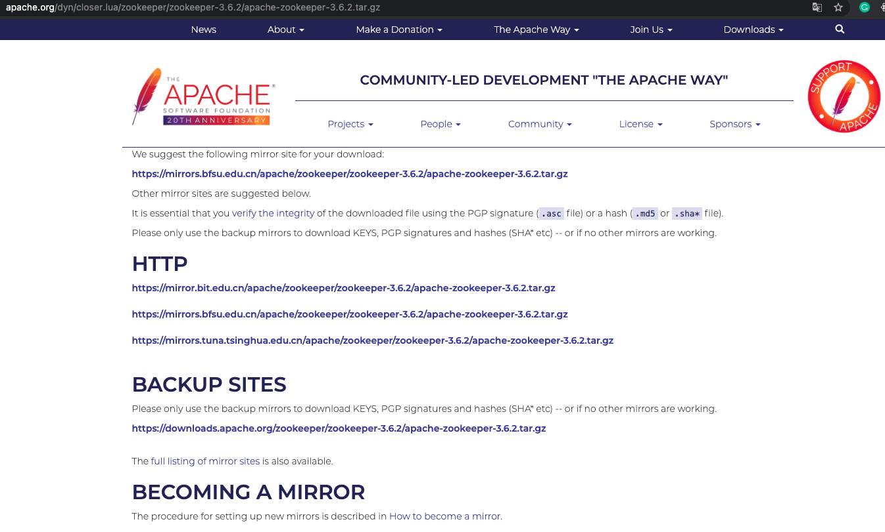

# 手摸手教你调试大型开源项目 ZooKeeper

Hi，这里是 HelloGitHub 推出的 HelloZooKeeper 系列，**免费开源、有趣、入门级的 ZooKeeper 教程**，面向有编程基础的新手。

> ZooKeeper 是 Apache 软件基金会的一个软件项目，它为大型分布式计算提供开源的分布式配置服务、同步服务和命名注册。 ZooKeeper 曾经是 Hadoop 的一个子项目，但现在是一个顶级独立的开源项目。

ZK 在实际开发工作中经常会用见到，算的上是吃饭的家伙了，那可得玩透、用的趁手，要不怎么进阶和升职加薪呢？来和 HelloGitHub 一起学起来吧～

本系列教程是**从零开始**讲解 ZooKeeper，内容从**最基础的安装使用到背后原理和源码的讲解**，整个系列希望通过有趣文字、诙谐的气氛中让 ZK 的知识“钻”进你聪明的大脑。本教程是开放式：开源、协作，所以不管你是新手还是老司机，我们都希望你可以**加入到本教程的贡献中，一起让这个教程变得更好**：

- 新手：参与修改文中的错字、病句、拼写、排版等问题
- 使用者：参与到内容的讨论和问题解答、帮助其他人的事情
- 老司机：参与到文章的编写中，让你的名字出现在作者一栏

> 项目地址：https://github.com/HelloGitHub-Team/HelloZooKeeper

今儿就带大家打入 ZooKeeper 的源码内部！


## 一、源码调试

> 授人以鱼不如授人以渔

我始终相信 “纸上得来终觉浅”，最终读者想要自己真正了解到 ZK 内部原理，阅读源码还是必不可少的，如果你们和我一样也拥有肉眼 Debug 的能力，那其实可以不用大费周章搭建源码调试环境，直接正面硬刚。


但是如果没有的话，把 ZK 源码下载下来，使用称手的 IDE 直接跑起来，然后在需要学习的地方直接打断点，岂不是美滋滋


### 1.1 下载源码

[ZooKeeper 3.6.2 源码下载页面](https://www.apache.org/dyn/closer.lua/zookeeper/zookeeper-3.6.2/apache-zookeeper-3.6.2.tar.gz)



上面的链接中随便选一个下载速度快的，点击下载压缩包即可，下载完成后解压缩就会得到如下的目录结构

```
.
├── zookeeper-server
├── zookeeper-recipes
├── zookeeper-metrics-providers
├── zookeeper-jute
├── zookeeper-it
├── zookeeper-docs
├── zookeeper-contrib
├── zookeeper-compatibility-tests
├── zookeeper-client
├── zookeeper-assembly
├── zk-merge-pr.py
├── pom.xml
├── owaspSuppressions.xml
├── excludeFindBugsFilter.xml
├── dev
├── conf
├── checkstyleSuppressions.xml
├── checkstyle-strict.xml
├── checkstyle-simple.xml
├── bin
├── README_packaging.md
├── README.md
├── NOTICE.txt
├── LICENSE.txt
├── Jenkinsfile-PreCommit
└── Jenkinsfile
```

目录中是有 `pom.xml` 所以 ZK 需要通过 maven 编译整个项目，先确保自己的 maven 是安装好的

```
$ mvn --version
Apache Maven 3.5.4 (1edded0938998edf8bf061f1ceb3cfdeccf443fe; 2018-06-18T02:33:14+08:00)
Maven home: /your/maven/home/apache-maven-3.5.4
Java version: 1.8.0_181, vendor: Oracle Corporation, runtime: /Library/Java/JavaVirtualMachines/jdk1.8.0_181.jdk/Contents/Home/jre
Default locale: zh_CN, platform encoding: UTF-8
OS name: "mac os x", version: "10.16", arch: "x86_64", family: "mac"
```

如果有这样的输出说明 maven 是安装成功的，具体安装过程我这里就略过了，如果你有困难的话，可以留言给我们

### 1.2 编译项目

进入和 `pom.xml` 同级目录中并输入

```
$ mvn install -DskipTests=true
```

就会看到项目在进行编译了，等到最后的输出 `BUILD SUCCESS`，就说明项目编译完成了

```
[INFO] Reactor Summary:
[INFO]
[INFO] Apache ZooKeeper 3.6.2 ............................. SUCCESS [  3.621 s]
[INFO] Apache ZooKeeper - Documentation ................... SUCCESS [  2.086 s]
[INFO] Apache ZooKeeper - Jute ............................ SUCCESS [ 10.633 s]
[INFO] Apache ZooKeeper - Server .......................... SUCCESS [ 19.246 s]
[INFO] Apache ZooKeeper - Metrics Providers ............... SUCCESS [  0.108 s]
[INFO] Apache ZooKeeper - Prometheus.io Metrics Provider .. SUCCESS [  1.286 s]
[INFO] Apache ZooKeeper - Client .......................... SUCCESS [  0.083 s]
[INFO] Apache ZooKeeper - Recipes ......................... SUCCESS [  0.092 s]
[INFO] Apache ZooKeeper - Recipes - Election .............. SUCCESS [  0.244 s]
[INFO] Apache ZooKeeper - Recipes - Lock .................. SUCCESS [  0.259 s]
[INFO] Apache ZooKeeper - Recipes - Queue ................. SUCCESS [  0.295 s]
[INFO] Apache ZooKeeper - Assembly ........................ SUCCESS [  5.425 s]
[INFO] Apache ZooKeeper - Compatibility Tests ............. SUCCESS [  0.072 s]
[INFO] Apache ZooKeeper - Compatibility Tests - Curator 3.6.2 SUCCESS [  0.432 s]
[INFO] ------------------------------------------------------------------------
[INFO] BUILD SUCCESS
[INFO] ------------------------------------------------------------------------
[INFO] Total time: 44.263 s
[INFO] Finished at: 2021-01-22T13:49:30+08:00
[INFO] ------------------------------------------------------------------------
```

### 1.3 打开并配置项目

之后就可以通过你的 IDE 打开这个目录了，我这里使用的是 idea


然后开始配置 `Run/Debug Configurations` 


点击 `+` 添加新的配置


选择 `Application`


#### 1.3.1 单机版启动配置 

然后配置按照下图去填写或选择


1. 先给这个配置起一个牛逼的名字
2. 选择 `Modify options` 打开子菜单
3. 确保图中菜单中的三个子选项都被选中（前面有 √）

然后我们看具体的配置


在我电脑上解压缩后的项目路径为 `/Users/junjiexun/Desktop/apache-zookeeper-3.6.2` 读者请根据自己情况修改

1. 选择你本地 jdk （我本地是 1.8 其他版本的不知道行不行，低版本肯定是不行，因为源码中用到了 1.8 的一些写法）
2. 选择 `zookeeper`
3. 配置 `VM options`，内容为 `-Dlog4j.configuration=file:/Users/junjiexun/Desktop/apache-zookeeper-3.6.2/conf/log4j.properties`，如果不配置的话，无法输出日志
4. 指定启动类 `org.apache.zookeeper.server.ZooKeeperServerMain`
5. 单机版启动需要命令行参数，内容为 `2181 /Users/junjiexun/Desktop/apache-zookeeper-3.6.2/data`
6. 这个应该是不用修改，自动就会填上的，反正内容就是 `/Users/junjiexun/Desktop/apache-zookeeper-3.6.2`
7. 点击中间的 `+` 添加包路径，内容为 `org.apache.zookeeper.server.*`

然后点击 `Apply` 以及 `OK` 完成保存。

然后点击这个小虫子就可以启动了


```
2021-01-22 15:12:16,319 [myid:] - INFO  [main:NIOServerCnxnFactory@674] - binding to port 0.0.0.0/0.0.0.0:2181
2021-01-22 15:12:16,413 [myid:] - INFO  [main:WatchManagerFactory@42] - Using org.apache.zookeeper.server.watch.WatchManager as watch manager
2021-01-22 15:12:16,413 [myid:] - INFO  [main:WatchManagerFactory@42] - Using org.apache.zookeeper.server.watch.WatchManager as watch manager
2021-01-22 15:12:16,413 [myid:] - INFO  [main:ZKDatabase@132] - zookeeper.snapshotSizeFactor = 0.33
2021-01-22 15:12:16,413 [myid:] - INFO  [main:ZKDatabase@152] - zookeeper.commitLogCount=500
2021-01-22 15:12:16,429 [myid:] - INFO  [main:SnapStream@61] - zookeeper.snapshot.compression.method = CHECKED
2021-01-22 15:12:16,432 [myid:] - INFO  [main:FileSnap@85] - Reading snapshot /Users/junjiexun/Desktop/apache-zookeeper-3.6.2/data/version-2/snapshot.2
2021-01-22 15:12:16,444 [myid:] - INFO  [main:DataTree@1737] - The digest value is empty in snapshot
2021-01-22 15:12:16,480 [myid:] - INFO  [main:ZKDatabase@289] - Snapshot loaded in 67 ms, highest zxid is 0x2, digest is 1371985504
2021-01-22 15:12:16,481 [myid:] - INFO  [main:FileTxnSnapLog@470] - Snapshotting: 0x2 to /Users/junjiexun/Desktop/apache-zookeeper-3.6.2/data/version-2/snapshot.2
2021-01-22 15:12:16,488 [myid:] - INFO  [main:ZooKeeperServer@529] - Snapshot taken in 6 ms
2021-01-22 15:12:16,544 [myid:] - INFO  [ProcessThread(sid:0 cport:2181)::PrepRequestProcessor@136] - PrepRequestProcessor (sid:0) started, reconfigEnabled=false
2021-01-22 15:12:16,546 [myid:] - INFO  [main:RequestThrottler@74] - zookeeper.request_throttler.shutdownTimeout = 10000
2021-01-22 15:12:16,623 [myid:] - INFO  [main:ContainerManager@83] - Using checkIntervalMs=60000 maxPerMinute=10000 maxNeverUsedIntervalMs=0
2021-01-22 15:12:16,628 [myid:] - INFO  [main:ZKAuditProvider@42] - ZooKeeper audit is disabled.
```

看到日志输出，如果没有报错的话就是成功了！

然后我们可以用客户端测试下

```java
ZooKeeper client = new ZooKeeper("127.0.0.1:2181", 3000, null);
List<String> children = client.getChildren("/", false);
System.out.println(children);
client.close();
```

输出为

```
[zookeeper]
```

单机版的搞定了！我们下面试试集群版

#### 1.3.2 集群版启动配置

我们有时候需要调试集群版 ZK 才有的逻辑，那之前的单机版就不够用了，并且我这里推荐将之前的源码压缩包，解压到两个不同的目录下，然后通过 IDE 分别打开这两个目录，去完全模拟两个不同的节点。集群版的和单机版配置是差不多的，我们来看看有哪些不一样的吧？我这里演示就启动两个节点 myid 分别是 1 和 2。


1. 首先将默认的 `zoo_sample.cfg` 复制并重命名成 `zoo.cfg`，也可以直接重命名
2. 新建 `data` 目录（如果没有的话），并在其下新建一个文本文件 myid 文本内容是 1

然后编辑下 `zoo.cfg`：

```bash
# 修改
dataDir=/Users/junjiexun/Desktop/apache-zookeeper-3.6.2/data
# 新增下面两行
server.1=127.0.0.1:2888:3888
server.2=127.0.0.1:2887:3887
```

具体的配置如下：


1. 启动类不同，集群的为 `org.apache.zookeeper.server.quorum.QuorumPeerMain`
2. 命令行参数不同，传入的是 `zoo.cfg` 路径，我的路径是 `/Users/junjiexun/Desktop/apache-zookeeper-3.6.2/conf/zoo.cfg`

然后是配置第二个节点，我这里假设第二个节点的项目目录是 `/Users/junjiexun/Desktop/apache-zookeeper-3.6.2-bak`

第二个节点把 myid 文件中的内容修改为 2

`zoo.cfg` 中内容是

```bash
# 修改
dataDir=/Users/junjiexun/Desktop/apache-zookeeper-3.6.2-bak/data
# 修改，因为我两个节点是在一台机器中的，所以端口是不能重复的
clientPort=2182
# 同样新增下面两行
server.1=127.0.0.1:2888:3888
server.2=127.0.0.1:2887:3887
```

命令行的参数是 `/Users/junjiexun/Desktop/apache-zookeeper-3.6.2-bak/conf/zoo.cfg`

其他我没提到的和节点 1 是一样的。

我们启动两个节点试试

```
2021-01-22 15:44:08,461 [myid:1] - INFO  [QuorumPeer[myid=1](plain=[0:0:0:0:0:0:0:0]:2181)(secure=disabled):WatchManagerFactory@42] - Using org.apache.zookeeper.server.watch.WatchManager as watch manager
2021-01-22 15:44:08,461 [myid:1] - INFO  [QuorumPeer[myid=1](plain=[0:0:0:0:0:0:0:0]:2181)(secure=disabled):WatchManagerFactory@42] - Using org.apache.zookeeper.server.watch.WatchManager as watch manager
2021-01-22 15:44:08,471 [myid:1] - INFO  [QuorumPeer[myid=1](plain=[0:0:0:0:0:0:0:0]:2181)(secure=disabled):Learner@677] - Learner received NEWLEADER message
2021-01-22 15:44:08,471 [myid:1] - INFO  [QuorumPeer[myid=1](plain=[0:0:0:0:0:0:0:0]:2181)(secure=disabled):QuorumPeer@1811] - Dynamic reconfig is disabled, we don't store the last seen config.
2021-01-22 15:44:08,471 [myid:1] - INFO  [QuorumPeer[myid=1](plain=[0:0:0:0:0:0:0:0]:2181)(secure=disabled):FileTxnSnapLog@470] - Snapshotting: 0x28100000001 to /Users/junjiexun/Desktop/apache-zookeeper-3.6.2/data/version-2/snapshot.28100000001
2021-01-22 15:44:08,472 [myid:1] - INFO  [QuorumPeer[myid=1](plain=[0:0:0:0:0:0:0:0]:2181)(secure=disabled):ZooKeeperServer@529] - Snapshot taken in 1 ms
2021-01-22 15:44:08,525 [myid:1] - INFO  [QuorumPeer[myid=1](plain=[0:0:0:0:0:0:0:0]:2181)(secure=disabled):Learner@661] - Learner received UPTODATE message
2021-01-22 15:44:08,525 [myid:1] - INFO  [QuorumPeer[myid=1](plain=[0:0:0:0:0:0:0:0]:2181)(secure=disabled):QuorumPeer@868] - Peer state changed: following - synchronization
2021-01-22 15:44:08,537 [myid:1] - INFO  [QuorumPeer[myid=1](plain=[0:0:0:0:0:0:0:0]:2181)(secure=disabled):CommitProcessor@476] - Configuring CommitProcessor with readBatchSize -1 commitBatchSize 1
2021-01-22 15:44:08,537 [myid:1] - INFO  [QuorumPeer[myid=1](plain=[0:0:0:0:0:0:0:0]:2181)(secure=disabled):CommitProcessor@438] - Configuring CommitProcessor with 4 worker threads.
2021-01-22 15:44:08,544 [myid:1] - INFO  [QuorumPeer[myid=1](plain=[0:0:0:0:0:0:0:0]:2181)(secure=disabled):RequestThrottler@74] - zookeeper.request_throttler.shutdownTimeout = 10000
2021-01-22 15:44:08,567 [myid:1] - INFO  [QuorumPeer[myid=1](plain=[0:0:0:0:0:0:0:0]:2181)(secure=disabled):QuorumPeer@863] - Peer state changed: following - broadcast
```

最后的 `Peer state changed` 代表选举完成了，贴出来的这个节点 1 是 Follower，大功告成！

之后当你想要学习源码的流程的时候，直接本地启动服务端即可，是不是美滋滋呢～

### 1.4 源码阅读指北

- 配置相关，`QuorumPeerConfig`
- 内存模型（小红本）`DataTree`
- 回调通知（小黄本）`IWatchManager`
- 选举 `FastLeaderElection`
- Leader 节点 `LeaderZooKeeperServer`
- Follower 节点 `FollowerZooKeeperServer`
- Observer 节点 `ObserverZooKeeperServer`
- 各个流水线员工 `RequestProcessor` 查看该接口的实现
- 持久化 log `FileTxnLog`，snapshot `FileSnap`
- 会话管理 `SessionImpl`
- 协议 `Record` 查看该接口的实现

### 1.5 小结

我用一些图文的篇幅介绍了如何在本地调试 ZK 源码，我本地的环境是 Mac，用的 IDE 是 idea，如果你的环境或者工具和我不一样，碰到了困难的话，也可以给我们留言哦～


## 二、ZK 中应用到的设计模式

ZK 本身就是分布式的应用，也是优秀的开源项目，我这里就简单聊聊我在阅读源码中看到的应用在 ZK 里的设计模式吧

### 2.1 生产者消费者

这个是 ZK 中非常有代表性的设计模式应用了，ZK 本身是 C/S 架构的设计，请求就是客户端发送给服务端数据，响应则是服务端发送给客户端数据，而 ZK 实现一些功能并不是通过线性顺序的去调用不同的方法去完成的，通常会由生产者线程，阻塞队列和消费者线程组成，生产者线程将上游收到的一些请求对象放入阻塞队列，当前的方法就返回了，之后由消费者线程通过循环不停的从阻塞队列中获取，再完成之后的业务逻辑。举例：

- `PrepRequestProcessor`，阻塞队列是 `submittedRequests`
- `SyncRequestProcessor`，阻塞队列是 `queuedRequests`

### 2.2 工厂模式

有一些接口的实现，ZK 本身提供了默认的选择，但是如果使用者在配置中配置了其他的实现的话，ZK 的工厂就会自动去创建那些其他的实现（可以留意配置大全中的**全路径**字样配置）。举例：

- 在创建 `ClientCnxnSocket` 时，会根据 `zookeeper.clientCnxnSocket` 的配置去选择客户端的 IO 实现
- 在创建 `IWatchManager` 时，会根据 `zookeeper.watchManagerName` 的配置去选择服务端的 watch 管理实现
- 在创建 `ServerCnxnFactory` 时，会根据 `zookeeper.serverCnxnFactory` 的配置去选择服务端的 IO 工厂实现

### 2.3 责任链模式

之前有学习过，ZK 服务端业务逻辑处理是通过将一个个 `XxxProcessor` 串起来实现的，Processor 彼此不关心调用顺序，仅仅通过 `nextProcessor` 关联，不同的服务端角色也可以通过这种方式极大的复用代码

- 单机模式下：`PrepRequestProcessor -> SyncRequestProcessor -> FinalRequestProcessor`
- 集群模式下 Leader ：`LeaderRequestProcessor -> PrepRequestProcessor -> ProposalRequestProcessor -> CommitProcessor -> Leader.ToBeAppliedRequestProcessor -> FinalRequestProcessor`
- 集群模式下 Follower ：`FollowerRequestProcessor -> CommitProcessor -> FinalRequestProcessor`
- 集群模式下 Observer ：`ObserverRequestProcessor -> CommitProcessor -> FinalRequestProcessor`

### 2.4 策略模式

`zookeeper.snapshot.compression.method` 可以配置成不同的 snapshot 压缩算法，当需要生成 snapshot 文件的时候，会根据不同的压缩算法去执行：

- `gz`：`GZIPInputStream`
- `snappy`：`SnappyInputStream`
- 默认：`BufferedInputStream`

### 2.5 装饰器模式

还是刚刚的压缩算法，对外提供的是 `CheckedInputStream` 的统一处理对象，使用 `CheckedInputStream` 将上面三种压缩实现包装起来，这些对象全部都是 `InputStream` 的子类

```java
switch (根据不同的配置) {
  // 策略模式的体现
  case GZIP:
    is = new GZIPInputStream(fis);
    break;
  case SNAPPY:
    is = new SnappyInputStream(fis);
    break;
  case CHECKED:
  default:
    is = new BufferedInputStream(fis);
}
// 都被包装进了 CheckedInputStream
// 装饰器模式的体现
return new CheckedInputStream(is, new Adler32()); 
```

## 三、总结

今天我讲了如何直接从 ZK 源码 DEBUG，介绍了一些 ZK 中用到的设计模式。

下一期介绍 **ZK 的高级用法纯实战**，期待一下吧～

