# ZK 的高级功能

Hi，这里是 HelloGitHub 推出的 HelloZooKeeper 系列，**免费开源、有趣、入门级的 ZooKeeper 教程**，面向有编程基础的新手。

> ZooKeeper 是 Apache 软件基金会的一个软件项目，它为大型分布式计算提供开源的分布式配置服务、同步服务和命名注册。 ZooKeeper 曾经是 Hadoop 的一个子项目，但现在是一个顶级独立的开源项目。

ZK 在实际开发工作中经常会用见到，算的上是吃饭的家伙了，那可得玩透、用的趁手，要不怎么进阶和升职加薪呢？来和 HelloGitHub 一起学起来吧～

本系列教程是**从零开始**讲解 ZooKeeper，内容从**最基础的安装使用到背后原理和源码的讲解**，整个系列希望通过有趣文字、诙谐的气氛中让 ZK 的知识“钻”进你聪明的大脑。本教程是开放式：开源、协作，所以不管你是新手还是老司机，我们都希望你可以**加入到本教程的贡献中，一起让这个教程变得更好**：

- 新手：参与修改文中的错字、病句、拼写、排版等问题
- 使用者：参与到内容的讨论和问题解答、帮助其他人的事情
- 老司机：参与到文章的编写中，让你的名字出现在作者一栏

> 项目地址：https://github.com/HelloGitHub-Team/HelloZooKeeper

今天我要介绍些 ZK 的隐藏功能，废话不多，让我们开始吧～

## 一、JMX

> JMX（Java Management Extensions，即 Java 管理扩展）是一个为应用程序、设备、系统等[植入](https://baike.baidu.com/item/植入/7958584)管理功能的框架。JMX 可以跨越一系列异构操作系统平台、[系统体系结构](https://baike.baidu.com/item/系统体系结构/6842760)和[网络传输协议](https://baike.baidu.com/item/网络传输协议/332131)，灵活的开发无缝集成的系统、网络和服务管理应用。

是不是听不懂？听不懂就对了，如果你从来没有开发过 JMX 或者应用过的话，我这里就简单介绍下：JMX 就是 Java 提供的一个标准，这个标准可以将一些有需要的 Java 对象运行时的状态暴露出去（这些对象可以叫 MBean），一般是用于监控或者运行时修改一些配置信息。

我们既然是讲解 ZK，那么我现在就有问题了，现在我手里有一个简单 ZK 集群正在运行，我想知道哪个节点是 Leader，怎么办？

首先 ZK 本身在启动的时候就会主动将一些对象注册成为 MBean，而我们直接使用 Java 自带的工具 `jconsole` 就能查看，下面我演示下，我这里有一个简单的 ZK 集群：

```bash
$ jps
5266 QuorumPeerMain
2964
10438 Jps
4550 Launcher
5286 QuorumPeerMain
5767 JConsole
5388 QuorumPeerMain
9215 Launcher
```

可以看到有三个 `QuorumPeerMain` 的进程，就代表了这个集群的三个节点。

下面我们使用 `jconsole` 打开该工具（安装了 jdk，这个工具就自动拥有了）

```bash
$ jconsole
```

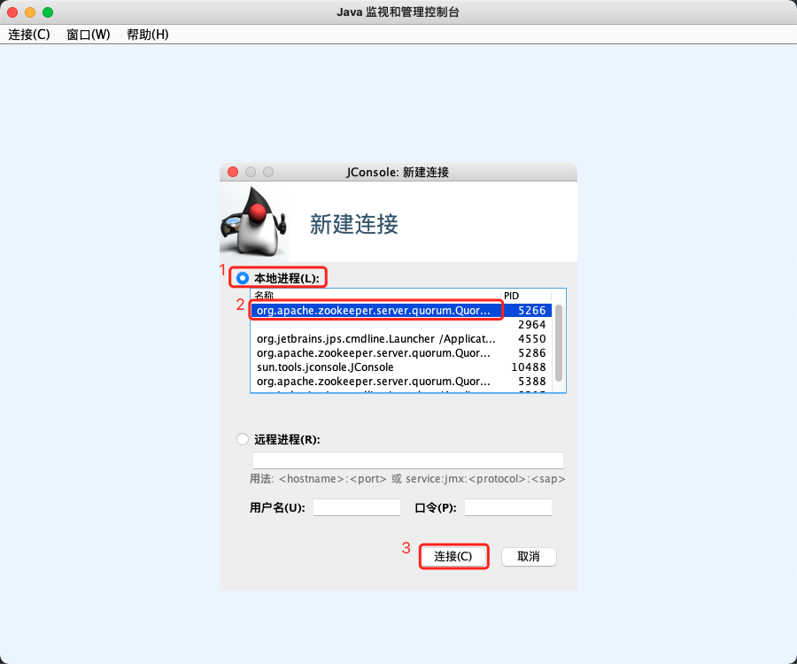

随便选择一个 ZK 的进程，选择连接即可。

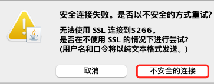

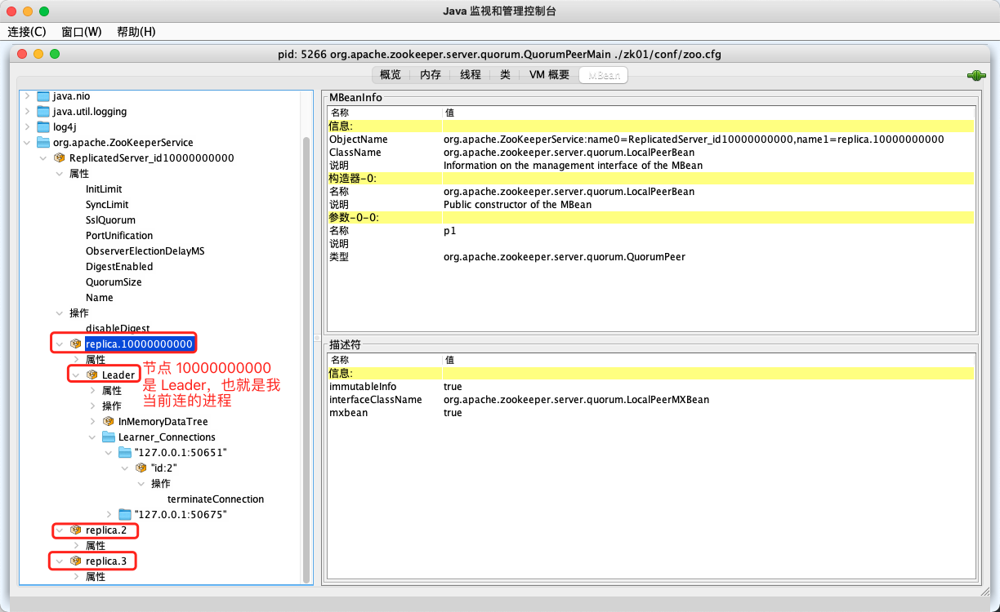

JMX 不光光可以看对象的属性也可以执行一些方法，比如：

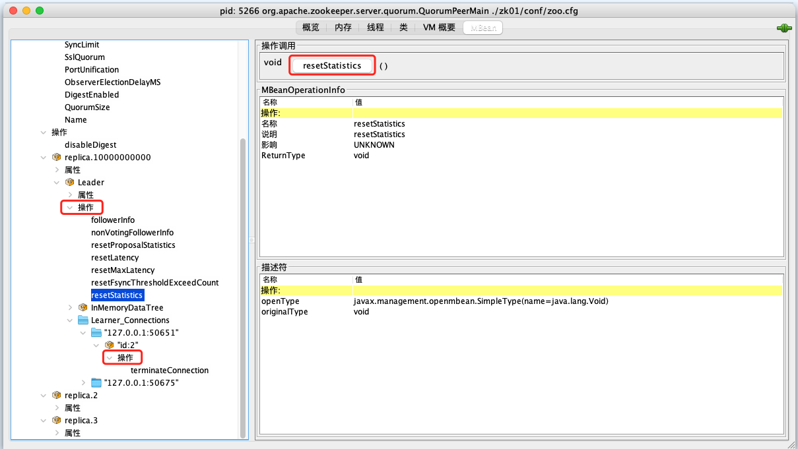

图中显示操作的地方都是可以在右侧找到一个按钮进行调用的（还可以传参），关于 ZK 中 JMX 更多的细节，我这里暂时不披露了，之后有机会单独讲解，反正大家只需要知道 JMX 就是将一些普通 Java 对象暴露出去，可以通过工具查看属性或者调用该对象的方法的一个标准。

## 二、四字命令 与 Admin Server

刚刚那个 JMX 查看还是比较麻烦的，因为现在我们测试访问的是我本地的进程，如果是远程的 JVM 进程，用 `jconsole` 访问起来就更麻烦了，有没有简单一点的方法。肯定是有！ZK 本身支持了一些四字命令（4lw）用于和服务端进行交互。

我这里做一个简单的演示，我本地的集群的客户端端口分别是：2181、2182、2183，我通过 `telnet` 命令随便连接上一个节点：

```bash
$ telnet localhost 2181
Trying ::1...
Connected to localhost.
Escape character is '^]'.

```

就会进入交互模式，然后输入 `srvr` 按下回车，就能得到以下输出

```bash
$ telnet localhost 2181
Trying ::1...
Connected to localhost.
Escape character is '^]'.
srvr
Zookeeper version: 3.6.2--803c7f1a12f85978cb049af5e4ef23bd8b688715, built on 09/04/2020 12:44 GMT
Latency min/avg/max: 0/3.8261/44
Received: 30
Sent: 29
Connections: 1
Outstanding: 0
Zxid: 0x100000009
Mode: leader
Node count: 6
Proposal sizes last/min/max: 48/48/94
Connection closed by foreign host.
```

`srvr` 命令就是用来查看服务节点的状态的，从输出中的 `Mode` 字段就能看到，监听 2181 端口的这个节点就是 Leader，我们再换一个 2182 节点看看，`Mode` 就是 Follower。

```bash
$ telnet localhost 2182
Trying ::1...
Connected to localhost.
Escape character is '^]'.
srvr
Zookeeper version: 3.6.2--803c7f1a12f85978cb049af5e4ef23bd8b688715, built on 09/04/2020 12:44 GMT
Latency min/avg/max: 0/0.0/0
Received: 3
Sent: 3
Connections: 1
Outstanding: 0
Zxid: 0x100000009
Mode: follower
Node count: 6
Connection closed by foreign host.
```

这里要提一下默认的四字命令不是全部打开的，如果想要启用所有的四字命令需要在环境变量中指定 `zookeeper.4lw.commands.whitelist=*`，也可以通过列出具体的命令（逗号分隔）来启用指定的一些四字命令。我们再换个命令看看吧，比如 `envi`，就会输出当前节点的环境参数

```bash
java.io.tmpdir=/var/folders/19/bx8xsqgd1c78g5j1mt_zq5v80000gp/T/
java.compiler=<NA>
os.name=Mac OS X
os.arch=x86_64
os.version=10.16
user.name=junjiexun
user.home=/Users/junjiexun
user.dir=/Users/junjiexun/develop/zk
os.memory.free=101MB
os.memory.max=889MB
os.memory.total=123MB
```

我这里列一下所有的四字命令的作用，具体就不演示了，留给读者自己尝试吧，[官网四字命令列表](https://zookeeper.apache.org/doc/current/zookeeperAdmin.html#sc_zkCommands)，四字命令其实就是它右边命令的别名而已，作用是完全一样的。（* 依旧表示 TODO，之后开篇单讲）

| 命令                                  | 返回数据的作用                                               |
| ------------------------------------- | ------------------------------------------------------------ |
| conf / configuration                  | 配置信息（常用的 `dataDir`、`clientPort` 等）                |
| cons / connections                    | 连接信息                                                     |
| crst / connection_stat_reset          | 重置连接统计信息                                             |
| dump                                  | 会话信息和临时节点                                           |
| envi / environment                    | 环境变量信息（`os.name`、`user.home` 等）                    |
| ruok                                  | 服务是否正常                                                 |
| srst / stat_reset                     | 重置统计信息                                                 |
| srvr / server_stats                   | 服务端信息概览                                               |
| stat                                  | 服务端信息统计                                               |
| wchs / watch_summary                  | 回调 watcher 的汇总                                          |
| wchc / watches                        | 注册回调的 session 信息汇总                                  |
| dirs                                  | log 和 snap 文件字节大小                                     |
| wchp / watches_by_path                | 注册回调的路径信息                                           |
| mntr / monitor                        | 所有监控信息                                                 |
| isro / is_read_only                   | 当前节点是否是只读                                           |
| hash                                  | 数字摘要                                                     |
| gtmk / get_trace_mask*                | 获取跟踪掩码                                                 |
| stmk / set_trace_mask*                | 设置跟踪掩码                                                 |
| lsnp / last_snapshot                  | 最后一次快照的信息                                           |
| icfg / initial_configuration          | 服务端启动初始配置                                           |
| orst / observer_connection_stat_reset | 重置 Observer 连接统计信息                                   |
| obsr / observers                      | 获取 Observer 的信息                                         |
| sysp / system_properties              | 环境变量信息和 `envi` 不同的是会返回 `zookeeper` 开头的自定义配置 |
| lead / leader                         | 当前节点是否是 Leader                                        |
| voting_view                           | 集群选票信息                                                 |
| zabstate                              | ZAB 状态信息汇总                                             |

我还看到了 `ruok`，用来查看服务器节点是否启动（能成功返回不代表能对外提供服务 ）


除了通过 `telnet` 方式去调用 ZK 提供的四字命令，ZK 还提供了一个更友好的方式就是 Admin Server。

ZK 在启动后，默认会监听本机的 8080 端口并启动一个 Jetty 容器作为 Web 服务器，如果访问该端口下的 `/commands` 路径的话会得到：

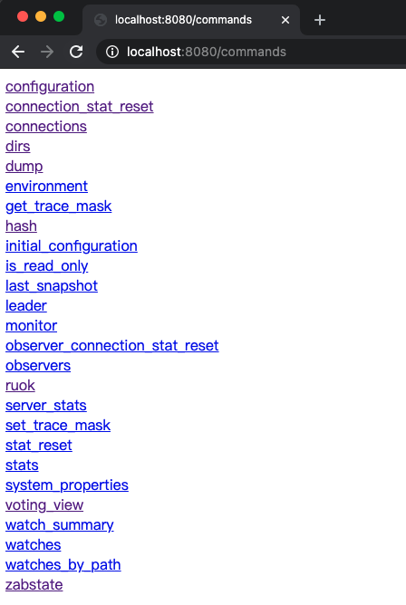

直接访问这些超链接就可以拥有和之前四字命令一样的效果～也可以直接在 URL 上访问 `ip:port/commands/<commandName>`。

以 `mntr`为例，可以直接访问 `http://localhost:8080/commands/mntr` 或者 `http://localhost:8080/commands/monitor` 都是一样的。

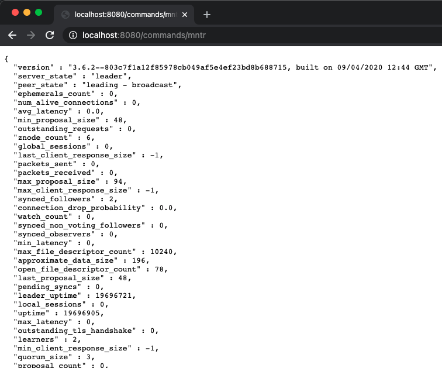

因为 Admin Server 默认就是启用的，而且接受来自任何 IP 的请求，为了安全考虑的话可以通过配置环境变量 `zookeeper.admin.serverAddress=10.3.54.12`，类似这样增加请求的 IP 的要求或者直接通过 `zookeeper.admin.enableServer=false` 禁用 Admin Server。

ZK 官方是推荐直接使用 Admin Server 的，来替代命令行的四字命令的，基于这些官方的接口是可以做一些 ZK 监控平台的。

## 三、动态配置

ZK 的集群配置一般都是在启动的时候通过读取配置文件，之后就不会再变更了，并且如果我要为集群添加一个新的节点，需要修改配置文件再重启方才能生效的。

但是在 3.5.0 之后， ZK 更新了动态配置的功能，集群的配置不再需要停机重新配置，可以在运行时直接修改，可以直接为集群增删节点，修改他们的角色，甚至可以修改集群的计票规则！是不是碉堡了！


### 3.1 计票规则

在此之前，我先介绍下 ZK 支持的两种计票规则。

#### 3.1.1 过半机制

这是 ZK 默认的计票规则，用于各种服务端集群需要 ACK 的场景，假设现在的配置是这样：

```
server.1=zoo1:2888:3888:participant
server.2=zoo2:2888:3888:participant
server.3=zoo3:2888:3888:participant
server.4=zoo4:2888:3888:observer
server.5=zoo5:2888:3888:observer
```

因为 Observer 是不会算入选票的，实际参与的机器是前三个节点：1、2、3

先不管 Leader 是谁，默认的计票规则需要这三个节点中的至少两个成功提交 ACK（或是其他需要计票的信息），这个选举（或者提案）才能被继续提交，这就是过半机制。

#### 3.1.2 分组权重

ZK 还提供了一个新的计票规则，这个规则支持将各个节点分成不同的组（当然也可以只有一个组），同一个组中的不同节点也可以被分配成不同的权重，我举个例子：

```
group.1=1:2:3
group.2=4:5:6:7:8
group.3=9

weight.1=1
weight.2=1
weight.3=1
weight.4=1
weight.5=1
weight.6=1
weight.7=1
weight.8=1
weight.9=1
```

group 开头和 weight 开头分别对应了分组和权重的配置，规定如下：

- group 的格式是 `group.<groupId>=<serverId>:<serverId>...`
- weight 的格式是 `weight.<serverId>=<weight>`
- serverId 就是每一个服务节点配置在 myid 中的数字
- 每一个节点只能属于一个 group

那以我现在配置的情况继续说明的话，现在一共有三个 group，分别的权重计算如下 ：

```
group1 的权重总和 = server1 的权重 + server2 的权重 + server3 的权重 = 1 + 1 + 1 = 3
group2 的权重总和 = server4 的权重 + server5 的权重 + server6 的权重 + server7 的权重 + server8 的权重= 1 + 1 + 1 + 1 + 1 = 5
group3 的权重总和 = server9 的权重 = 1
```

假如现在成功 ACK 的服务节点有 1、4、5、8、9 并以这样的配置进行计票的话

- 首先看 group1 只有 server1 成功回复 ACK，权重值为 1，并未超过 group1 权重总和 3 一半以上，所以 group1 相当于 ACK 失败了
- 再看 group2 有 4、5、8 三个节点成功回复 ACK，权重值为 3，超过了 group2 权重总和 5 的一半以上（3 > 5/2)，所以 group2 ACK 成功
- 然后看 group3，因为只有一个节点 9，并成功回复 ACK，所以也满足了超过 group3 权重总和 1 的一半以上（1 > 1/2），所以 group3 ACK 成功
- 最后统计成功 ACK 的 group 数量是否超过整体 group 数量的一半以上，现在有 2 个 group 成功 ACK（2 > 3/2) ，所以最终 ACK 通过

感觉看起来和默认的过半机制差不多，No，No，No。我这里看起来差不多的原因是因为我把权重都设置成了 1，如果设置成别的数字呢？


刚刚的场景中只有 group1 的 ACK 最终失败了，原因是因为只有 server1 一个节点成功回复，但是如果我把 group1 的权重改成（另外两个 group 省略了）

```
group.1=1:2:3

weight.1=3
weight.2=1
weight.3=1
```

现在 group1 的权重总和变成了 `3 + 1 + 1 = 5`，server1 的权重是 3 了，就算只有它一个节点回复了，也超过了 group1 的一半以上（3 > 5/2)，如果是此时的权重配置的话，group1 也是算作成功 ACK 的。

还有必须要说明的一点，在 ZK 读取这些配置的时候就会计算每一个 group 的权重总和，如果计算出来某一个 group 的权重总和是 0，则该 group 被移除出计票规则中了。

和默认的过半机制不同的是，使用权重配置的话，是可以让 Observer 参与的。

### 3.2 推荐配置

说了半天，怎么启用这个权重的计票规则呢？

- （推荐）在 `zoo.cfg` 中配置 `dynamicConfigFile` 选项用来指定动态配置的路径地址，将所有的 server 、group 和 weight 开头的配置都移至该路径的配置文件中。
- 将所有的 server 、group 和 weight 开头的配置都直接配置在 `zoo.cfg` 文件中 

只要在配置文件中被 ZK 发现有 group 或者 weight 开头的配置，就表示启用权重的计票规则，否则使用默认的过半机制。

我们之前的 server 前缀配置是这样：

```
server.1=zoo1:2888:3888:participant
```

实际的 server 配置的格式应该是这样的，可以将客户端的端口配置在 server 配置中的（最后的分号后面）

```
server.1=zoo1:2888:3888:participant;2181
```

如果这样配置的话，`zoo.cfg` 中就不需要配置 `clientPort` 选项了。

所以按照推荐的配置方式的话，`zoo.cfg` 就配置这些（路径请根据读者的电脑自行调整）

```
tickTime=2000
initLimit=10
syncLimit=5
dataDir=/Users/junjiexun/develop/zk/zk01/data
dynamicConfigFile=/Users/junjiexun/develop/zk/zk01/conf/zoo.dyn.cfg
...
```

而我在 `/Users/junjiexun/develop/zk/zk01/conf/zoo.dyn.cfg` 的文件中就可以配置

```
server.10000000000=127.0.0.1:2888:3888:participant;2181
server.2=127.0.0.1:2887:3887;2182
server.3=127.0.0.1:2886:3886;2183

group.1=10000000000:2:3

weight.10000000000=1
weight.2=1
weight.3=1
```

更详细的可以查看[官方文档](https://zookeeper.apache.org/doc/r3.6.2/zookeeperReconfig.html#sc_reconfig_file)

### 3.3 动态修改

那么问题来了，我这样配置好了后，怎么才能动态的往集群中添加节点或者删除节点呢？

Java 的客户端提供了一个 `getConfig` 的方法

```java
ZooKeeper client = new ZooKeeper("127.0.0.1:2181", 3000, null);
byte[] config = client.getConfig(false, null);
System.out.println(new String(config));
client.close();
```

打印出来的结果是

```
server.2=127.0.0.1:2887:3887:participant;0.0.0.0:2182
server.3=127.0.0.1:2886:3886:participant;0.0.0.0:2183
server.10000000000=127.0.0.1:2888:3888:participant;0.0.0.0:2181
group.1=2:3:10000000000
weight.2=1
weight.3=1
weight.10000000000=1
version=0
```

这些信息看起来和我们配置的 `zoo.dyn.cfg` 有点像但是又有点不一样，不一样的地方实际就是 ZK 帮我们自动补齐的格式，而这个返回的数据 ZK 是存在哪里的呢？ZK 在启动的时候默认会在根路径创建以下节点

```
/
|--zookeeper
     |--config
     |--quota
```

而 `getConfig` 返回的数据实际就是 `/zookeeper/config` 节点的数据，而且这个节点的权限只有 Read，不信你用 `getData` 试试，返回的数据是一样的

```java
ZooKeeper client = new ZooKeeper("127.0.0.1:2181", 3000, null);
byte[] config = client.getData("/zookeeper/config", false, null);
System.out.println(new String(config));
client.close();
```

现在可以获取到这个配置了，那怎么去修改呢？ZK 官方提供了两种方式：命令行、Java API。

如果使用 Java 内置的命令行工具，在支持的命令中就有一个 `reconfig` 命令，参数是：

```
reconfig [-s] [-v version] [[-file path] | [-members serverID=host:port1:port2;port3[,...]*]] | [-add serverId=host:port1:port2;port3[,...]]* [-remove serverId[,...]*]
```

另一种就是使用 Java 的客户端代码，我们之前一直使用的是 `ZooKeeper` 这个类，他还有一个子类叫 `ZooKeeperAdmin`，这个子类就拥有 `reconfigure` 方法可以对配置进行修改，下面我来演示下，但在此之前我必须说明下动态修改配置的特性

- 动态修改配置分为：增量和非增量的方式
- 因为实际上修改的就是 `/zookeeper/config` 节点的数据，而这个节点默认只有 Read 权限，所以要么直接使用管理员权限进行修改操作，要么就在环境变量中配置 `zookeeper.skipACL=yes` 跳过 ACL 的校验
- 使用增量方式修改配置的时候，集群的计票规则必须是过半机制！
- 使用非增量的方式修改配置时，两种机制均可。
- 将 Follower 从集群配置中删除，只是相当于把它降级为 Observer，它是仍然可以对外提供服务端，并且也同样可以接受到 Leader 的消息
- 将 Leader 从集群配置中删除时，会造成较大的性能影响，整个集群在选出新的 Leader 之前是无法对外提供服务的，请尽量不要这么做
- 而增加节点就轻松很多，新加入的节点会自动和 Leader 进行同步数据

#### 3.3.1 增量删除节点

假设我现在一共有 3 个节点，采用的是过半机制（必须得是），三个 ID 分别是 10000000000、2、3，我们尝试将 ID 为 3 的节点删除，我这里采用直接配置 `skipACL` 跳过权限校验（下同）

```java
ZooKeeperAdmin client = new ZooKeeperAdmin("127.0.0.1:2181", 3000, null);
List<String> leavingServers = new ArrayList<>();
leavingServers.add("3");
byte[] reconfigure = client.reconfigure(null, leavingServers, null, -1, null);
System.out.println(new String(reconfigure));
client.close();
```

该接口返回的数据就是 `/zookeeper/config` 修改完成后的配置信息，可以看到新的配置中和 3 有关的数据就消失了

```
server.2=127.0.0.1:2887:3887:participant;0.0.0.0:2182
server.10000000000=127.0.0.1:2888:3888:participant;0.0.0.0:2181
version=400000004
```

这个 `version=400000004` 是干嘛的呢？ZK 为修改的配置默认也提供了版本的控制，启动成功后会在你配置的 `dynamicConfigFile` 路径下自动生成一个文件，我这里是 `zoo.cfg.dynamic.300000000` 读者可能跟我的不一样。这个 `300000000` 就是版本号，而当我把 ID 为 3 的节点删除后，ZK 又自动生成了个文件 `zoo.cfg.dynamic.400000004` 这个 `400000004` 就是新的版本号，如果我们在修改的时候对当前集群配置的版本号有要求的话就可以在 `reconfigure` 方法中的第四个参数填入需要的目标版本号即可，我例子中是 -1 代表无视版本号，和 delete、setData 的 version 字段是一个用意。

#### 3.3.2 增量增加节点

让我们再把节点 3 加回去

```java
ZooKeeperAdmin client = new ZooKeeperAdmin("127.0.0.1:2181", 3000, null);
List<String> joiningServers = new ArrayList<>();
joiningServers.add("server.3=127.0.0.1:2886:3886;2183");
byte[] reconfigure = client.reconfigure(joiningServers, null, null, -1, null);
System.out.println(new String(reconfigure));
client.close();
```

得到的新配置内容是

```
server.10000000000=127.0.0.1:2888:3888:participant;0.0.0.0:2181
server.2=127.0.0.1:2887:3887:participant;0.0.0.0:2182
server.3=127.0.0.1:2886:3886:participant;0.0.0.0:2183
version=400000013
```

节点 3 加回去了，而且版本号又改变了，又多了一个 `zoo.cfg.dynamic.400000013` 文件

#### 3.3.3 非增量

```java
ZooKeeperAdmin client = new ZooKeeperAdmin("127.0.0.1:2181", 3000, null);
List<String> newMembers = new ArrayList<>();
newMembers.add("server.10000000000=127.0.0.1:2888:3888:participant;2181");
newMembers.add("server.3=127.0.0.1:2886:3886;2183");
byte[] reconfigure = client.reconfigure(null, null, newMembers, -1, null);
System.out.println(new String(reconfigure));
client.close();
```

这样的话相当于把 ID 为 2 的节点给删除了（当然也可以新增节点，我这里就不演示了）

### 3.4 小节

三种不同的方式实际对应的就是 Java API 的三个参数 `joiningServers`、`leavingServers`、`newMembers`，而且 Java API 参数除了使用 List 还可以使用 String（逗号分隔）也可以达到同样的效果。动态增删服务节点让我们可以在避免停机的前提下调整整个 ZK 集群的服务能力（个人觉得动态增加比较有用）。

而分组权重的计票规则提供了一种新的归票策略，特别是配合动态配置，可以运行时修改权重，但总体来说，分组权重的计票规则比较鸡肋，我也不知道能在什么样的场景下使用（高性能的机器可以权重大一点？问题是现在都是云服务，容器化和虚拟化的，机器的配置都可以动态调整的，而且一般机器配置也都是一样的，实在是想不到还有什么用）

如果读者有关于分组权重的使用思路可以分享给大家噢～关于更多的动态配置可以参考 [官方文档](https://zookeeper.apache.org/doc/r3.6.2/zookeeperReconfig.html)

## 四、ZK 监控

ZK 3.6 之后新增的 Metrics 是 ZK 提供给用户可查询的监控指标，官网上也说了可以结合 [Prometheus](https://prometheus.io/) 或者 [Grafana](https://grafana.com/grafana/) 来使用。什么？你完全没用过，甚至没听说过！那巧了这两个东西我也没玩过，借着这个机会就和大家一起学习下，搞个 Hello World，不过因为本系列是以 ZK 为主的，所以一切从简配置，Let's GO！

### 4.1 Prometheus

Mac 安装特别简单，其他平台可以去官网下载压缩包

```
$ brew install prometheus
```

我这里的默认安装路径是 `/usr/local/Cellar/prometheus/2.23.0` 

在此之前还需要在 ZK 节点的配置 `zoo.cfg` 加两行

```
metricsProvider.className=org.apache.zookeeper.metrics.prometheus.PrometheusMetricsProvider
metricsProvider.httpPort=7000
```

我是本地起的三个节点，另外两个节点需要改成 7001 和 7002，因为端口不能重复

之后修改 Prometheus 的默认配置，在我的电脑上路径为 `/usr/local/etc/prometheus.yml` 修改为

```yaml
global:
  scrape_interval: 15s
scrape_configs:
  - job_name: "test-zk"
    static_configs:
      - targets: ["localhost:7000", "localhost:7001", "localhost:7002"]
```

job_name 可以随便起，重点是 targets 目标地址和 scrape_interval 访问间隔，修改完毕后，就可以启动 Prometheus

```
$ cd /usr/local/Cellar/prometheus/2.23.0
$ ./bin/prometheus --config.file=/usr/local/etc/prometheus.yml
```

然后访问 `localhost:9090` 就能看到如下界面了：

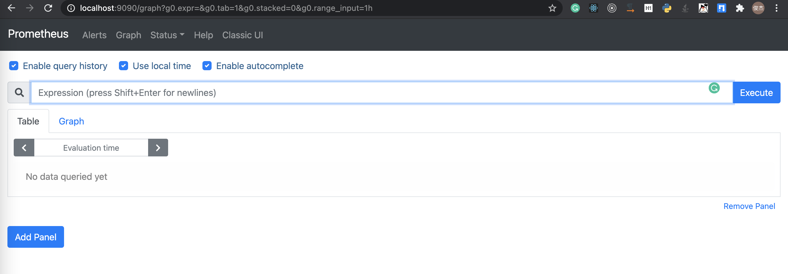

只要勾上了 `Enable autocomplete` 就可以在输入框里输入了，马上就能得到提示，我这里随便输几个参数看看

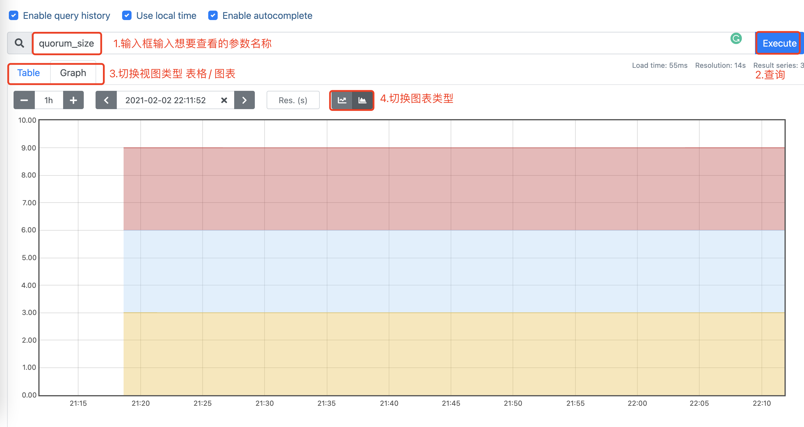

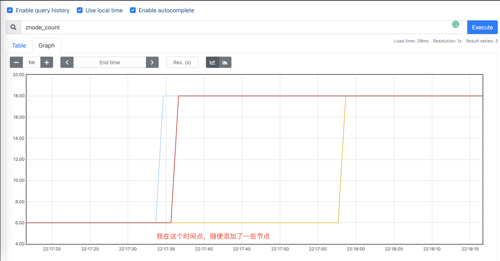

简单的就演示到这里了，剩下的交给读者了～

### 4.2 Grafana

Mac 安装 Grafana 也非常简单

```
$ brew install grafana
```

安装完毕后，可以通过命令启动

```
$ grafana-server --config=/usr/local/etc/grafana/grafana.ini --homepath /usr/local/share/grafana --packaging=brew cfg:default.paths.logs=/usr/local/var/log/grafana cfg:default.paths.data=/usr/local/var/lib/grafana cfg:default.paths.plugins=/usr/local/var/lib/grafana/plugins
```

Grafana 默认的端口是 3000，访问 `localhost:3000` 默认的用户名密码均是 admin，就能看到首页了

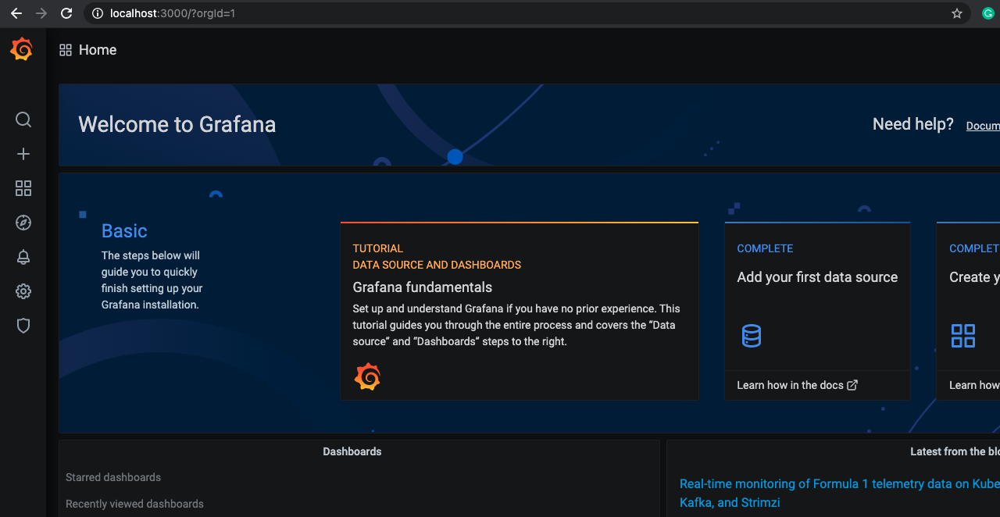

Grafana 天然支持了 Prometheus 的数据源，可以直接添加

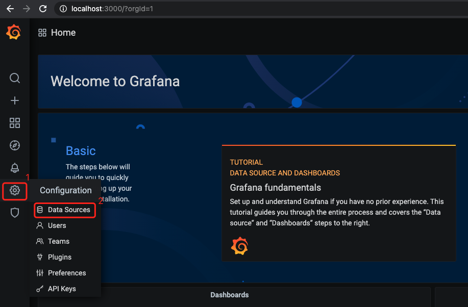

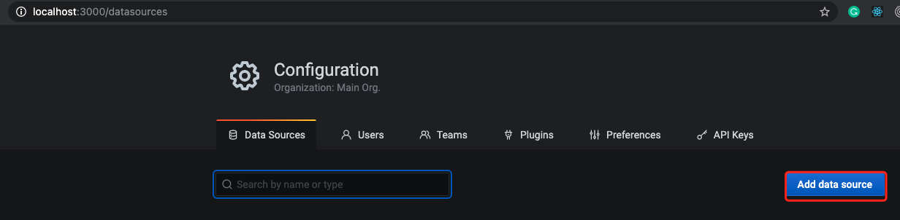

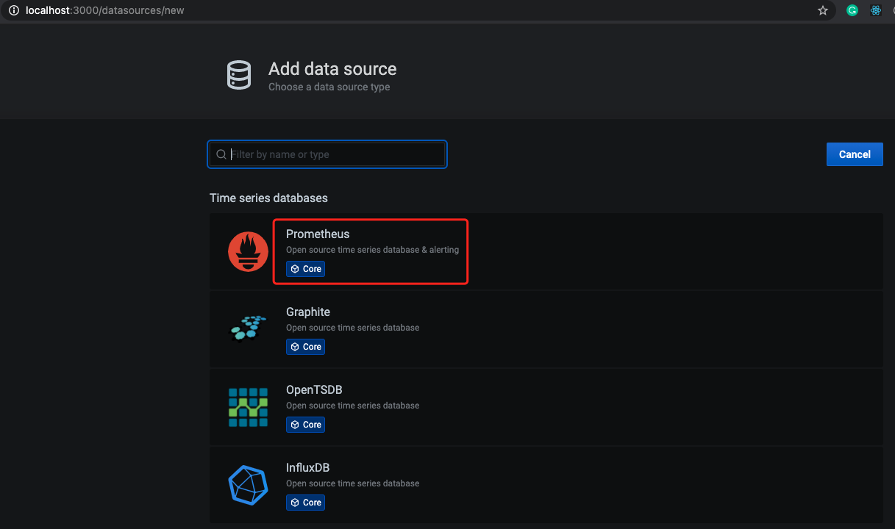

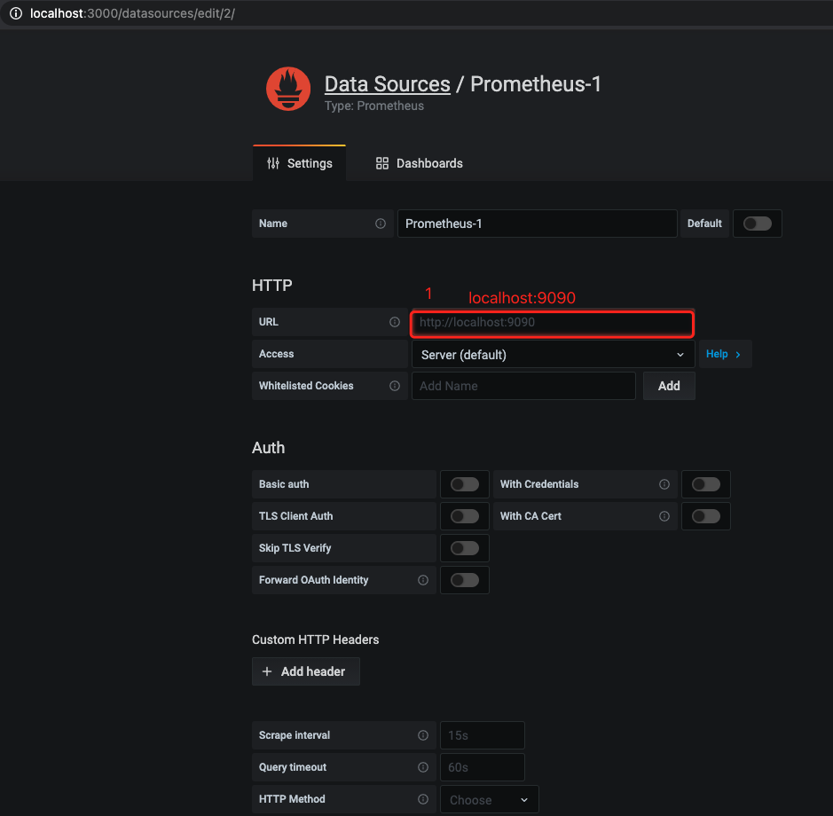

默认的配置只需要修改 URL（默认是 localhost:9090）

然后需要添加一个 dashboard 的模板，ZK 官方给我们提供了一个模板，贴心吧

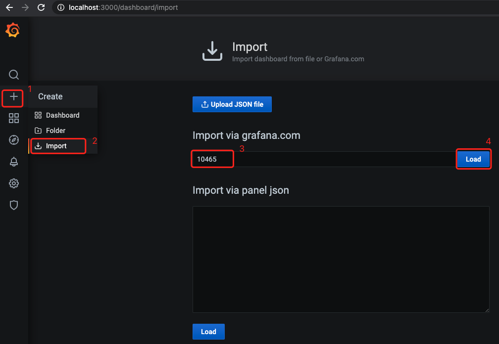

10465 这个数字哪儿来的呢？[官方文档的模板](https://grafana.com/grafana/dashboards/10465)

大功告成！比 Prometheus 好看多了～

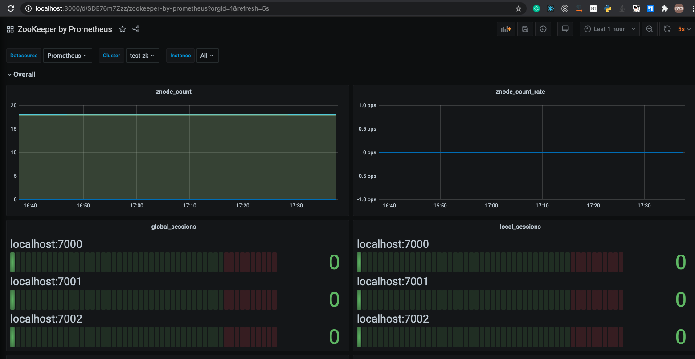

关于 ZK 的监控就介绍到这里了。传统功夫，点到为止～

## 五、ZK 可视化开源项目介绍

使用命令行操作 ZK 太麻烦了，所以可视化就很有必要了，下面推荐几个不错的可视化客户端，有的是本地客户端，有的是 Web 服务，大家按需获取吧～

- PrettyZoo：https://github.com/vran-dev/PrettyZoo，可视化 GUI 客户端，各个平台都有安装文件，需要连接 ZK 服务端的时候，手边有这样一个工具还是很方便的
- zkdash：https://github.com/ireaderlab/zkdash，JavaScript + Python 可视化 Web 客户端，是个可以直接运行的 Web 服务，缺点是 Python2.7 开发的，如果不需要二次开发的话就没什么问题
- zoonavigator-web：https://github.com/elkozmon/zoonavigator-web，TypeScript 编写的可视化 Web 客户端，是个可以直接运行的 Web 服务
- visual-zookeeper：https://github.com/ghostg00/visual-zookeeper，Electron + React 编写的客户端

