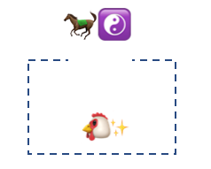
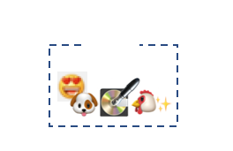
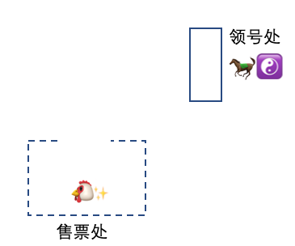
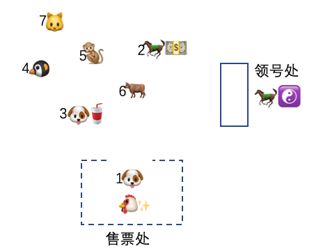

# 坐下坐下，基本操作


<p align="center">本文作者：HelloGitHub-<strong>老荀</strong></p>

Hi，这里是 HelloGitHub 推出的 HelloZooKeeper 系列，**免费开源、有趣、入门级的 ZooKeeper 教程**，面向有编程基础的新手。

> ZooKeeper 是 Apache 软件基金会的一个软件项目，它为大型分布式计算提供开源的分布式配置服务、同步服务和命名注册。 ZooKeeper 曾经是 Hadoop 的一个子项目，但现在是一个顶级独立的开源项目。

ZK 在实际开发工作中经常会用到，算的上是吃饭的家伙了，那可得玩透、用的趁手，要不怎么进阶和升职加薪呢？来和 HelloGitHub 一起学起来吧～

本系列教程是**从零开始**讲解 ZooKeeper，内容从**最基础的安装使用到背后原理和源码的讲解**，整个系列希望通过有趣文字、诙谐的气氛中让 ZK 的知识“钻”进你聪明的大脑。本教程是开放式：开源、协作，所以不管你是新手还是老司机，我们都希望你可以**加入到本教程的贡献中，一起让这个教程变得更好**：

- 新手：参与修改文中的错字、病句、拼写、排版等问题
- 使用者：参与到内容的讨论和问题解答、帮助其他人的事情
- 老司机：参与到文章的编写中，让你的名字出现在作者一栏

> 项目地址：https://github.com/HelloGitHub-Team/HelloZooKeeper

今天我们会讲解下，如何使用 Java 代码客户端去操作 ZK。

## 一、基本操作

### 1.1 马果果的新规定

老规矩，在开始实战之前呢，我还是讲一个小故事（故事中的人物，纯属虚构，请勿对号入座，如有雷同，纯属巧合）。

**马果果**自从担任了办事处的负责人后，每天那是忙的不可开交，村民有事都来找他，他的小本子上已经密密麻麻记了一大堆：


特别是**鸡太美**，俨然已经成为了日更 UP 主，每天的频繁更新让**马果果**倍感力不从心，他想，如果再这样毫无章法的记下去，不但以后自己会越来越累，等自己退休后，别人来交接也会无从下手，那还不得在背后说我管理不当，对着我指指点点。要晚节不保啊，到时候怕不是要给全村人民谢罪。


于是办事处出台了新的规定，每次过来登记的村民必须对自己要登记的事务进行分类，而**马果果**则根据这些分类去进行记录，所以**马果果**的笔记（以下简称：小红本）就变成了这样：


但是执行了规定一段时间以后，以**鸡太美**和**马小云**为首的村民代表又向**马果果**提出了：“我们都是老熟人了，每次来都得自报家门，能不能做点便民措施？你这办事处的宗旨难道不就是服务咱人民群众的吗？”

**马果果**听完也觉得很有道理，于是给每一个老熟人都创建了一个标签。比如以后**鸡太美**过来创建的记录，都直接放到**鸡太美**的标签下，这样**鸡太美**只需要关心自己具体想要记哪些东西就行了，所以笔记本最后变成了这样：


而对于需要接收到通知到村民也是一样，**马果果**会在需要通知的事务旁备注下，比如**鸡太美**的头号粉丝**坤坤**，对**鸡太美**的跳舞视频十分感兴趣，所以在**鸡太美**的跳舞事务旁备注下：


然后拿出另一本本子（以下简称：小黄本）把需要通知谁给记下来：


随着时间推移**鸡太美**的人气与日俱增，现在连**马小云**，**东东**都成了她的粉丝，纷纷都要关注她的更新：


所以现在**马果果**当记录完小红本后，会看看当前的事务是不是有别人订阅了通知，如果有的话，会再拿出小黄本去找到对应需要通知的村民，一个个打电话通知他们。

**马果果**对自己的这次出台的规定非常满意，当面对记者采访的时候得意的说道，这是自己退休后坚持学习计算机，从计算机的文件目录中得到的灵感，人果然还是要「活到老学到老」啊！


---

小故事讲完了，下面用猿话翻译一下：

ZK 定义了每一个记录必须有一个对应路径，这个路径就是对应小故事中的办事处规定的分类，而整个记录的结构的确和 Linux 中的文件树类似，有一个根节点 `/`，节点间有父子关系，路径用 `/` 分割，比如：

```
/鸡太美/更新视频/跳舞/20201101
```

而故事中的标签，其实就是客户端中指定的 chroot，实际上是由客户端维护的，服务端并不知道。

### 1.2 代码实战

特别说明接下来的实战是用官方的 Java 客户端作为演示的，新建一个空白的 Maven 项目，然后引入 ZK 的依赖：

```xml
<dependency>
  <groupId>org.apache.zookeeper</groupId>
  <artifactId>zookeeper</artifactId>
  <version>3.6.2</version>
</dependency>
```

要操作 ZK 首先得先创建一个客户端对象，我们以**鸡太美**为例

```java
ZooKeeper client = new ZooKeeper("127.0.0.1:2181/鸡太美", 3000, null);
```

`ZooKeeper`第一个字符串就是连接的服务端地址，`/` 后面就是 `chroot`， 就是小故事里的标签，之后该客户端所有的操作都会以`/鸡太美`作为顶层路径去处理。

最后当客户端退出的时候，记得要关闭客户端噢

```java
client.close();
```

#### 1.2.1 创建路径

这里需要提醒的是，官方的客户端是没有递归创建的功能的，所以在创建多级路径的时候，客户端需要自己确保路径中的父级节点是存在的！

下面的方法，直接运行是会报错的，所以需要逐级创建 `20201101` 的父路径，最终才能成功，这里主要是演示结构，而之后的 `ZooDefs.Ids.OPEN_ACL_UNSAFE` 是一种 ACL 的权限，意思就是不会进行权限校验，关于权限，之后会有篇幅介绍，这里直接跳过。

```java
client.create("/更新视频/跳舞/20201101", "这是Data，既可以记录一些业务数据也可以随便写".getBytes(), ZooDefs.Ids.OPEN_ACL_UNSAFE, CreateMode.PERSISTENT);
```

最后的 `CreateMode.PERSISTENT` 代表当前节点是一个持久类型的节点，`3.6.2` 中一共有 7 种类型，下面列出并且给出简单解释：

```java
PERSISTENT											// 持久节点，一旦创建成功不会被删除，除非客户端主动发起删除请求
PERSISTENT_SEQUENTIAL 					// 持久顺序节点，会在用户路径后面拼接一个不会重复的字增数字后缀，其他同上
EPHEMERAL												// 临时节点，当创建该节点的客户端链接断开后自动被删除
EPHEMERAL_SEQUENTIAL						// 临时顺序节点，基本同上，也是增加一个数字后缀
CONTAINER												// 容器节点，一旦子节点被删除完就会被服务端删除
PERSISTENT_WITH_TTL							// 带过期时间的持久节点，带有超时时间的节点，如果超时时间内没有子节点被创建，就会被删除
PERSISTENT_SEQUENTIAL_WITH_TTL	// 带过期时间的持久顺序节点，基本同上，多了一个数字后缀
```

大家可能比较熟悉前四种，对后三种不太熟悉，特别是最后两种带 `TTL` 的类型，这两种类型在 ZK 默认配置下还是不支持的，需要在 `zoo.cfg` 配置中添加 `extendedTypesEnabled=true` 启用扩展功能，否则的话就会收到 `Unimplemented for` 的错误。

示例中路径创建完就会是这样：

```
鸡太美
	|--更新视频
  	|--跳舞
    	|--20201101
```


#### 1.2.2 删除路径

官方的客户端也不支持递归删除，需要确保删除的节点是叶子节点，否则就会收到错误，我们这里把 20201101 给删除：

```java
client.delete("/更新视频/跳舞/20201101", -1);
```

-1 是一个 version 字段，相当于 ZK 提供的乐观锁机制，如果是 -1 的话就是无视节点的版本信息。

删除完就是这样：

```
鸡太美
	|--更新视频
  	|--跳舞
```

#### 1.2.3 设置数据

每一个节点都可以拥有自己的数据，既可以通过创建的时候指定，也可以在之后通过设置的方式指定。

```java
client.setData("/更新视频/跳舞", "这是Data，可以写一些关于业务的参数".getBytes(), -1);
```

-1 的含义和删除路径中是一样的，也是无视版本信息。

#### 1.2.4 判断路径是否存在

由于创建和删除都不支持递归，所以需要对目标路径进行判断是否存在来决定是否进行下一步

```java
Stat stat = client.exists("/更新视频", false);
System.out.println(stat != null ? "存在" : "不存在"); // 存在
```

false 意思是不进行订阅，关于订阅之后会一起说。

#### 1.2.5 获取数据

能设置数据，必然也能获取数据，所以 ZK 可以偶尔客串一下数据存储的角色

```java
byte[] data = client.getData("/更新视频/跳舞", false, null);
System.out.println(new String(data)); // 这是Data，可以写一些关于业务的参数
```

#### 1.2.6 获取子节点列表

前面说了 ZK 是一个树形的结构，有父子节点概念，所以可以查询某一个节点下面的所有子节点

```java
List<String> children = client.getChildren("/更新视频", false);
System.out.println(children); // [跳舞]
```

#### 1.2.7 设置订阅

上面介绍的三个方法：判断路径是否存在、获取数据、获取子节点列表，这三种方法（包括他们的重载方法），都可以对路径进行订阅，订阅的方式有两种：

- 传递一个 `boolean` 值，如果使用此方式的话，回调对象就是创建 `ZooKeeper` 时的第三个参数 `defaultWatcher`，只不过之前示例中是 `null`
- 直接在方法中传入一个 `Watcher` 的实现类，此实现类会作为此路径之后的回调对象（推荐）

下面分别演示下：

```java
// 方式1
ZooKeeper client = new ZooKeeper("127.0.0.1:2181/鸡太美", 3000, new Watcher() {
  // 这个就是 defaultWatcher 参数，是当前客户端默认的回调实现
  @Override
  public void process(WatchedEvent event) {
    System.out.println("这是本客户端全局的默认回调对象");
	}
});
// exists
client.exists("/更新视频", true);
// getData
client.getData("/更新视频/跳舞", true, null);
// getChildren
client.getChildren("/更新视频", true);
```

```java
// 方式2
// exists
client.exists("/更新视频", new Watcher() {
  @Override
  public void process(WatchedEvent event) {
    System.out.println("我是回调对象的实现");
  }
});
// getData
client.getData("/更新视频/跳舞", new Watcher() {
  @Override
  public void process(WatchedEvent event) {
    System.out.println("我是回调对象的实现");
  }
}, null);
// getChildren
client.getChildren("/更新视频", new Watcher() {
  @Override
  public void process(WatchedEvent event) {
    System.out.println("我是回调对象的实现"); 
  }
});
```

至于回调是怎么每次能触发到对应的方法的，这里就卖个关子，之后会有文章详细解释。

关于 ZK 客户端的操作大致就这么几种，限于篇幅我也无法一一举例，本系列文章目的也不是作为官方文档的翻译，重要的还是能激发出大家对于技术的热情，剩下的那些使用情况就当我给大家的课后练习题吧～关于 ZK 的基本操作就讲完了。


## 二、进阶操作

整完了基本操作，咱们再来整点高级的。

### 2.1 鸡太美的签售会

我们继续先说说动物村发生的故事。

随着直播的人气和关注数的日益增长，**鸡太美**俨然已经成为了动物村的大明星，都出专辑了，所以准备回馈下粉丝办场签售会。


决定在**马果果**的办事处前布置场地，由身强体壮的太极宗师**马果果**担任保安保证现场的秩序



**马果果**说了想要进去和**鸡太美**一对一粉丝见面会的，需要拿走我手中的凭证，在签完名后赶紧出来，还要把这个凭证归还给我。


对不起，放错图了


**鸡太美**的粉丝们听到可以和明星一对一见面，都疯了，都火急火燎的赶到了办事处的门口，不知道谁在人群中大喊了一声：“抢啊！先到先得啊！”，都像饿虎扑食一般把**马果果**扑倒在地，场面相当混乱！


最后是由**鸡太美**的铁杆粉丝**坤坤**拔得头筹，抢下了**马果果**手中的唯一凭证，换到了和明星偶像一对一的机会



**坤坤**捧着手中心爱的专辑，心满意足的回去了。

重新拿回凭证的**马果果**，看着眼前这一群饿狼


顿时明白了自己接下来要面对的...

（ 四小时以后 ）

终于，所有的粉丝都拿着手中还热乎的专辑高高兴兴的回家去了。忙碌了一天的**马果果**心想下次可不能这样，要不是我老当益壮怕不是要被抬进医院！


### 2.2 鸡太美的演唱会

**鸡太美**的粉丝数量终于突破了 100w ！是时候找个理由再营销自己一波了，于是就和经纪公司商量能不能办一个演唱会，现场卖票，既可以为自己造势也可以满足下粉丝见面的要求。这次同样的找到了**马果果**，希望**马果果**能继续帮忙组织下现场的秩序，高风亮节的**马果果**本来不想再接这些杂活了，但是听到了经纪公司开出的价钱后...


但是自己毕竟年事已高，可经不起上次的那样折腾了，于是决定这次出台一个新的规定来应对之后粉丝疯狂的行为，新场地布置成这样：



每一个粉丝都得先去**马果果**那里拿一个从小到大的号码，**马果果**每次从 1 开始发，一边发一边还要叫，从最小的号码开始叫，叫到号码的粉丝才能进售票处买票，每一个粉丝拿到号之后就要关注下排在自己前面一位的情况，如果他买好了，自己赶紧要准备起来，因为下一个就会轮到自己。

就这样，整个售卖现场井井有条，大家纷纷都夸奖**马果果**高超的管理技巧。




---

小故事又又讲完了，下面用猿话翻译一下：

这两个小故事讲的就是 ZK 分布式锁的大致原理，并且基本对应了非公平锁和公平锁的两种情况，虽然实际情况和故事中会有出入，但是通过故事希望给大家能有一个感性的认识。

非公平锁的缺点在故事中也体现了，就是当前一个持有锁的进程释放之后，其他所有等待锁的进程都会被通知，这个就是经常在面试题中提到的“羊群效应”，从而再去争抢该锁，但是因为又只有一个进程能抢到锁，其他的进程会重新继续等待循环下去，所以在应对高并发场景的情况下该方案有较严重的性能问题，极大的增大了服务端的压力。

而公平锁的话，每一个没有获取到锁的进程往往只需要关心排在它的前一个进程的情况，每次也只有一个进程会被唤醒，所以如果采用 ZK 作为分布式锁的中间件的话，建议采用公平锁的方式。

### 2.3 代码实战

下面用简单的（伪）代码演示下，如何使用 ZK 来编写分布式锁的逻辑

#### 2.3.1 非公平锁

假设我现在要锁的对象是**鸡太美**的演唱会

```java
ZooKeeper client = new ZooKeeper("127.0.0.1:2181", 3000, null);
try {
  // 之前有提过必须保证 鸡太美 的路径存在
  client.create("/鸡太美/演唱会", "Data 没有用随便写".getBytes(), ZooDefs.Ids.OPEN_ACL_UNSAFE, CreateMode.EPHEMERAL);
  // 创建成功的话就是获取到锁了, 之后执行业务逻辑
  System.out.println("我是拿到锁以后的业务逻辑");
  ...
  // 处理完业务记得一定要删除该节点，表示释放锁，实际场景中这一步删除应该是在 finally 块中
  client.delete("/鸡太美/演唱会", -1);
} catch (KeeperException.NodeExistsException e) {
  // 如果报 NodeExistsException 就是没获取到锁
  System.out.println("锁被别人获取了");
  // 对这个节点进行监听
  client.exists("/鸡太美/演唱会", new Watcher() {
    @Override
    public void process(WatchedEvent event) {
      if (event.getType().equals(Event.EventType.NodeDeleted)) {
        // 如果监听到了删除事件就是上一个进程释放了锁, 尝试重新获取锁
        // 这里就牵涉到这次再获取失败要继续监听的递归过程, 其实需要一个封装好的类似 lock 方法，伪代码这里就不继续演示了
        client.create("/鸡太美/演唱会", "Data 没有用随便写".getBytes(), ZooDefs.Ids.OPEN_ACL_UNSAFE, CreateMode.EPHEMERAL);
        ...
      }
    }
  });
}
...
```

ZK 的非公平锁用到了相同路径无法重复创建加上临时节点的特性，用临时节点是因为如果当获取锁的进程崩溃后，没来得及释放锁的话会造成死锁，但临时节点会在客户端的连接断开后自动删除，所以规避了死锁的这个风险。

#### 2.3.2 公平锁

同样的演唱会，这次换成公平锁来试试

```java
ZooKeeper client = new ZooKeeper("127.0.0.1:2181", 3000, null);
String currentPath = client.create("/鸡太美/演唱会", "Data 没有用随便写".getBytes(), ZooDefs.Ids.OPEN_ACL_UNSAFE, CreateMode.EPHEMERAL_SEQUENTIAL);
// 因为有序号的存在，所以一定会创建成功
// 然后就是获取父节点下的所有子节点的名称
List<String> children = client.getChildren("/鸡太美", false);
// 先排序
Collections.sort(children);
if (children.get(0).equals(currentPath)) {
  // 当前路径是最小的那个节点，获取锁成功
  System.out.println("我是拿到锁以后的业务逻辑");
  ...
  // 同样记得业务处理完一定要删除该节点
  client.delete(currentPath, -1);
} else {
  // 不是最小节点，获取锁失败
  // 根据当前节点路径在所有子节点中获取序号相比自己小 1 的那个节点
  String preNode = getPreNode(currentPath, children);
  // 对该节点进行监听
  client.exists(preNode, new Watcher() {
    @Override
    public void process(WatchedEvent event) {
      if (event.getType().equals(Event.EventType.NodeDeleted)) {
        // 和非公平锁一样，再次尝试获取锁，由于顺序节点的缘故，所以此次获取锁应该是不会失败的
        ...
      }
    }
  });
}
...
```

ZK 的公平锁用到了临时顺序节点，序号无法重复的特性，当前的最小子节点才视为获取锁成功。

#### 2.3.3 Curator Recipes

你们肯定会问上面这两段代码都没法直接用，如果我想在项目中使用的话怎么办呢？

当当当当～这种活开源社区早就有人替我们干啦

```xml
<dependency>
  <groupId>org.apache.curator</groupId>
  <artifactId>curator-recipes</artifactId>
  <version>5.1.0</version>
</dependency>
```

下面给出简单例子

```java
RetryPolicy retryPolicy = new ExponentialBackoffRetry(1000, 3);
CuratorFramework client = CuratorFrameworkFactory.newClient("127.0.0.1:2181", retryPolicy);
client.start();
InterProcessMutex lock = new InterProcessMutex(client, "/lock");
try (Locker locker = new Locker(lock)) {
  // 使用 try-with-resources 语法糖自动释放锁
  System.out.println("获取到锁后的业务逻辑");
}
client.close();
```

Curator 内置了几种锁给我们使用，并且都可以通过 `Locker` 包装使用

- `InterProcessMultiLock` 			    可以同时对几个路径加锁，释放也是同时的
- `InterProcessMutex` 				       可重入排他锁
- `InterProcessReadWriteLock`         读写锁
- `InterProcessSemaphoreMutex`       不可重入排他锁

如果想看看优秀的 ZK 分布式锁如何写的话，直接翻 `curator-recipes` 它的源码吧～

Curator 提供的还不止是分布式锁，它还提供了分布式队列，分布式计数器，分布式屏障，分布式原子类等，厉害吧～开源牛逼～

#### 2.3.4 和 Spring Boot 整合

有没有比上面 Curator 更简单的呢？当然！

我已经为你准备好了一个示范项目：

- 项目地址：[https://github.com/HelloGitHub-Team/curator-springboot-demo](https://github.com/HelloGitHub-Team/curator-springboot-demo)

事先说明，该项目仅仅只是用作演示如何将 Curator 整合进 Spring Boot，一切都是从简配置，并且也只是演示了分布式锁这一项功能，其他高级功能，如果有需要，读者可以自行前往了解！

常规 Spring Boot 的依赖我就不展示了，我就列下和 Curator 相关的：

项目使用 Maven 作为依赖管理工具

```xml
<dependency>
  <groupId>org.springframework.boot</groupId>
  <artifactId>spring-boot-starter-integration</artifactId>
</dependency>
<dependency>
  <groupId>org.springframework.integration</groupId>
  <artifactId>spring-integration-zookeeper</artifactId>
</dependency>
```

一个 `@Configuration` 对象，用于创建对应的 Bean

```java
@Configuration
public class ZookeeperLockConfiguration {
    @Value("${zookeeper.host:127.0.0.1:2181}")
    private String zkUrl;

    @Bean
    public CuratorFrameworkFactoryBean curatorFrameworkFactoryBean() {
        return new CuratorFrameworkFactoryBean(zkUrl);
    }

    @Bean
    public ZookeeperLockRegistry zookeeperLockRegistry(CuratorFramework curatorFramework) {

        return new ZookeeperLockRegistry(curatorFramework, "/HG-lock");
    }
}
```

两个测试用的接口

```java
// 在需要使用锁的 bean 中直接注入
@Resource
private LockRegistry lockRegistry;

@GetMapping("/lock10")
public String lock10() {
  System.out.println("lock10 start " + System.currentTimeMillis());
  final Lock lock = lockRegistry.obtain("lock");
  try {
    lock.lock();
    System.out.println("lock10 get lock success " + System.currentTimeMillis());
    TimeUnit.SECONDS.sleep(10);
  } catch (Exception e) {
  } finally {
    lock.unlock();
  }
  return "OK";
}

@GetMapping("/immediate")
public String immediate() {
  System.out.println("immediate start " + System.currentTimeMillis());
  final Lock lock = lockRegistry.obtain("lock");
  try {
    lock.lock();
    System.out.println("immediate get lock success " + System.currentTimeMillis());
  } finally {
    lock.unlock();
  }
  return "immediate return";
}
```

逻辑我稍微讲一下，我是先调用 `lock10` 这个接口的，然后再调用 `immediate ` 接口。`lock10` 这个接口获取锁后会 sleep 10 秒，而同时 `immediate` 也会尝试获取锁，但是不会 sleep，假设分布式锁有效的话，对应的也会等 10 秒，所以可以从控制台的时间戳看到两个接口几乎是同时请求的，但是获取锁的时间大概差了 10 秒，证明锁有效。`lockRegistry` 的 `obtrain` 方法字符串参数就是对应的业务场景，例如：订单号、用户 ID 等，字符串相同的话就可以认为是同一把锁。

另外有那么一点不严谨的地方是我本地的测试只启动了一个 java 进程，如果读者需要测试分布式环境的话，只需要修改配置文件中的启动端口，即可启动多个进程用来模拟分布式环境～

```bash
lock10 start 1607417328823
lock10 get lock success 1607417328855
immediate start 1607417329943
immediate get lock success 1607417338872
```

而我在 sleep 的时间，去 ZK 上查了下发现框架会在我们指定的节点下创建两个临时节点来控制并发，和我们之前演示的差不多，但具体的细节等待作为读者的你去挖掘了～（或者自挖一坑？）

```bash
/
|--zookeeper
|--HG-lock
  |--lock
     |--_c_41d75f28-2346-4cf2-89e8-accccce9ad1a-lock-0000000000
     |--_c_98549447-0ee4-4c93-8194-4ed428225f75-lock-0000000001
```

更多关于示例的细节（其实也没什么细节，是个特别简单的项目），可以直接访问上面的项目地址查看源码。


## 三、总结

本文使用故事和实战讲解了下，ZK 的基本操作和一部分进阶操作。下一篇就会进入原理篇了，我会介绍 ZK 的服务端是如何处理每次的请求。


[传送门：3. 单机版业务流程处理](../3/content.md)


