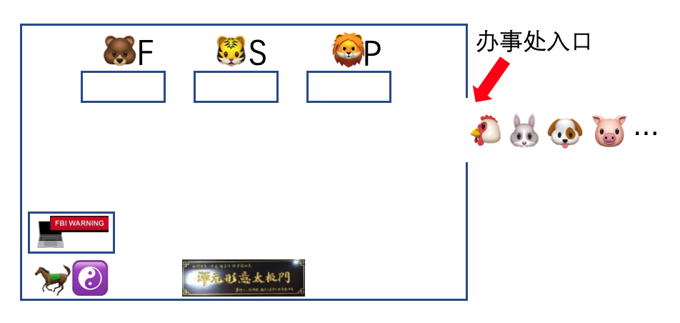
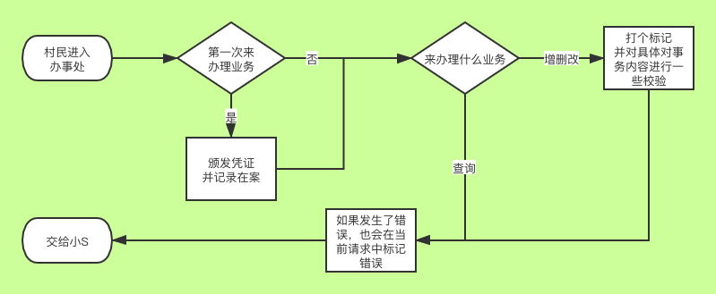
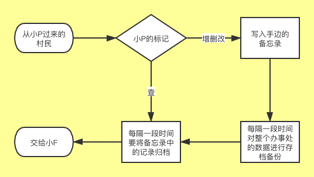
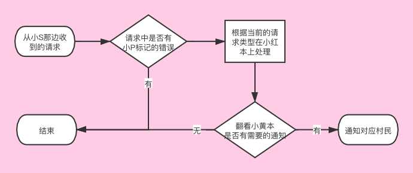
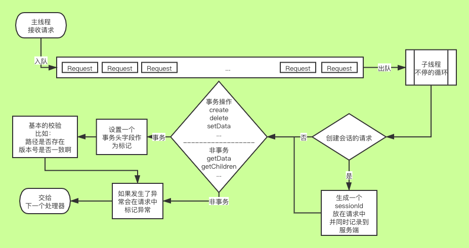
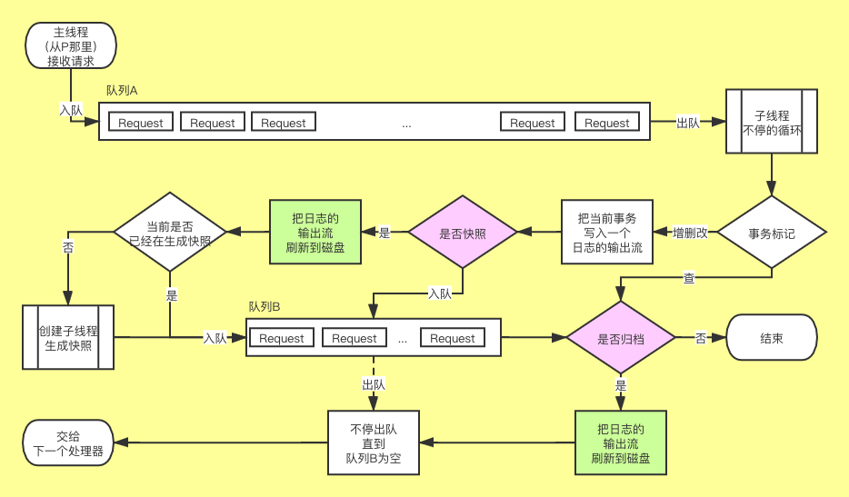
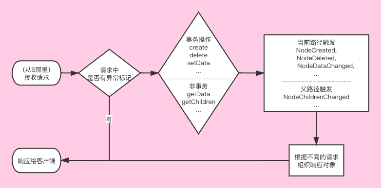

# 你见过这么井井有条的流水线吗

Hi，这里是 HelloGitHub 推出的 HelloZooKeeper 系列，**免费开源、有趣、入门级的 ZooKeeper 教程**，面向有编程基础的新手。

本系列教程是**从零开始**讲解 ZooKeeper，内容从**最基础的安装使用到背后原理和源码的讲解**，整个系列希望通过有趣文字、诙谐的气氛中让 ZK 的知识“钻”进你聪明的大脑。本教程是开放式：开源、协作，所以不管你是新手还是老司机，我们都希望你可以**加入到本教程的贡献中，一起让这个教程变得更好**：

- 新手：参与修改文中的错字、病句、拼写、排版等问题
- 使用者：参与到内容的讨论和问题解答、帮助其他人的事情
- 老司机：参与到文章的编写中，让你的名字出现在作者一栏

> 项目地址：https://github.com/HelloGitHub-Team/HelloZooKeeper

从今天这篇开始，开始进入 ZK 的原理讲解了，我会尽量把背后的原理比喻的有趣点的，大家放心看下去吧！今天讲的是**单机版业务处理流程**。

## 一、办事处的新同事

老规矩～我们继续来看看动物村又发生了什么事情吧？

### 1.1 马果果要做老板啦

**马果果**毕竟年纪大了，每天接待这么多村民，实在是吃不消了，最终决定向村委会申请下能不能多招几个人，让他也能过过当老板的瘾。村委会考虑再三最终还是同意了，并且决定由**马果果**自己去邻里街坊找合适的人拉来工作。**马果果**一直非常注重体育锻炼，所以三天两头泡在健身房里，于是开始在健身房里物色人选，最终选了三个身强体壮的年轻小伙，并且连昵称都给他们起好了，一个 80 多公斤叫**小P**，一个 90 多公斤叫**小S**，最后一个 200 斤叫**小F**！

我起名的时候为了加深大家的印象才用了这三个名字：

- **小P**对应代码中的 `PrepRequestProcessor` 
- **小S**对应代码中的 `SyncRequestProcessor`
- **小F**对应代码中的 `FinalRequestProcessor`

招人完成后，把办公室的布置也换下，变成了这样：

**马果果**现在高枕无忧在后方当管理者了，前面的工作都交接给了三个小伙，三个小伙各自工作也比较简单，我们一个个来看吧

### 1.2 细心的小P(Prep)

作为办事处第一个被村民接触到的员工，**小P(Prep)**先会对要来处理事务的村民进行检查并做一些简单的询问：

这里必须得提下，如果出现了异常错误，**小P(Prep)**不会终止对该村民的服务，也会继续引导他至**小S(Sync)**的柜台继续办理

### 1.3 认真的小S(Sync)

**小S(Sync)**的工作也非常简单，我们直接来看下流程图：

**小S(Sync)**是办事处的记录员，一直手边备着一本备忘录：

这本备忘录不需要去管是谁来登记的只需要把登记具体的内容（甚至是**小P(Prep)**标记的异常）给记录下来就行，之后每过一段时间统一进行归档。

### 1.4 能干的小F(Final)

**小F(Final)**作为曾经的大力士和**马果果**是有切磋过的，并且以微弱的优势输给了**马果果**，但是大度的**小F(Final)**并没有把这些陈年旧事放在心中，仍然心甘情愿的来**马果果**手下帮忙，真是一位受人尊敬的好同志啊！

**小S(Sync)**这边每次归档完就会把那些事务一起交给**小F(Final)**，而作为办事处坐在最后一位的业务员，**小F(Final)**手中握有**马果果**交给他的两个核心文件：小红本和小黄本！

需要把村民的请求认认真真的记录在小红本上，同时还需要查看是否有需要通知的村民在小黄本上，代替**马果果**对他们进行电话通知。

看起来**小F(Final)**做的事很少，但是实际是最多的，只是我这里把小红本和小黄本的逻辑给简单化了，小红本和小黄本我之后单独开篇讲解，这样又能水一期。

---

## 二、井井有条的背后

小故事讲完了，下面用猿话进行翻译：

在服务端启动的时候，就会把这三个处理器按照 P(Prep) -> S(Sync) -> F(Final) 的顺序串成一个链条，并且 P(Prep) 和 S(Sync) 本身就是一个线程对象，两者会随着服务端的启动而启动。

而 P(Prep) 和 S(Sync) 启动后各自都会使用一个死循环来处理主要的逻辑，而这部分 ZK 又会使用一个非常经典的模式来处理：生产者和消费者模式！他们各自都维护了一个阻塞队列，将接收请求和处理请求的逻辑拆开，从这个设计上就提升了吞吐量和性能。

其实不光光是这里，在 ZK 中这个模式可谓是随处可见，之后有遇到的时候会再说，我们现在把三个处理器的处理逻辑再深挖一下。

### 2.1 PrepRequestProcessor

从流程上可以看到，PrepRequestProcessor 不涉及内存的操作和文件的操作，作为第一个处理器主要负责做些校验和标记的任务。

### 2.2 SyncRequestProcessor

这里需要额外的提一下，流程中的两个粉红色的框，分别对是否快照和是否归档进行了判断：

- 是否快照：事务记录的数量或者大小大于了某一个程度，而这个程度的数字则是一个随机数（每次快照完都会重置）
- 是否归档：上次归档的时间和当前时间是否超过了配置的间隔时间（默认该配置为 0），或者事务的记录超过了配置的数量（默认为 1000）

使用了这两个判断控制了快照和归档的频率：

- 频率低的话，一次写入更多数据到磁盘，性能更好，但是容灾能力就低
- 频率高的话，对性能会有一定影响，但是容灾能力强

### 2.3 FinalRequestProcessor

好像这张图和上面那张图其实没什么区别（Orz），就是因为细节都在小红本和小黄本中，所以留到下一章展开。

为什么**小P(Prep)**那边的异常不直接返回给客户端，而要向后传递至**小F(Final)**再响应？我想可能是为了能统一每个处理器的职责，客户端的响应都是**小F**来处理的。

在这里我小小的剧透下，以上的场景实际是 ZK 单机版的处理场景，如果换成了集群版会在该链条中加入更多的处理器，之后会涉及到集群后再讲。

## 三、总结

本章节介绍了单机版的 ZK 处理客户端请求的流程，并且通过责任链的方式把不同的逻辑拆分到不同的对象中去处理。下一章我们会正式进入内存模型和通知机制的实现，一起来看看**马果果**手中的两大核心账本到底是怎么记录的吧～

由于本章开始进入了 ZK 的原理讲解，一篇文章以及我个人很难做到面面俱到，所以如果你有任何对文章中的疑问也可以是建议或者是对 ZK 原理部分的疑问，可以来我创建的话题中来讨论，方便记录和答疑：

> 地址：https://www.yuque.com/kaixin1002/yla8hz

我会为每一篇文章建立一个话题，这样你就可以在其中讨论，把你的问题困惑描述清楚。

答应我从今天起 ZKr 起来，好吗～

[传送门：4. 内存模型和回调通知](../4/content.md)