# 人多力量大

Hi，这里是 HelloGitHub 推出的 HelloZooKeeper 系列，**免费开源、有趣、入门级的 ZooKeeper 教程**，面向有编程基础的新手。

> ZooKeeper 是 Apache 软件基金会的一个软件项目，它为大型分布式计算提供开源的分布式配置服务、同步服务和命名注册。 ZooKeeper 曾经是 Hadoop 的一个子项目，但现在是一个顶级独立的开源项目。

ZK 在实际开发工作中经常会用见到，算的上是吃饭的家伙了，那可得玩透、用的趁手，要不怎么进阶和升职加薪呢？来和 HelloGitHub 一起学起来吧～

本系列教程是**从零开始**讲解 ZooKeeper，内容从**最基础的安装使用到背后原理和源码的讲解**，整个系列希望通过有趣文字、诙谐的气氛中让 ZK 的知识“钻”进你聪明的大脑。本教程是开放式：开源、协作，所以不管你是新手还是老司机，我们都希望你可以**加入到本教程的贡献中，一起让这个教程变得更好**：

- 新手：参与修改文中的错字、病句、拼写、排版等问题
- 使用者：参与到内容的讨论和问题解答、帮助其他人的事情
- 老司机：参与到文章的编写中，让你的名字出现在作者一栏

> 项目地址：https://github.com/HelloGitHub-Team/HelloZooKeeper

今天开始我们将深入 ZK 集群相关知识～

## 一、为什么需要集群

### 1.1 马果果病了

ZKr～老规矩～

**马果果**毕竟年纪大了，这办事处的事情越来越多，终于有一天扛不住，生病了，住院了，听医生说要休息好几天。办事处负责人不在的话就不能给村民们提供服务了。大家平时也要注意身体啊～

一连好几天都没收到通知的**坤坤**急死了，还有其他非常依赖办事处的村民们都一起跑去村委会投诉了，村委会也很无奈啊，最终商量了下，决定请村里威望同样很高的著名企业家，太极爱好者并且还是村里首富的**马小云**成立第二办事处，地点离原来的办事处也很近，同样负责处理之前**马果果**办事处的事务。**马小云**之前也是办事处的常客，对其中的流程已经是非常清楚了，一直想为人民做实事的他，欣然答应了下来。

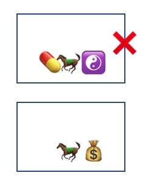

而且已经有了之前的成功经验，所以直接照搬之前的处理流程就行了。但是细心的村民很快就发现了问题，之前在**马果果**的办事处很多已经记录过的事务，现在都消失了，在新的办事处这里需要重新登记，非常不方便，但是**马小云**表示也没办法，**马果果**病得太突然了，还没交接过，只能表示让大家忍忍。

就这样，过了两周，**马果果**痊愈出院了，在住院期间他也已经得知了**马小云**这两周代他帮助村民解决大小事务，他内心非常感激**马小云**所做的一切，热爱工作的他，第一时间就回到了工作岗位，把办事处的大门重新打开，也广播告诉了村民，自己这里又能办理事务了，希望大家可以继续过来。由于**马小云**毕竟业务能力稍差点，处理速度没那么快，导致第二办事处排队更严重了。

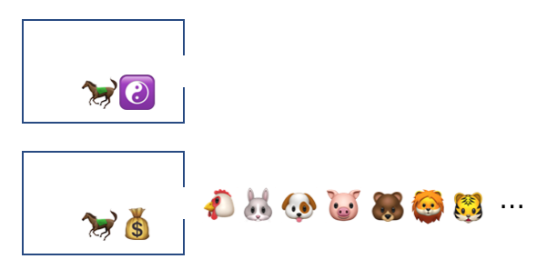

听到第一办事处又开张的村民们非常高兴，毕竟谁也不希望排长队浪费时间，于是都来到了第一办事处

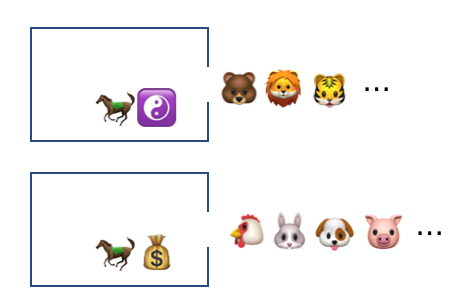

但是呢，**马果果**休息了两周，这两周期间村民的登记的事务，他全部都没有，村民们纷纷表示这不行啊：“我们不管你们有几个办事处，你们得保证数据都是一致的啊！”。村委会也同意村民的诉求，勒令两个办事处整改，需要解决这个问题！而且因为**马果果**资历更老，更有经验，所以让**马小云**一切听**马果果**的指挥，方案也由**马果果**去想办法出台。

### 1.2 马果果的新规定

**马果果**不愧姜还是老的辣，很快就想出了一个好办法，出台了一系列的规则：

- 数据必须以**马果果**为主
- 两个办事处间需要打通联系，随时保持沟通
- 之前把村民前来登记的事务区分成读和写，是非常正确的决定。之后写操作必须通过**马果果**，读操作**马小云**可以自行解决

但是光出台规则还不够，还需要一系列可以落地的操作，于是**马果果**向村委会申请，办事处需要扩招人，村委会决定让**马果果**放手干，同意了他的申请。

**马果果**把自己办公室的布置重新调整了下变成了这样：

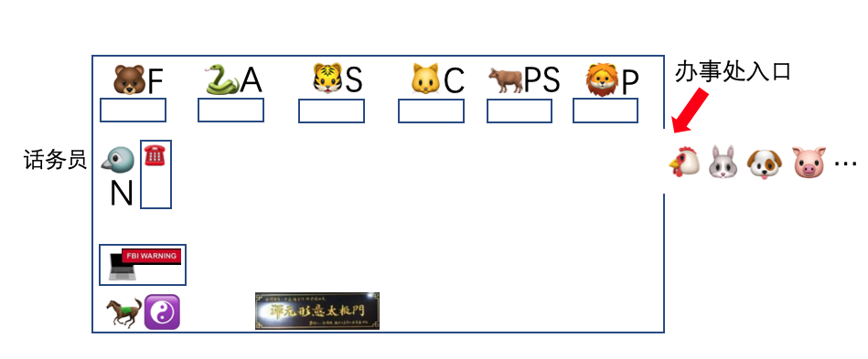

简单介绍下新来的同事们：

- **小PS**负责区分村民的请求是否需要发起提案，并把请求再次转发给**小C**以及**小S**
- **小C**负责管理**小PS**提案的提交工作，这个职位非常重要，所以**马果果**很有私心的请了一个妹子来承担这个职位
- 现在的**小S**不再和**小F**打交道了而是和**小A**打交道，等他归档完后就会通知**小A**
- 因为现在有两个办事处了，所以需要聘请一个话务员，专门负责和隔壁的**马小云**办事处进行沟通

光是安排好自己还不够，**马果果**替**马小云**也设计了一套新的办公室方案：

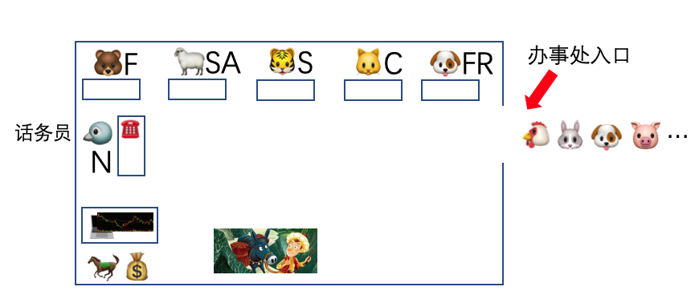

和**马果果**不太一样，这里也简单介绍下：

- 使用**小FR**替换了原来的**小P**作为办事处第一接待人
- **小S**也不和**小F**打交道了，直接和**小SA**打交道，等他归档完就会通知**小SA**
- 和**马果果**一样也聘请了一个话务员负责和**马果果**进行联系

---

原来只有**马果果**负责的一个办事处，随着**马果果**的病倒，村民的业务就无法继续展开了，这就是单点故障，所以在原来的基础上增加一个办事处，可以增加整个办事处的吞吐量的同时也可以在一个办事处无法提供服务时，不至于导致村民们无法使用，这就是高可用。这也是为什么需要集群部署的最重要原因！

## 二、第一办事处

引入了集群前，原本一个节点数据自己内部运作管理就行，非常方便，但是引入集群后，集群间的节点如何沟通成了问题，让我们一起来看看**马果果**的新员工们是怎么做的吧？

不同于之前的单机流程，现在流程复杂了很多，增加了很多出场的人物，为了让大家能快速记忆，我这里提前把名字的由来剧透给大家：

- **小P**对应代码中的 `PrepRequestProcessor` 负责预处理
- **小PS**对应代码中的 `ProposalRequestProcessor` 负责写事务的提案
- **小C**对应代码中的 `CommitProcessor` 负责对事务请求提交
- **小S**对应代码中的 `SyncRequestProcessor` 负责数据的归档
- **小A**对应代码中的 `AckRequestProcessor` 负责告诉**马果果**当前事务的 ACK 信息
- **小F**对应代码中的 `FinalRequestProcessor` 负责对内存模型的操作

### 2.1 负责的小PS

原先**小P**在第一时间询问村民后，并对当次请求进行标记后，就会把该请求转发给**小PS**，**小PS**做的事情也很简单：

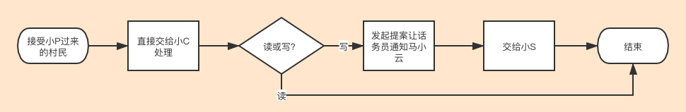

主要就是看是不是写请求，如果是的话就要发起提案并且本地要通知**小S**归档。

### 2.2 忙碌的小C

**小C**是除了**小F**最忙碌的人了，她在接受到上一个同事传递过来的请求后会：

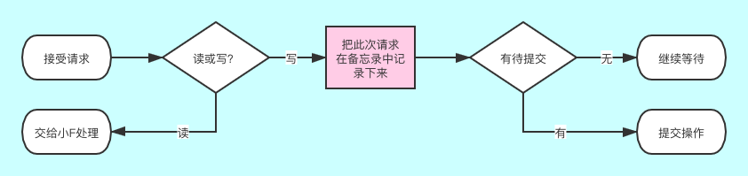

不是说**小C**是最忙的吗？就这？

别急，**小C**的处理过程的确是比较繁琐，但是我这里先给出简单的流程，最重要的提交操作，我暂时不展开，之后会讲～

### 2.3 小S和小A

**小S**处理的流程发生了改变，他前面的同事不再是**小P**，而他处理完归档后也不再把请求交给**小F**而是交给**小A**，而**小A**做的事情更简单，仅仅只是告诉**马果果**办事处此次事务请求归档成功，其实就是 ACK。

### 2.4 话务员

为了更顺畅的和隔壁的**马小云**办事处相互沟通，**马果果**定下了几个暗号，而话务员则负责用暗号去通知**马小云**

- REQUEST
- PROPOSAL
- ACK 
- COMMIT

当然暗号不止这些，之后有遇到再说。

在具体展开流程细节前，我觉得还是要把**马小云**的流程简单介绍下，等两边都介绍完后，再合并在一起讲解～

## 三、第二办事处

同样因为现在有两个办事处的关系，**马小云**也无法单纯使用之前的流程，并且新员工中有明显区别于**马果果**的**小FR**和**小SA**，这里也介绍下：

- **小FR**对应代码中的 `FollowerRequestProcessor` 负责**马小云**这边的预处理
- **小SA**对应代码中的 `SendAckRequestProcessor` 和**马果果**的**小A**类似，通过话务员通知**马果果**当前事务的 ACK

### 3.1 同样细心的小FR和小SA

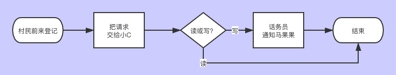

和**小PS**有点类似，也是需要区分读写，但区别是写请求需要通知**马果果**。

**小SA**的逻辑是接受到**小S**的归档信息后，把 ACK 通知给**马果果**，太简单了就不画图了。

## 四、实战

刚刚我们把两个办事处逻辑都大致介绍了下，但是太过于碎片化了和简单，所以下面开始进入实战环节，会分别假定不同的业务场景和复杂程度，从简单到复杂，把从村民来办事处登记事务到办事处处理完成之间的逻辑按照时间顺序进行整理。

*前排提醒，多图预警*

### 4.1 一个读请求（马果果）

假设我们的**坤坤**来到**马果果**的办事处，想要查询**鸡太美**最新的跳舞视频 `/鸡太美/跳舞`

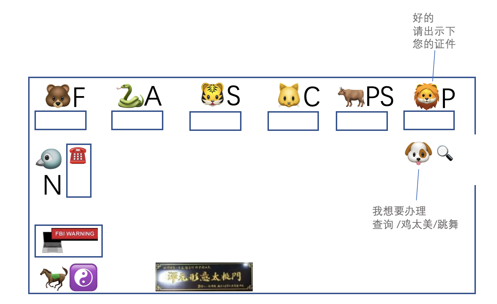

**小P**首先知道**坤坤**是合法的村民，然后询问得知，此次来办事处的目的是为了查询，就会把此次登记标记为读请求，就把**坤坤**的请求交给下一个柜台的**小PS**。

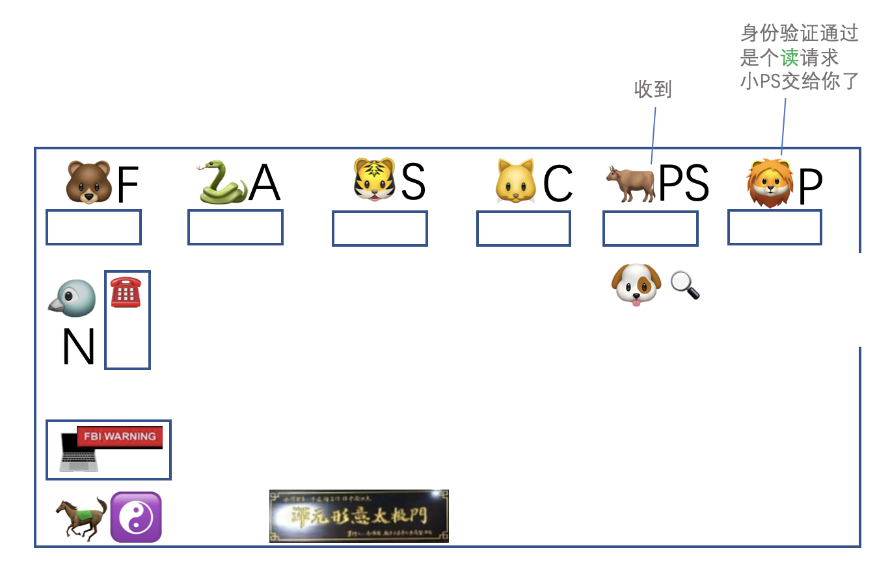

**小PS**拿到请求后，先把请求原封不动的给到了**小C**，之后通过**小P**的标记知道了这是一个读请求，便不做其他处理。

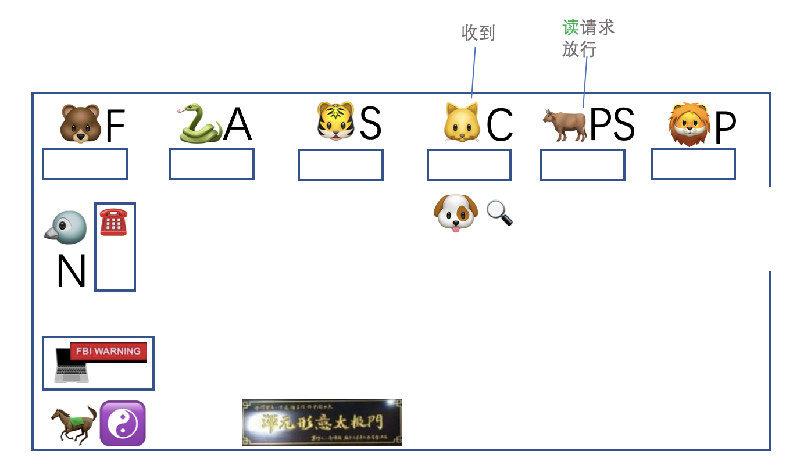

**小C**取到这个请求后也发现这是一个读请求，所以也直接交给了**小F**，自己不需要其他处理。

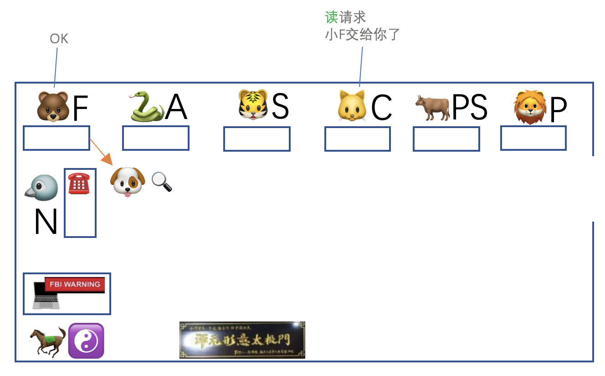

**小F**拿出了小红本查看，假设 `/鸡太美/跳舞` 存在，把对应的数据就返回给了**坤坤**。

**坤坤**拿到了结果心满意足的回去了并且定好了 17 点的闹钟守在电脑前等着**鸡太美**的开播了

---

可以看到一个读请求的处理流程是非常简单的，别急，难度会一点点的增加哦

### 4.2 一个读请求（马小云）

同样还是我们的**坤坤**，但是这次来到**马小云**的办事处，同样想要查询**鸡太美**最新的跳舞视频 `/鸡太美/跳舞`

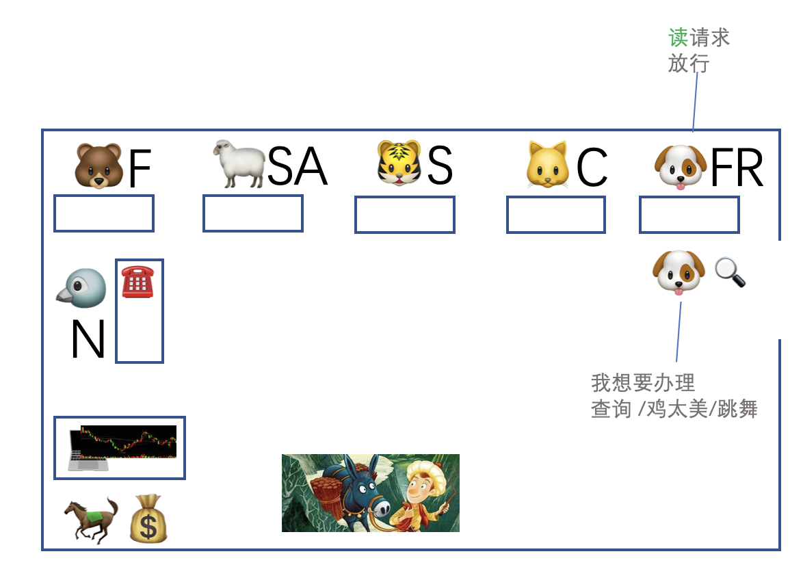

与**马果果**不同的是，先处理**坤坤**请求的是**小FR**，他会先把请求发给**小C**，之后通过询问**坤坤**得知此次目的是查询，就不会做其他处理。你可能会问，**小FR**不需要对**坤坤**的身份进行核实吗？我认为可能是因为当前是读请求所以不会对数据造成破坏，所以并没有做校验。

之后的**小C**和**小F**和**马果果**版本没有任何不同，就不赘述了。让我们进入下一个难度吧。

### 4.3 一个写请求（马果果）

写请求就和读请求不一样了，因为根据**马果果**的规定，两个办事处的数据得保持一致，所以就会涉及到如何通知对方了，让我们一起来看看吧。

假设我们的**坤坤**来到**马果果**的办事处，想要为自己创建一个事务登记 `/坤坤/日记`

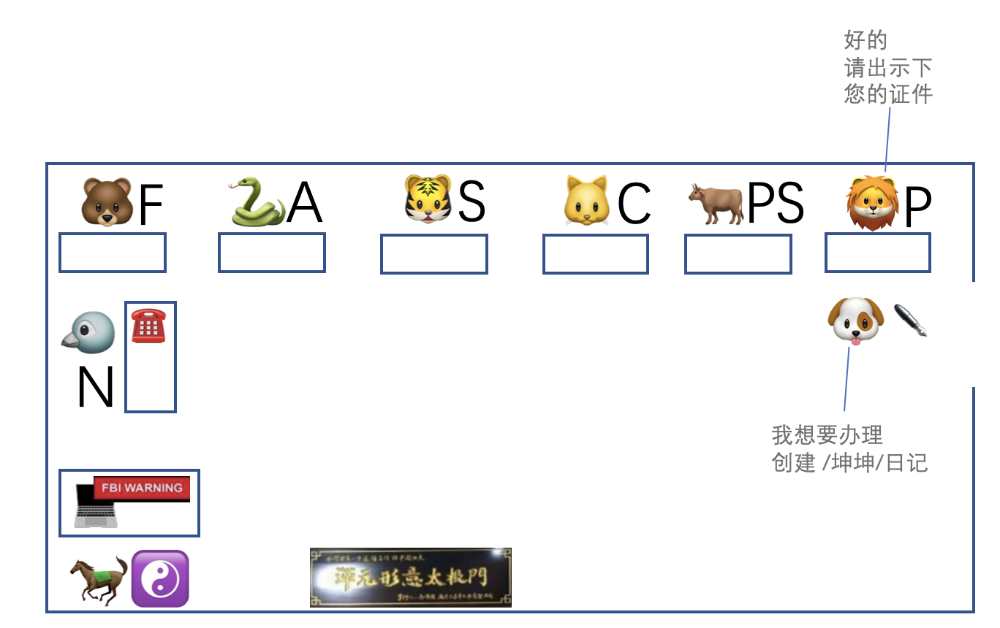

**小P**知道**坤坤**是合法的村民并且**坤坤**此次的目的是写数据，所以就给**坤坤**的请求打了一个写事务的标记，就把请求交给了**小PS**了。

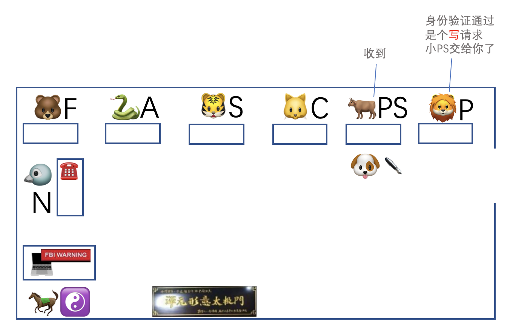

**小PS**还是先把请求交给了**小C**先处理。

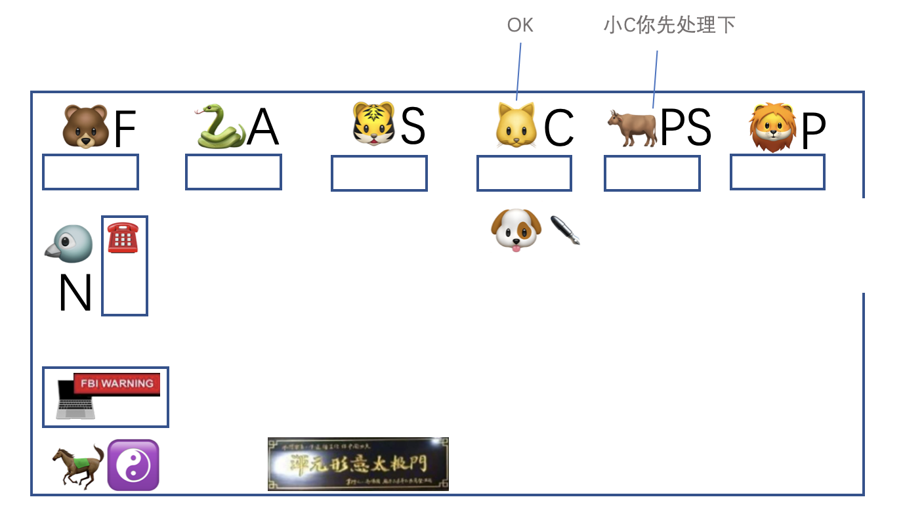

**小C**看到此次是写请求就拿出自己的小本子记了下来

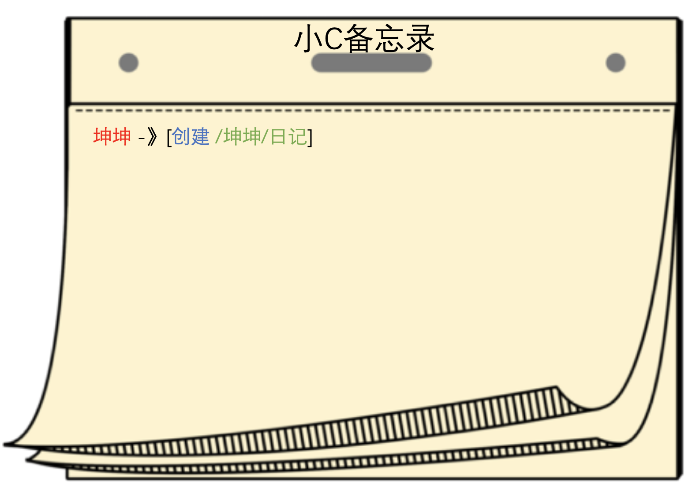

**小PS**已经得知此次是写请求。注意！这里开始就不一样了，**小PS**会让话务员给**马小云**办事处打电话。

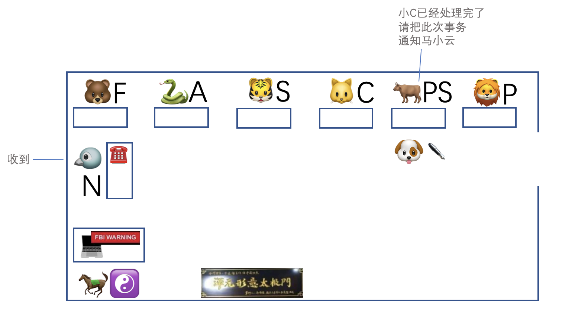

话务员告诉他们这次的请求并带着 PROPOSAL 的暗号。

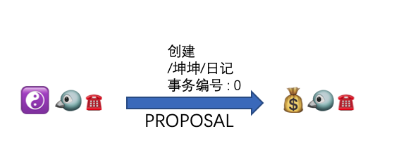

这里必须要提一下事务编号，为了严格保证村民来登记的顺序，**马果果**还规定了必须给每一次的写事务分配一个唯一的递增数字，从 0 开始。

并且通知**马小云**的同时，**马果果**也会把当前的提案记录下来：

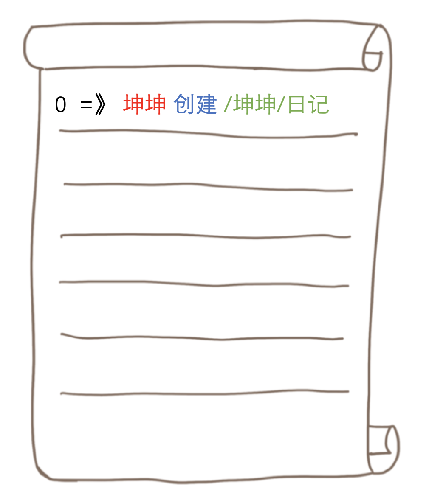

---

这时候我们把视角切换到**马小云**这边，**马小云**的话务员接受到**马果果**那边的 PROPOSAL 的暗号后，会直接让自己这边的**小S**进行归档，**马小云**则会在备忘录里记录：

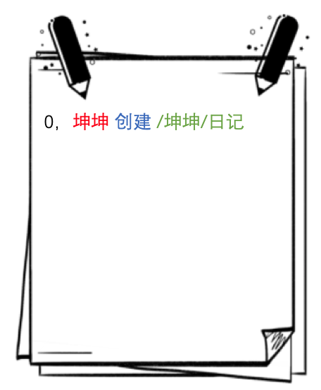

等**小S**归档完后，就会把**坤坤**的请求交给**小SA**

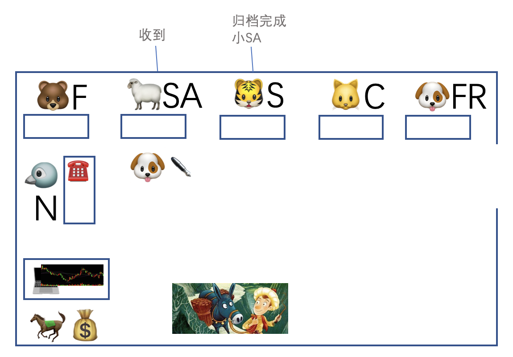

**小SA**事情很简单就是让话务员通知**马果果**归档完成

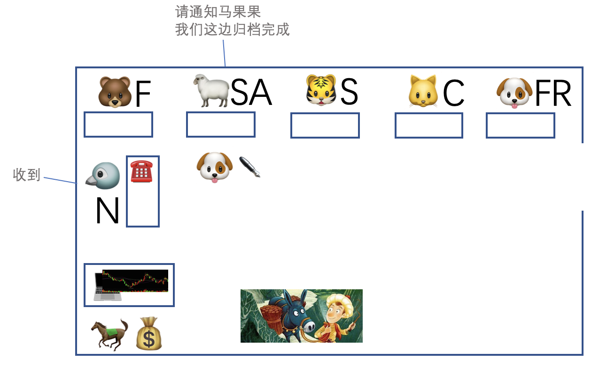

接着**马小云**这边的话务员就会给**马果果**办事处打电话通知他们归档完成

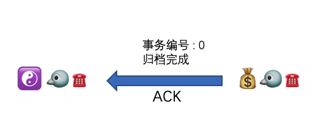

---

视角再一次回到**马果果**这边，在**小PS**让话务员通知**马小云**那边的同时**小S**也没闲着，进行了归档的操作

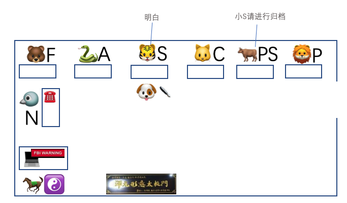

**小S**归档完成后，会把请求交给**小A**，**小A**做的事情很简单就是通知**马果果**此次归档完成。

我们这里假设先是**马果果**这边的**小S**归档完成，**马果果**在收到归档完成消息后会拿出刚刚的小本本找到对应的提案记录，并把已经归档完成的给记下来：

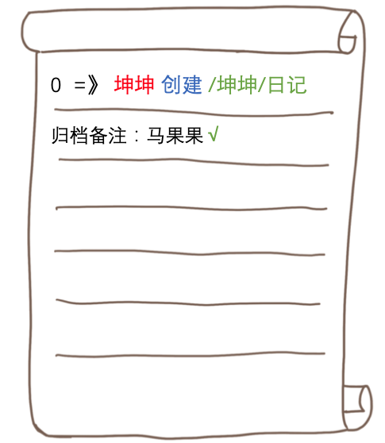

因为**马果果**知道一共有两个办事处，所以还需要等待**马小云**的归档完成通知。

过了一会会，**马小云**的归档通知也来了，就再在小本本上记下来

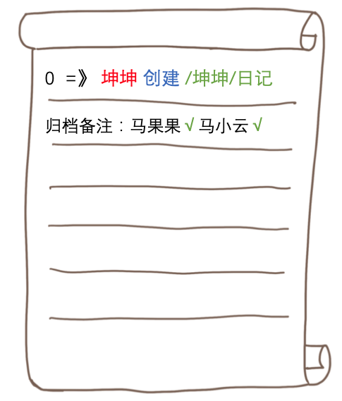

至此，两个办事处对于当前提案都已经完成了归档，**马果果**就会让话务员通知**马小云**可以提交了，并且会将小本本上事务 0 的这条记录删除（图就不画了）。

通知完，**马果果**就让**小C**可以进行提交了

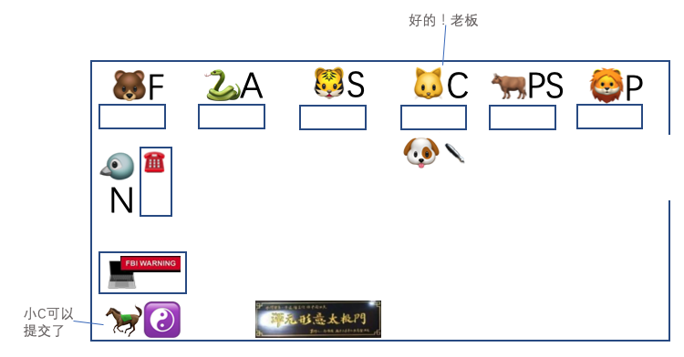

**小C**就会拿出刚刚的备忘录，找到**坤坤**的等待处理的事务的第一条（当前场景只有一条）就是：创建 `/坤坤/日记`。就马上把这个事务交给了**小F**处理

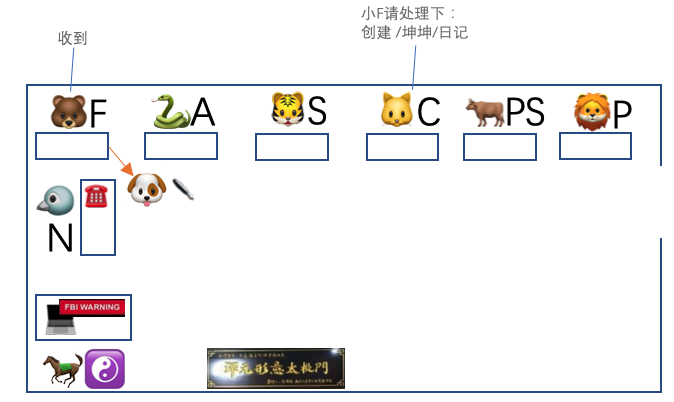

**小F**就会在小红本上把当前事务记录下来：

交给**小F**后，**小C**发现**坤坤的**所有事务都处理完了，就把他从备忘录上删除了：

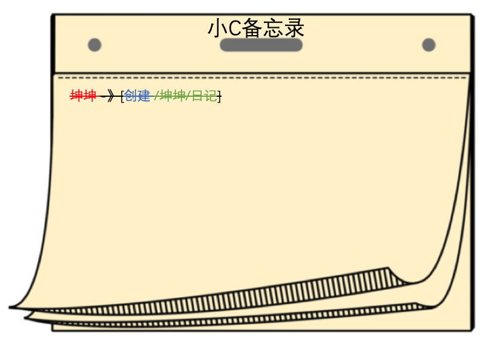

---

让我们把视角再切到**马小云**，**马果果**这边的**小C**在处理的时候，**马小云**的话务员收到了来自**马果果**的 COMMIT 消息并告诉了**马小云**，而**马小云**会从备忘录中找出最早的一条请求就是：坤坤，创建，`/坤坤/日记`，然后就会把该请求交给**小C**

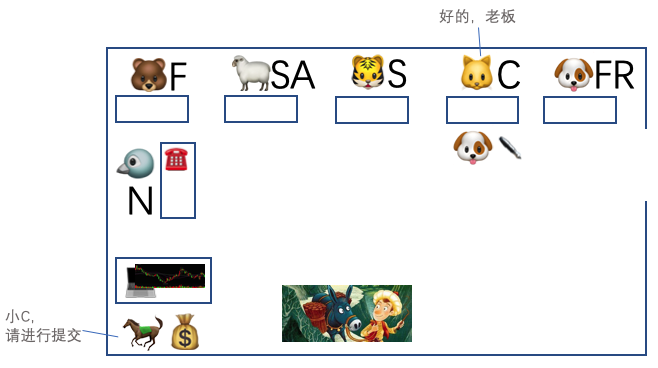

至于之后**小C**处理以及处理完交给**小F**处理，和**马果果**那边的逻辑是一样的，就不赘述了。

至此，一个写请求（**马果果**）的基本流程就算完成了。

### 4.4 一个写请求（马小云）

假设我们的**坤坤**这次来到**马小云**的办事处，同样为自己创建一个事务登记 `/坤坤/日记`

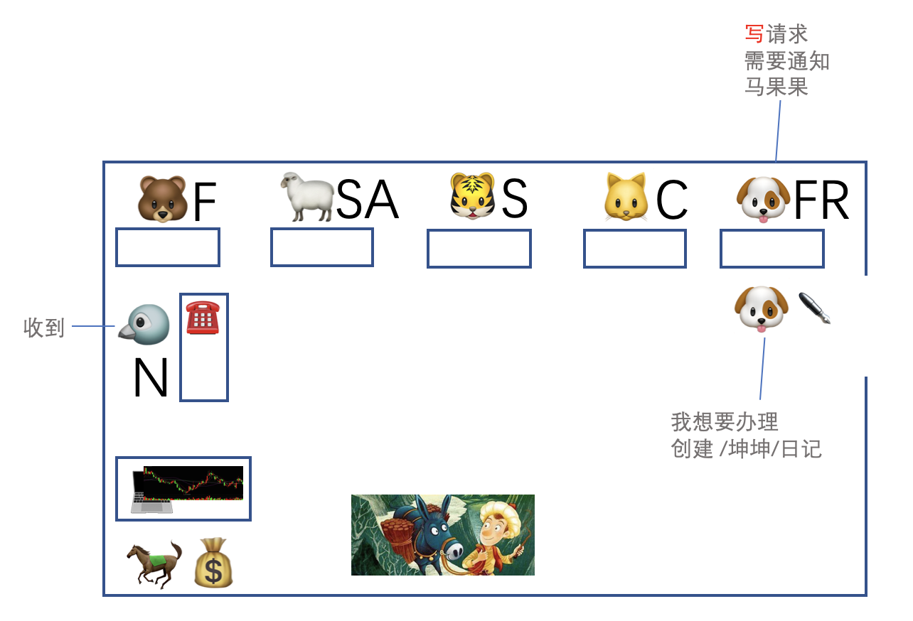

**小FR**先把请求交给了**小C**，然后发现了**坤坤**这次来办理的是写请求，就会要求话务员通知**马果果**。

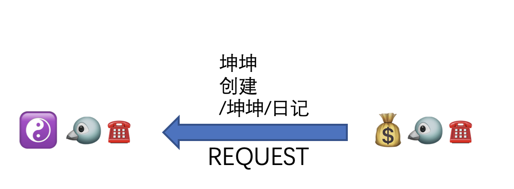

话务员就会打电话给**马果果**办事处，并且告诉他们此次的请求以及携带上 REQUEST 暗号

而**马小云**这边的**小C**会和之前的例子一样，也会在备忘录里记录下

---

现在我们把视角切到**马果果**这边，话务员接受到 REQUEST 的请求后，告诉了**马果果**，而**马果果**会直接把这个请求交给**小P**去处理

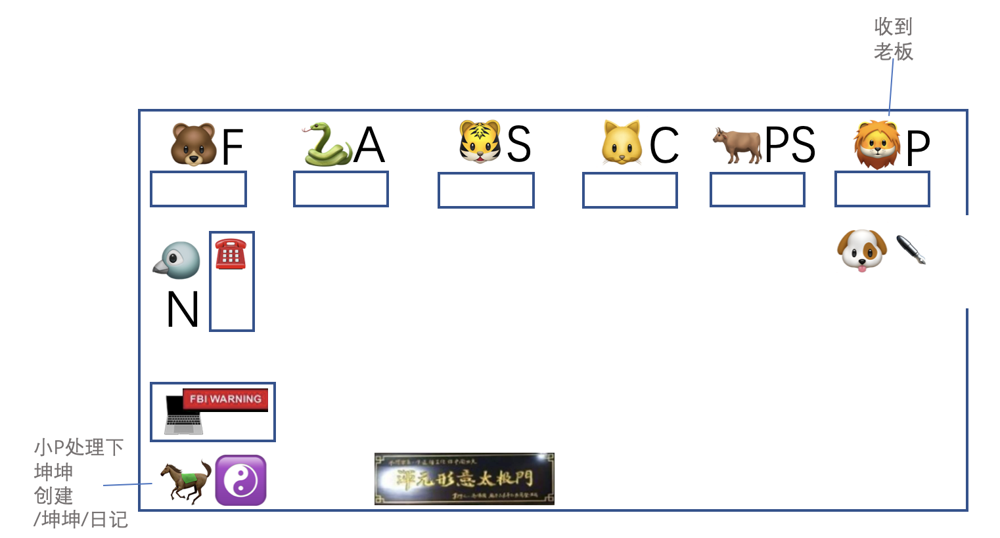

仿佛就是**坤坤**直接来自己办事处办理业务一样，从**小P**之后的流程和之前的例子可以说是一模一样了，就不赘述了。

我现在举了 4 种无并发的场景，除了写请求都很简单，我这里就再把写请求**马果果**重新用图画一遍

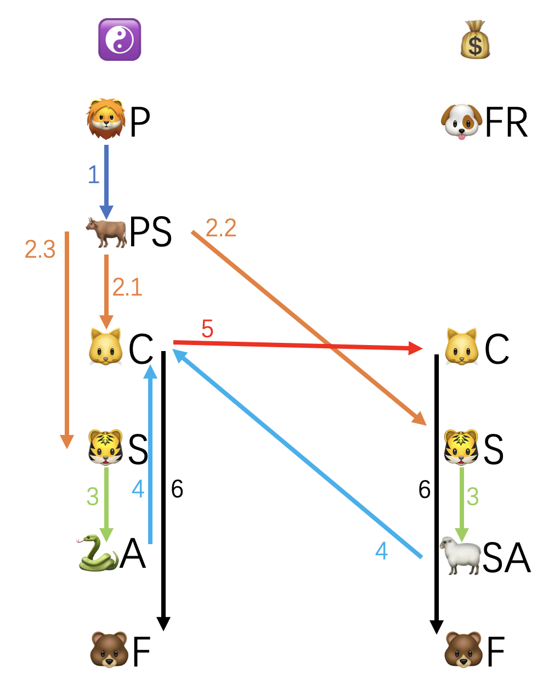

为了简约图中省略了故事中的话务员以及**马果果**和**马小云**，相同颜色代表处于同一时间处理，时间顺序从小到大。

好了，让我们继续提升难度进入并发实战，作为一个公共的办事处是不可能同时只处理一件事务的！

### 4.5 多个村民多种请求

这一章节我不会再从头开始画图了，只画重要的部分，我们先看看，如果有多个村民的话，那几个小本本是怎么记的吧！

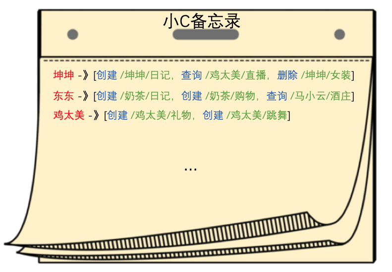

**小C**的备忘录的特点总结：

- 以村民作为 key，之后的请求是按照请求的顺序摆放的队列
- 队列中的第一个请求肯定是写请求，如果是读请求的话，就根本不会记录
- 当村民对应的请求队列为空后，整条记录删除

我们以图中的**坤坤**举例，假设现在等待的请求是这样的（我省略了路径，这里只关心事务的类型）

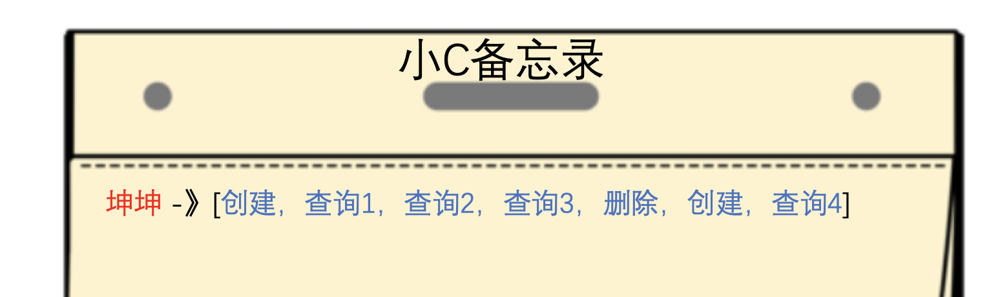

当第一个创建的请求入队后，之后的查询请求也无法被执行，都需要等到创建请求执行完毕后才能继续，所以当第一个创建的请求被提交后，之后的查询1、查询2、查询3会被立马按顺序移除出队列并执行，而查询4则需要等待前面的删除和创建全部提交后才会被执行。

这样的逻辑保证了，同一个客户端的请求是按照时间顺序执行的，不会出现后到的读请求先于前面的写请求执行，造成脏读，但是需要注意的是不同的客户端的顺序是无法保证的，很可能**坤坤**的创建请求还未提交，之后**东东**的查询操作就能被返回了。

---

**马果果**的小本本如果有多条记录的话就是这样

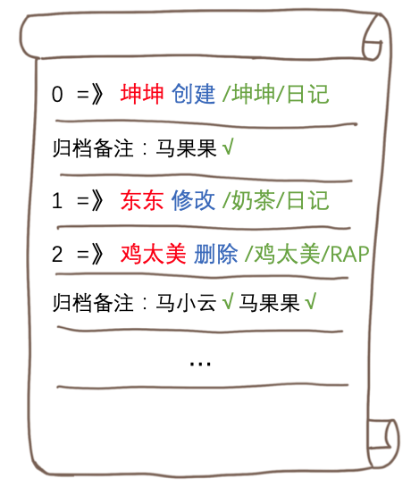

你可能会问：**鸡太美**的那条记录不是归档完成了吗，为什么还在小本本里？因为 ZK 必须保证事务执行的顺序！所以只要有比当前事务编号小的其他事务仍然未提交，本事务就不能提交，图里就是**鸡太美**必须等到**坤坤**和**东东**都提交完才能进行提交！

---

**马小云**这边也有一个备忘录，如果有多条记录的话会是这样：

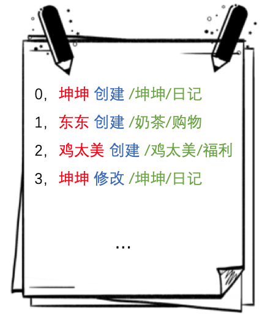

这个备忘录其实是一个先进先出的队列，每次**马小云**的提交会从队列中移除最前面的一条记录来操作。

---

故事差不多讲完了，有些细节用程序员的语言再说一下，我其实省略了两个处理器 ：

- `ToBeAppliedRequestProcessor`这个处理器在**马果果**这边才是紧接着**小C**的，但是我个人感觉下来没什么用就不讲了，大家有兴趣可以去了解下
- `LeaderRequestProcessor` 这个处理器才是**马果果**的第一个处理器，他的逻辑涉及到会话、ACL，其他就没什么用，留到之后有机会讲

大家先看下这个图：

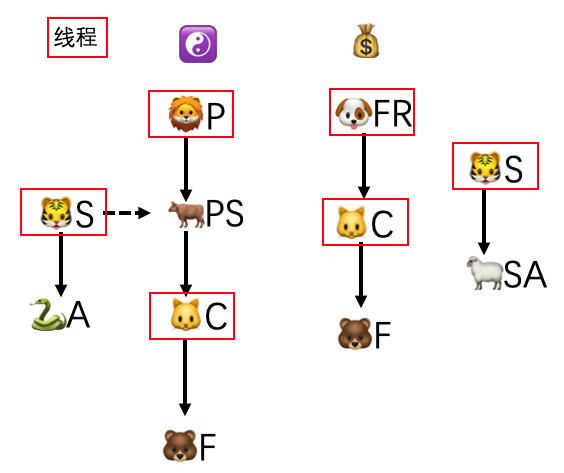

用红框标记的都是线程对象，主要逻辑都在 `run` 方法中，**小P**和**小S**我们之前就讲过了，这里就多了**小C**和**小FR**。这里我得提一下，但凡你们只要在 ZK 中看到线程对象，那么他基本上是使用了生产者-消费者的模型，对象内部维护了一个阻塞队列，我这次就不画图了，因为重要的逻辑之前都已经讲了。

画了这么多图，这里先进行下小结：

- **马果果**就是我们平时在 ZK 中听到的 Leader 节点，负责对写事务请求发起提案并最终决定提交
- **马小云**对应就是 ZK 中的 Follower，只能独自处理读请求，写请求需要转发给 Leader 去处理
- 读请求无论客户端请求给哪个服务端的节点，处理流程都相对简单，可能几乎不需要节点之间的通信，自己就能处理（前提是没有待处理的写请求）
- 写请求如果客户端请求到的是 Leader， Leader 就会对此次事务请求在集群中发起提案，接受到提案的 Follower 各自进行归档，并返回给 Leader 成功的 ACK 信息，Leader 对 ACK 进行统计，达到集群数量半数以上就集群中发起 COMMIT 请求，Follower 们接收到提交请求后，才会修改各自内存中的数据
- 写请求如果客户端请求到的是 Follower，Follower 在本地做简单记录后就会把请求转发给 Leader 去处理，之后和上一条是一样的情况
- 分布式事务的理论中是有回滚阶段的，当集群中的节点本地提交失败后，会通知 Leader 失败信息，而 Leader 统计 ACK 之后发现本次事务无法提交就会发送回滚的请求给各个节点。但是！很遗憾我并没有在 ZK 的源码中找到和事务回滚有关的逻辑（当然也很有可能是我疏忽了，如果你知道逻辑在哪儿的话，请一定告诉我），我现在的认为**小S**处理归档的时候是不允许失败的，如果失败报错了，整个服务节点会报错退出

## 五、剧透

在本篇文章的最后，我们再看看动物村又发生了哪些故事吧。

**马果果**毕竟年事已高，需要定期去医院进行体检，就会耽误办事处这边的工作，而渐渐的随着时间的推移，**马小云**的业务能力越来越强了，心里就产生了：凭什么我要听这老头的？于是主动向村委会提议，建议 Leader 的人选要进行选举，不能就一直让**马果果**占着这个位子，村委会听后也觉得很有道理，于是拉来**马果果**一起商量，**马果果**肯定不能同意啊，但是无奈**马小云**毕竟是首富，很快就通过上下打点让村委会一致通过了这个建议

但是现在只有两个办事处，如果双方各执一词，就平票了，所以村委会再次经过商量决定引入第三个办事处，这个新办事处的负责人选择了村里的著名企业家**马小腾**，这样就不会出现平票的情况，具体选举规则如下：

- 每天三个办事处开张前必须要先投票选出一个 Leader
- Leader 必须是经手处理过事务编号最大的
- 需要各个办事处半数以上的同意
- 一切以 Leader 为主，读写请求遵守之前**马果果**的定下的流程
- 当 Leader 无法处理事务的时候，需要立即选出新的 Leader，选出之前办事处不能对外提供服务

所以现在有了三个办事处成了这样

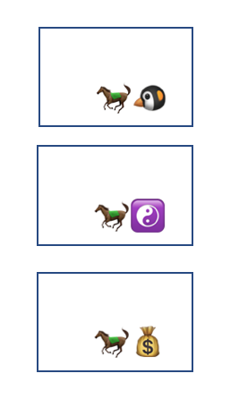

---

所以下一篇的主题大家应该知道了吧～就是：选举！会讲讲 ZK 集群是如何选举出 Leader。敬请期待吧～

老规矩，如果你有任何对文章中的疑问也可以是建议或者是对 ZK 原理部分的疑问，欢迎来仓库中提 issue 给我们，或者来语雀话题讨论。

> 地址：https://www.yuque.com/kaixin1002/yla8hz 

老哥们转评赞安排一下好吗，ZKr～

