# 谁才是老大

Hi，这里是 HelloGitHub 推出的 HelloZooKeeper 系列，**免费开源、有趣、入门级的 ZooKeeper 教程**，面向有编程基础的新手。

> ZooKeeper 是 Apache 软件基金会的一个软件项目，它为大型分布式计算提供开源的分布式配置服务、同步服务和命名注册。 ZooKeeper 曾经是 Hadoop 的一个子项目，但现在是一个顶级独立的开源项目。

ZK 在实际开发工作中经常会用见到，算的上是吃饭的家伙了，那可得玩透、用的趁手，要不怎么进阶和升职加薪呢？来和 HelloGitHub 一起学起来吧～

本系列教程是**从零开始**讲解 ZooKeeper，内容从**最基础的安装使用到背后原理和源码的讲解**，整个系列希望通过有趣文字、诙谐的气氛中让 ZK 的知识“钻”进你聪明的大脑。本教程是开放式：开源、协作，所以不管你是新手还是老司机，我们都希望你可以**加入到本教程的贡献中，一起让这个教程变得更好**：

- 新手：参与修改文中的错字、病句、拼写、排版等问题
- 使用者：参与到内容的讨论和问题解答、帮助其他人的事情
- 老司机：参与到文章的编写中，让你的名字出现在作者一栏

> 项目地址：https://github.com/HelloGitHub-Team/HelloZooKeeper

今天开始我们将继续深入 ZK 选举相关的知识

## 一、选举的基本规则

这次我决定一反常态，先不讲故事了～先得聊聊在 ZK 选举中非常重要的一些东西。

### 1.1 zxid

zxid 就是我们之前提到的事务编号，是一个 8 字节的整型数字，但是 ZK 设计的时候把这一个数字拆成了两部分使用，一鱼两吃！

8 个字节的整数一共有 64 位长度，前 32 位用来记录 epoch，后 32 位就是用来计数。你可能要问了？ epoch？是啥？


zxid 初始化是 0，也就是这样

```
00000000000000000000000000000000 00000000000000000000000000000000
```

每一次写请求都会增加后 32 位，假设现在进行了 10 次写请求（无论该请求有没有真的修改到数据），zxid 就会变成这样

```
00000000000000000000000000000000 00000000000000000000000000001010
```

当进行一次选举的时候，前 32 位就会增加 1，并且清零后 32 位

```
00000000000000000000000000000001 00000000000000000000000000000000
```

除了选举以外，当后 32 位彻底用完（变成全 1，也就是 ZK 正常执行了 2^32 - 1 次写请求都没进行过一次选举，牛逼！）也会让前 32 位增加 1，相当于进位

```
# 进位前
00000000000000000000000000000000 11111111111111111111111111111111
# 进位后
00000000000000000000000000000001 00000000000000000000000000000000
```

到这里我就可以回答大家前面的问题了，epoch 就是 zxid 前 32 位的这个数字，epoch 本身的翻译是“纪元，时代”的意思，意味着更新换代，而 zxid 的后 32 位数字仅仅是写请求的计数罢了

### 1.2 myid

在之前的小故事里，我给 ZK 的集群中的各个节点都起了一个好记的名字（神特么好记！）。但是 ZK 官方自己是如何给每一个集群中的节点起名字的呢？用的就是 myid！

ZK 的启动配置 `zoo.cfg` 中有一项 `dataDir` 指定了数据存放的路径（默认是 `/tmp/zookeeper`)，在此路径下新建一个文本文件，命名为 `myid`， 文本内容就是一个数字，这个数字就是当前节点的 myid

```
/tmp
└── zookeeper
    ├── myid
    └── ...
```

然后在 `zoo.cfg` 是这样配置集群信息

```
server.1=zoo1:2888:3888
server.2=zoo2:2888:3888
server.3=zoo3:2888:3888
```

这个 `server.` 之后的数字就是 myid，这个 myid 在整个集群中，各个节点之间是不能重复的。我忘记之前在哪儿看到的了，说是 myid 只能是 1 到 255 的数字，我一直信以为真，直到这次，我本着严谨的态度去做了实践，一切以事实为主，并且我的实验覆盖了 3.4、3.5、3.6 三大版本（都是三台机器的简单集群），结论是：myid 只要是不等于 -1 就行（-1 是一个固定的值会导致当前节点启动报错），不能大于 `Long.MAX_VALUE` 或者小于 `Long.MIN_VALUE`，但是如果在当前的节点中配置了 `zookeeper.extendedTypesEnabled=true` 那当前节点的最大 myid 是 254（负数不影响，我也不知道这个 254 的用意，但是代码中的确有判断） 是不是奇怪的知识又增加了呢～

关于配置更多的信息，之后单独再整理，今天就点到为止


## 1.3 选举规则

知道了上面这些有什么用呢？非常重要！因为选举 Leader 完全看的就是这几个值

- epoch
- 写请求次数
- myid

优先级从上到下逐级比较，谁大谁就更有资格成为 Leader，当前级一样就比较下一级，直到分出胜负为止！因为 myid 是不能重复的，所以最终是一定能分出胜负的！

好了，现在大家知道了最基本的选举规则了～让我们进入下一节吧

## 二、三马之争

**马果果**一定想不到，这辈子自己可以和两位鼎鼎大名的明星企业家相提并论，让我们一起去看看发生了什么吧～

### 2.1 准备开工

之前**马果果**规定了三个办事处在对外开张前必须选出一个 Leader，在正式开始选之前，每一个办事处也有一些准备工作需要做：

- 每一个办事处必须得知道一共有多少个办事处
- 额外聘请一些专门负责和其他办事处沟通的话务员
- 准备好一个票箱用来对投票统计和归票
- 为每一个办事处设置一个固定的 myid

所以现在办公室的布置变成了这样（我省略了之前章节的其他要素）：

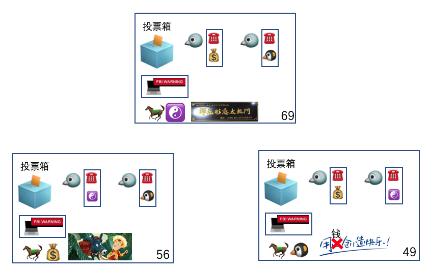


有了这些准备工作以后所有办事处都可以进入选举的阶段了，并且村委会规定了几种状态用于表示当前办事处正处在的阶段：

- LOOKING，正在寻找 Leader，处于此阶段的办事处不能对外提供服务
- LEADING，当前办事处就是 Leader，可以对外提供服务
- FOLLOWING，当前办事处正在跟随 Leader，可以对外提供服务

很明显刚刚准备好的各个办事处现在都处于 LOOKING 状态，下面让我们正式进入选举流程吧

### 2.2 开始选举

由于各个办事处刚准备好，所以彼此之间还没有通过信，又加上大家都是姓马的，心里面都是想当老大的，所以每一个办事都会率先拟一张写着自己的选票发给其他办事处。主要有这些信息：

- sid：我是谁
- leader：我选谁
- state：我当前的状态
- epoch：我当前的 epoch
- zxid：我选择的 leader 的最大的事务编号

以**马果果**举例：

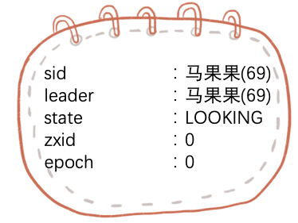

**马小云**和**马小腾**也一样，一开始都选了自己做 Leader 候选人，并且都把自己认为的候选人（当前场景下就是自己）的票分别发送给了其他两位（以及自己）

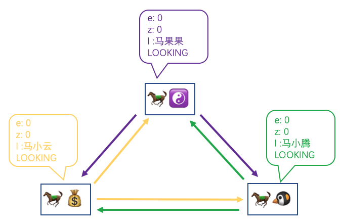

#### 2.2.1 马果果视角

每个办事处各自也会收到来自其他办事处的选票（也有可能是自己的），每拿到一张选票，都需要和当前自己认为的 Leader 候选人做比较，理论上自己投给自己的选票会先一步达到自己的票箱，因为不需要经过通讯减少了传输的路径，自己的选票和自己的候选人是一致的所以不需要比较，只需要在票箱中记上一笔，我们还是以**马果果**举例：

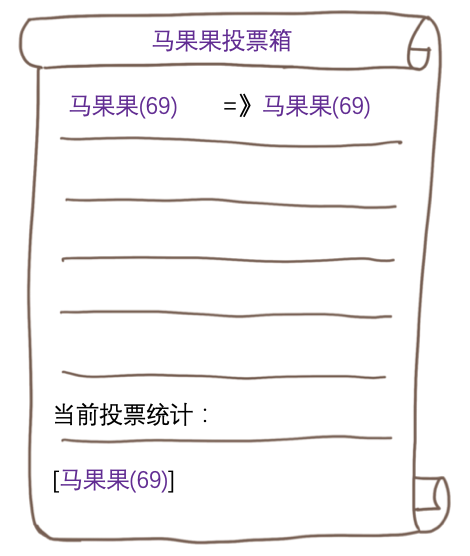

`=》`的左边是办事处的名字，右边是该办事处选的 Leader。当前投票统计是指，当前节点所选的 Leader 获得的选票统计。

假设他再收到了**马小云**的选票：

- **马果果**首先看到的是**马小云**也处在 LOOKING 状态
- 接着就会比较自己候选人和**马小云**的选票（左边代表当前办事处的候选人，右边代表收到的选票信息，下同）

```
e:0						==		e:0
z:0 					==		z:0
l: 马果果(69)	> 		l: 马小云(56)
```

最终因为**马果果**的 myid 69 要比**马小云**的 myid 56 要大，所以**马果果**最终胜出！虽然**马小云**胜出了，但是当前投票统计是不能修改的，因为**马小云**这一轮的选票就是选的**马小云**，需要等待他重新改票后再投才能修改投票统计。

之后会往投票箱记录：

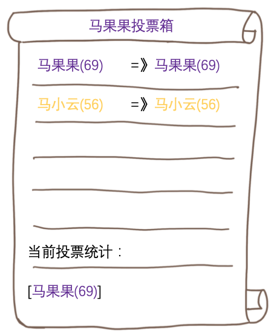

紧接着是**马小腾**的投票：

```
e:0						==		e:0
z:0 					==		z:0
l: 马果果(69)	> 		l: 马小腾(49)
```

**马果果**还是胜出！

记录投票箱：

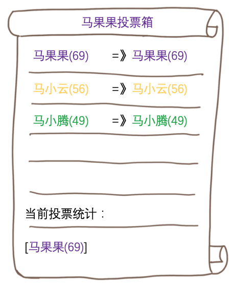

每次收到投票的时候，**马果果**都会依据当前的投票统计进行归票，但是很遗憾选举仍然无法结束，因为结束的规则必须有某一个办事处获得半数以上的选票，现在只有一个**马果果**自己的选票，不满足半数以上，所以马果果只能再等等了。

而在**马果果**这边忙的热火朝天的同时，**马小云**和**马小腾**也在进行着同样的动作。

#### 2.2.2 马小云视角

我们这省略描述**马小云**记录自己选票的过程，假设他这边是先收到**马果果**的选票，是怎么处理的呢？

```
e:0						==		e:0
z:0 					==		z:0
l: 马小云(56)	< 		l: 马果果(69)
```

**马小云**看到自己认为的 Leader 候选人被**马果果**的选票击败了，所以将自己的候选人改为**马果果**，并将新的选票重新广播出去

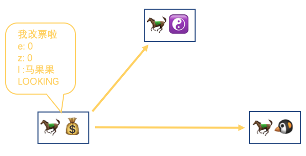

然后在自己的投票箱中记录：

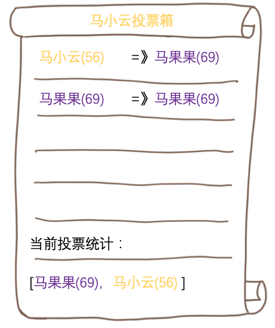

为了叙述的完整性，我们还是把**马小腾**的票也看完

```
e:0						==		e:0
z:0 					==		z:0
l: 马果果(69)	> 		l: 马小腾(49)
```

**马果果**还是胜出了，所以**马小云**的投票箱最终变成这样：

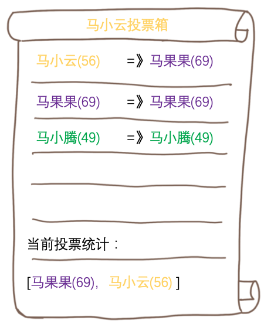

讲道理接下来应该以**马小腾**为主视角，再讲一遍刚才的过程，但是可以认为几乎和**马小云**是一样的，为了故事的顺畅，我们需要回到**马果果**的视角，因为**马小云**输给**马果果**之后改票了，又发了一轮选票

#### 2.2.3 马果果视角（再）

**马果果**又再一次收到了**马小云**的选票（改票后），投票箱就会改成这样：

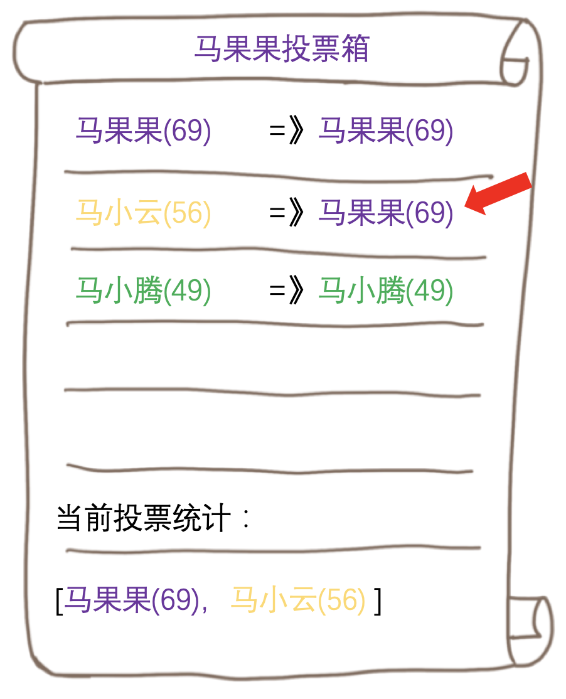

收到这个投票后，当前投票统计就会增加**马小云**的记录，然后**马果果**进行归票就发现了这次自己的选票超过半数了，然后会进行二次确认，会等待一会看看还能不能收到更新的选票，这里假设没有收到更新的投票，就会进行判断，当前过半数的候选人是不是自己？如果是的话，那自己就是 Leader，不是的话，自己就是 Follower。

很明显，**马果果**就是 Leader，然后会把自己的状态修改为 LEADING。

与此同时，**马小云**、**马小腾**也进行归票，归票结果自己为 Follower，把自己状态修改为 FOLLOWING，然后各自都会和 Leader 进行数据的同步，同步完成之后整个办事处就都可以对外提供服务了。

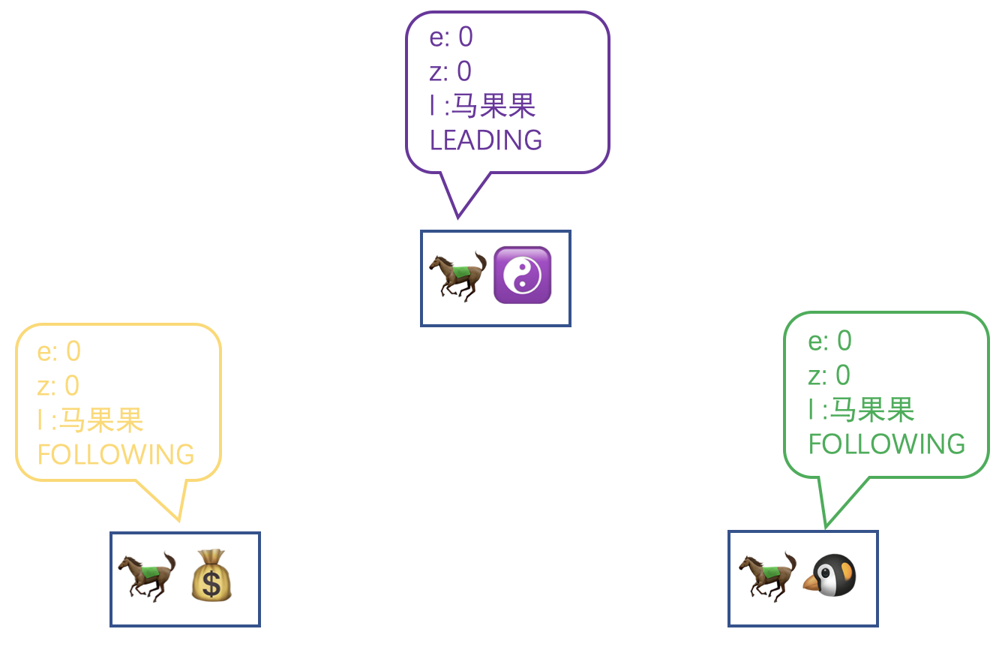

### 2.3 马小腾停电啦

选举本身涉及到集群间的通信、节点自身的状态管理和状态变更，本身就是一个比较复杂的过程，刚才只是举例了一个最简单的启动选举流程，下面会举更多的例子帮助大家能理解整个选举的逻辑。

现在假设办事处安然无恙得对外提供了一段时间服务后，**马小腾**的办事处突然停电了，就不能和另外两马进行通讯了，而另外两马在一段时间内都没有收到过**马小腾**的信息的时候就知道，出事了！但是各自盘点了下目前仍然还有两个办事处可以对外提供服务，是达到整个集群总数的半数以上的，是可以继续让村民们来办理业务的，所以现在整个集群变成了这样：

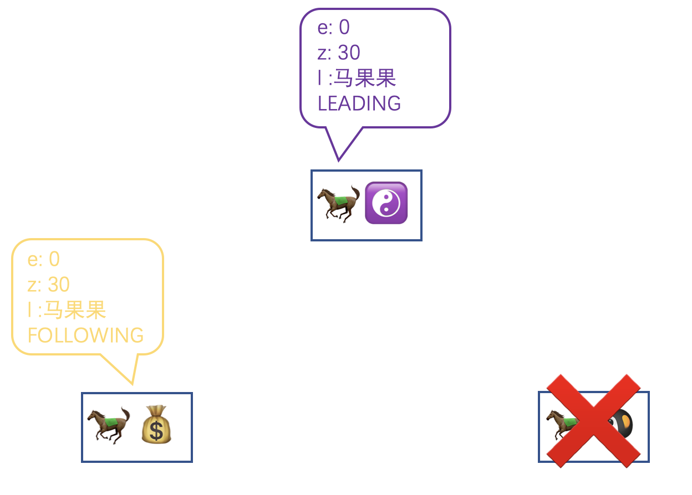

没过一会，因为电力公司的积极抢修，**马小腾**的办事处恢复供电了，重新开张了，但是每一个办事处在开张前都是处在 LOOKING 状态的，还是会优先投票给自己，并会通过复盘本地的存档来得到自己办事处最新的数据，假设**马小腾**停电前是这样：

```
e:0					
z:21 					
l: 马小腾(49)
LOOKING
```

他和之前一样会给另外两个办事处发自己的选票

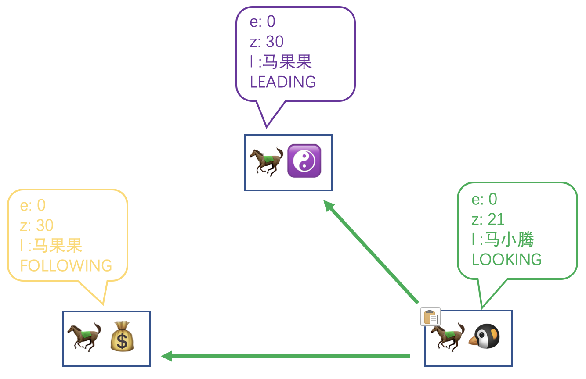

但和之前的情况不同，无论是**马果果**还是**马小云**他们现在都处在工作的状态，收到了**马小腾**的选票后就会把当前的 Leader 也就是**马果果**的选票信息以及自己当前的状态发送给他。

**马果果**发送的选票信息：

```
e:0					
z:30 					
l: 马果果(69)
LEADING
```

**马小云**发送的选票信息：

```
e:0					
z:30 					
l: 马果果(69)
FOLLOWING
```

**马小腾**收到两位的选票信息后，知道了当前的 Leader 是**马果果**，并且**马果果**本人也确认了是 LEADING 状态，就马上把自己的状态修改为了 FOLLOWING 状态，并且会和之前一样与 Leader 进行数据的同步，关于具体怎么同步的，我打算留到之后再进行讲解～

同步之后，**马小腾**的状态变成了和**马小云**一样的了。

---

我再假设这里有一个平行世界，回到**马小腾**刚恢复完供电准备开张上线的时候，此时的**马小腾**的状态假设是这样的：

```
e:1					
z:7 					
l: 马小腾(49)
LOOKING
```

哪怕 epoch 比目前的 Leader 还要大，其实照道理是更有资格当 Leader，但是由于当前集群中的其他办事处已经有了一个明确的 Leader，**马小腾**也只能忍辱负重（谁让你停电了呢）还是以 Follower 的身份加入到集群中来，并且仍然以当前 Leader 的信息来同步，你也可以理解为降级（把自己的 epoch 降级回 0 ）

职场就是这么残忍，你稍微请个长假再回来可能已经是物是人非了～

 

### 2.4 马果果又病啦

**马果果**毕竟年事已高，又又又生病了，办事处只能含泪关门，但是和上一次**马小腾**停电不同，这次是作为 Leader 的**马果果**停止服务了，因为之前定下的规定，整个办事处集群必须得有一个 Leader。现在**马小云**和**马小腾**发现 Leader 联系不上了，说明 Leader 无法服务了，他们就知道必须选出一个新的 Leader。于是纷纷将自己的状态都修改为 LOOKING 状态，并且再次把候选人选为自己，重新向其他仍然可以提供服务的办事处广播自己的选票（当前这个场景就是互相发选票了）。

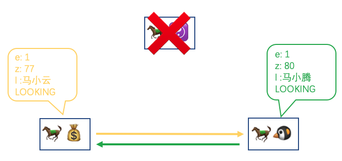

无论谁收到选票后经过比较后都会知道是**马小腾**胜出

```
e:1						==		e:1
z:77 					< 		z:80
l: 马小云(56)	  		l: 马小腾(49)
```

**马小云**会把自己的候选人修改为**马小腾**之后重新再把自己的选票发出去，现在**马小腾**就获得了 2 票通过，同时也满足大于整个办事处集群半数以上，所以**马小腾**和**马小云**各自修改状态为 LEADING 和 FOLLOWING 后，并且会和之前说的一样，把 epoch 加 1 同时清空计数部分，最后重新恢复对村民提供服务。

而**马果果**这边病好以后，会重新开张和之前的例子一样也是先从 LOOKING 状态开始，最后会从其他两马那里得知目前的 Leader 是**马小腾**之后，就会主动和**马小腾**同步数据并以 Follower 的身份加入到办事处集群中对外提供服务。

### 2.5 招商引资

办事处的热火朝天被村委会看在了眼里，心想只有三个办事处就能达到这样的效果，如果有更多的办事处呢？于是和三马商量了下，决定对外招商引入社会资本，让他们自己按照现有模式建立新的办事处，这样村委会不用出一分钱，村民还能获得实在的好处，秒啊！


此举一度引来社会资本的大量关注，但是商量过后，三马又觉得如果过多的引入外部力量势必会削弱自己手中的权力，所以又出了一个规定，三马自封为 Participant 只有他们三个才有资格进行 Leader 的竞选，而引入的社会资本所创建的办事处只能作为 Observer 加入办事处的集群中对外提供只读服务，没有资格竞争 Leader，这样就可以在不增加选举复杂程度的同时，提升整个办事处集群对读请求的吞吐量。

要声明当前节点是 Observer，需要在 `zoo.cfg` 中先配置 `peerType=observer`

同时声明的集群信息最后要多加一个 `:observer` 用来标识，这样其他节点也会知道当前 myid 为 1 和 2 都是 Observer

```
server.69=maguoguo:2888:3888
server.56=maxiaoyun:2888:3888
server.49=maxiaoteng:2888:3888
server.1=dongdong:2888:3888:observer
server.2=jitaimei:2888:3888:observer
```

而在 LOOKING 状态的 Observer 一开始的 Leader 候选人也会选自己，但是选票信息被设置成了这样，以**东东**举例：

```
e:Long.MIN_VALUE					
z:Long.MIN_VALUE 					
l: 东东(1)
LOOKING
```

因为 epoch 被设置成了最小值所以这个选票等同于形同虚设，可以被直接忽略，并且在三马那里会维护一个 Participant 的列表，如果他们收到了来自 Participant 以外的办事处的选票会直接选择忽略，所以可以说 Observer 的选票对选举结果是完全没有影响的。最终是等待 Participant 之间的选举结果通知，Observer 自身修改状态为 OBSERVING，开始和 Leader 进行同步数据，这点和 Follower 没区别，之后 Observer 和 Follower 会统称为 Learner

### 2.6 小结

> - 竞选 Leader 看的是 epoch、写请求操作数、myid 三个字段，依次比较谁大谁就更有资格成为 Leader
> - 获选超过半数以上的办事处正式成为 Leader，修改自己状态为 LEADING
> - 其他 Participant 修改为 FOLLOWING，Observer 则修改为 OBSERVING
> - 如果集群中已经存在一个 Leader，其他办事处如果中途加入的话，直接跟随该 Leader 即可
> - 还得提一句，如果当前可提供服务的节点已经不足半数以上了，那么这个选举就永远无法选出结果，每个节点都会一直处在 LOOKING 状态，整个办事处集群也就无法对外提供服务了

## 三、猿话一下

扯蛋扯完了，现在用咱的行话对有一些概念再深入一下。

首先我必须要说的是，故事里的三马，为了一定的节目效果，我描述成了三个角色，但是实际中 ZK 服务端是不会做这样的区分的，都是相同的代码，根据不同的配置启动，才有了运行时期 Leader、Follower、Observer 的角色之分，所以更贴近于实际的应该类似于火影里的影分身或者龙珠里的残像拳之类的（好像混入了什么奇怪的东西）。


我画了下选举的简单流程图：

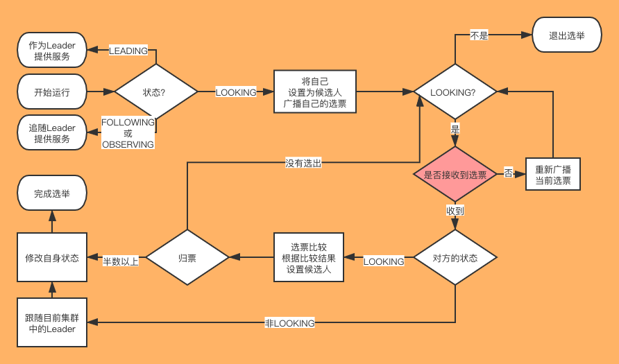

其他地方我基本上都讲过了，这里再讲下红色部分，因为可能一些网络因素，发出去的选票对方却没收到，这个发起重新广播投票就是为了能让对方再重新发一次刚刚的选票。

同监听客户端 2181 端口不同的是，服务端集群之间相互通信，直接使用的是原生的 Socket 并没有使用 NIO 或者是 Netty，因为服务端节点一共就这么几个而且针对每一个其他节点都会启动一个线程去监听，所以直接采用了这种比较原始的并且是阻塞的方式通信，更简单直接，而且假设对方服务不可用了的话， Socket 会直接报错退出。

收发选票也是采用了 ZK 中非常常见的生产者-消费者模式，分别维护了两个阻塞队列，一个对应发送出去的选票，一个对应收到的选票，各自使用一个子线程去轮询该阻塞队列。

之前的 ZK 是拥有 3 种选举策略的，虽然另外两种之前都是被废弃的状态，不建议使用，但是通过配置文件还是可以强行使用的。不过在最新的 3.6.2 中另两种策略直接从源码中删除了，现在只有一种选举的策略，源码中对应 `FastLeaderElection`，另外两个我也没研究过，就不展开了。

关于服务端之间的心跳检测：

- 服务端之间的心跳检测（PING）是由 Leader 发起的，发向所有集群中的其他节点
- Follower 收到 PING 后会回一个PING 给 Leader 并带上自己这边的客户端会话数据
- 而 Leader 收到 Follower 的 PING 后，就会对这些客户端进行会话连接

关于会话相关的知识点留到之后再说～

## 四、总结

今天我们介绍了选举的规则，以及举例了一些选举的场景并加以说明。为了介绍 Follower 或者 Observer 是如何在选举完成之后和 Leader 同步数据的，下一篇我们会先介绍 ZK 是如何进行持久化的，期待一下吧～

