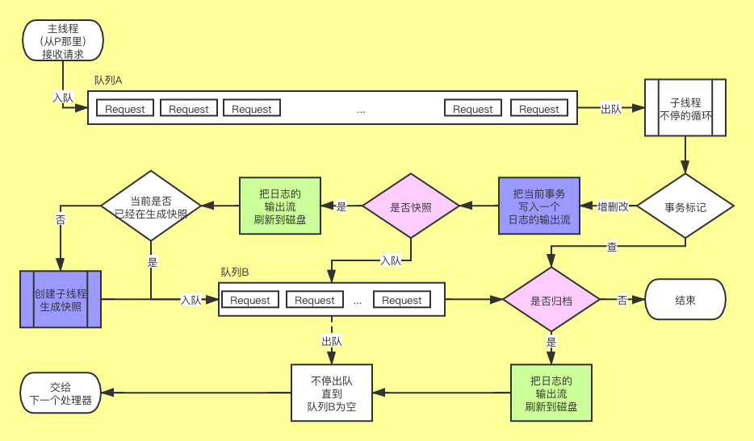
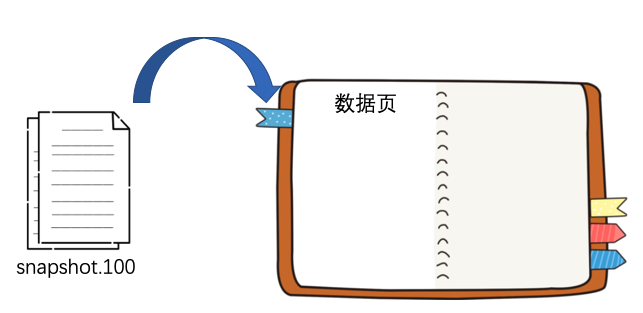
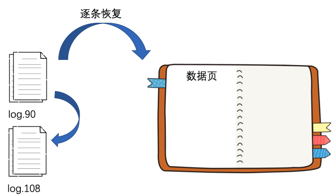

# 数据恒久远，快照永流传

Hi，这里是 HelloGitHub 推出的 HelloZooKeeper 系列，**免费开源、有趣、入门级的 ZooKeeper 教程**，面向有编程基础的新手。

> 项目地址：https://github.com/HelloGitHub-Team/HelloZooKeeper

前一篇文章我们介绍了 ZK 是如何进行选举的，这篇我们开始学习 ZK 是如何将数据持久化到磁盘中的。

## 一、优秀员工小S(Sync)

我们通过之前的文章有介绍过，**小S(Sync)** 负责对办事处的数据进行归档，所以今天他就是我们的主角，让我们一起深入了解他的日常工作吧


为了唤醒大家的远古记忆，我放一张之前的图片



今天我们会重点讲一下图中的蓝色部分，不过在此之前还是得先从整体架构上介绍下 ZK 的数据管理，ZK 的数据大致是分为了两部分，一个是内存，一个就是磁盘文件。

### 1.1 内存

虽然今天我们的主角是磁盘文件，但是内存还是稍微再提一下下，帮助大家记忆的同时也能有一个比较全面的视角去认知 ZK 整体的数据管理。

ZK 在内存中的存储就是之前故事中有提到的两个账本：小红本和小黄本。如果排除作为回调通知记录的小黄本，那 ZK 的内存中就是小红本对应的哈希表而已，但是小黄本中的数据依然非常重要，所以需要将两者作为整体一起看待，以及之前我有说过 **小F(Final)** 掌管了这两个账本，作为业务处理的最后一个负责人，**小S(Sync)** 从时间上来说是优先于 **小F(Final)** 先处理的，所以 ZK 的设计是优先将数据存入磁盘，再去修改内存中的数据保证尽可能的提升数据的可靠性。下面我们继续了解磁盘文件（还真就提一下下！）

### 1.2 磁盘文件

ZK 的开发者给 ZK 设计了两种磁盘文件，对应的路径分别是 `zoo.cfg` 配置中的 `dataDir` 和 `dataLogDir` 这两项目录的配置。为了之后的描述清楚，我给这两种磁盘文件起了名字： `dataDir` 对应 snapshot，`dataLogDir` 对应 log，log 就是的是 **小S(Sync)** 工作中的归档，snapshot 就是的是 **小S(Sync)** 工作中的快照。

log 是负责顺序记录每一个写请求到文件，snapshot 则是直接将整个内存对象持久化至文件中。假设我现在 `zoo.cfg` 的配置是这样：

```properties
dataDir=/tmp/zookeeper/snapshot
dataLogDir=/tmp/zookeeper/log
```

当 ZK 启动后会基于上面两个路径继续创建 `version-2` 子路径，之后的文件都会在该子路径下创建

```
/tmp
└── zookeeper
    ├── snapshot
    		└── version-2
    				└── ...
    └── log
    		└── version-2
    				└── ...
```

## 二、文件的创建和写入

两种文件分别是在什么时候被写入磁盘的呢？写入的内容又是哪些呢？我们接下来对两种文件一一进行分析。

### 2.1 log 文件

log 文件名的格式是这样 `log.{zxid}` zxid 对应当时创建该文件时的最大 zxid，假设现在创建时 zxid 为 0，那目录结构会是这样：

```
/tmp
└── zookeeper
    └── log
    		└── version-2
    				└── log.0
```

这个 `log.0` 文件创建的时机你也可以简单的理解为当服务端收到第一个写请求的时候，而且当创建完成后，并不能直接将数据写入，而是要先写一些文件头的字段，比如大名鼎鼎的魔数，版本号等元信息。

而 log 文件的魔数是 ZKLG（4 个字节），版本号固定为 2（4 个字节），还要记录一个 dbId 固定为 0（8 个字节） （当前没用，可能之后会派用处吧），所以前 16 个字节是固定这样的：

```
 Z K L G        2                 0
5A4B4C47 00000002 00000000 00000000
```

那之后的业务数据是如何记录的呢？

每一个写请求都可以分为四个部分：校验和、请求头、请求数据、签名，校验和是通过后面三个字段计算出来的，**小S** 每次收到写请求后都会按照这样的顺序将对应请求的四个字段写入 log 文件，由于不同的业务请求数据不固定，而且数据长度也比较大，这里就不给大家展示具体的值（如果大家想要知道这硬核的存储过程，不妨给我留言，我以后单独做下，尝试逐个字节解释）


然后是 `zookeeper.txnLogSizeLimitInKb` 这个环境变量配置，默认是 -1，这个配置限制了 log 单个文件大小（单位是 KB），每次 **小S(Sync)** 归档的时候（图中右下角粉色部分“是否归档”），将数据统一刷到磁盘后，如果用户手动配置了该参数，就会检查当前 log 文件大小是否超过了该参数大小，如果超过了就会进行 rollLog，相当于下一次的写请求会创建一个新的 log 文件。除此之外，当 **小S(Sync)** 每次快照的时候会强制执行一次 rollLog。

### 2.2 snapshot 文件

snapshot 文件名的格式是这样 `snapshot.{zxid}` zxid 对应当是创建该文件时的最大 zxid，假设现在创建是最大 zxid 是 0，那目录结构会是这样：

```
/tmp
└── zookeeper
    └── snapshot
    		└── version-2
    				└── snapshot.0
```

而关于是否快照（图中中间区域粉色部分“是否快照”），之前有简单介绍过是和随机数有关，这次我们深入了解下。

首先有两个配置 `zookeeper.snapCount` （默认 100000）和 `zookeeper.snapSizeLimitInKb`（默认 4194304  单位是KB，相当于 4 GB）在启动后会基于这两个配置分别生成两个随机数，假设上述的配置是按照默认的设置，这两个随机数的范围就是：

```
randRoll = [0, 50000]
randSize = [0, 4194304 * 1024 / 2]
```

可以简单的认为就是上述两个配置的一半之内的随机数，至于 `randSize` 为什么要乘以 1024 因为最终文件计算大小是以 byte 作为单位的。

而是否快照就是取决于上面两个随机数，有两个条件：

- 当前写请求的数量达到了 `zookeeper.snapCount` 的一半并加上 `randRoll` 的数量
- 当前 log 文件的大小达到了 `zookeeper.snapSizeLimitInKb` 的一半并加上 `randSize` 的大小

上述条件满足任意一个条件后就会重置上面的两个随机数，并开始生成快照，生成快照这个过程是启动一个子线程去创建的。

snapshot 和 log 还有个不同的地方就是，snapshot 文件 ZK 提供了三种不同的压缩实现，GZIP、SNAPPY、CHECKED，通过 `zookeeper.snapshot.compression.method` 进行配置，默认是 CHECKED，就是原始按照字节顺序写入，另外两个这里就不展开了。那我们接下来看看 snapshot 文件是怎么记的吧。

和 log 文件一样，也要先记一些文件的头部字段，而 snapshot 文件的魔数是 ZKSN（4 个字节），版本号固定为 2（4 个字节），还要记录一个 dbId 固定为 -1（8 个字节） （当前没用，可能之后会派用处吧），所以前 16 个字节是固定这样的：

```
 Z K S N        2								 -1
5A4B534E 00000002 FFFFFFFF FFFFFFFF
```

然后紧跟其后的部分客户端的会话信息，客户端的数量，然后循环记录每一个客户端的 sessionId、超时时间，然后是小红本里的所有信息了包括但不限于 ACL，节点的统计数据，节点的数据，子节点的信息等。最后一部分就是校验和和签名。和 log 一样，如果大家有兴趣的话，我之后单独再做一篇逐个字节讲解的。

## 三、从文件中恢复

如果只是单单存文件，那这文件也没什么用，所以文件另一个重要用途就是帮助 ZK 恢复服务端的信息。

在 ZK 启动的时候就会尝试读取  `dataDir` 和 `dataLogDir` 这两个目录下的文件，假设在这两个路径下的文件是：

```
/tmp
└── zookeeper
    ├── snapshot
    		└── version-2
    				└── snapshot.5
    				└── snapshot.37
    				└── snapshot.100
    └── log
    		└── version-2
    				└── log.0
    				└── log.6
    				└── log.38
    				└── log.90
    				└── log.108
```

我这里例子中的文件名的后缀数字是我随便举例只是为了说明恢复的过程，实际未必是这样，切记。

现在 ZK 服务端启动后，会先从 snapshot 的目录中找到 zxid 最大的那个文件，然后根据它的内容恢复 **小红本**



恢复完后就会去 log 文件目录下寻找所有比 100 要大的 log 文件以及比 100 要略小一点的 log 文件，本例子中就是 `log.90` 和 `log.108` 这两个文件。

你可能会问为什么要找小于 100 的 `log.90` 这个文件呢？因为文件名中的 90 只是说明这个文件建立的时候，最大的 zxid 是 90，但是文件中记录的写请求是很有可能会大于 100 的，所以 `log.90` 也需要被找到。

然后就是从 `log.90` 这个文件开始恢复，先从 zxid 比 100 大的写请求开始读取并执行该写请求，然后继续读取 `log.108`，等待所有符合条件的 log 文件读取后，整个 ZK 的数据就恢复完成了。



## 四、总结

今天我们介绍了关于 ZK 持久化的知识：

- ZK 会持久化到磁盘的文件有两种：log 和 snapshot
- log 负责记录每一个写请求
- snapshot 负责对当前整个内存数据进行快照
- 恢复数据的时候，会先读取最新的 snapshot 文件
- 然后在根据 snapshot 最大的 zxid 去搜索符合条件的 log 文件，再通过逐条读取写请求来恢复剩余的数据

今天的内容还是比较简单的，为我们下一篇文章打好了基础～下一篇我们开始介绍之前选举中没有介绍的内容：选举完成后，Follower 和 Observer 是如何同 Leader 同步数据的？

