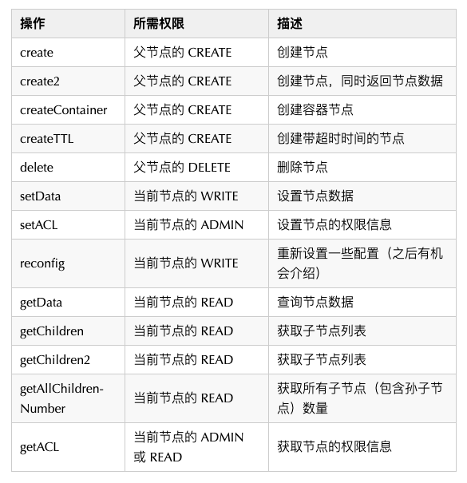
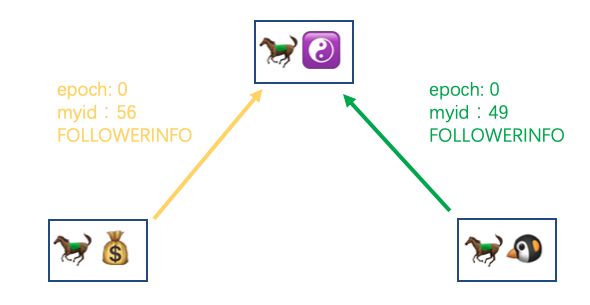
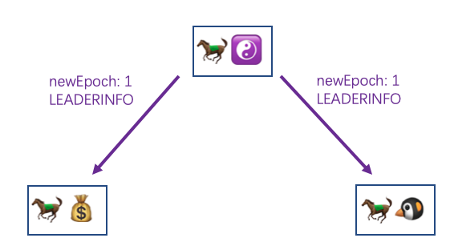
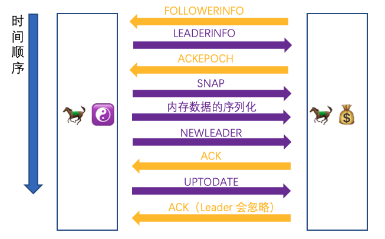

# 以我为准

Hi，这里是 HelloGitHub 推出的 HelloZooKeeper 系列，**免费开源、有趣、入门级的 ZooKeeper 教程**，面向有编程基础的新手。

> ZooKeeper 是 Apache 软件基金会的一个软件项目，它为大型分布式计算提供开源的分布式配置服务、同步服务和命名注册。 ZooKeeper 曾经是 Hadoop 的一个子项目，但现在是一个顶级独立的开源项目。

ZK 在实际开发工作中经常会用见到，算的上是吃饭的家伙了，那可得玩透、用的趁手，要不怎么进阶和升职加薪呢？来和 HelloGitHub 一起学起来吧～

本系列教程是**从零开始**讲解 ZooKeeper，内容从**最基础的安装使用到背后原理和源码的讲解**，整个系列希望通过有趣文字、诙谐的气氛中让 ZK 的知识“钻”进你聪明的大脑。本教程是开放式：开源、协作，所以不管你是新手还是老司机，我们都希望你可以**加入到本教程的贡献中，一起让这个教程变得更好**：

- 新手：参与修改文中的错字、病句、拼写、排版等问题
- 使用者：参与到内容的讨论和问题解答、帮助其他人的事情
- 老司机：参与到文章的编写中，让你的名字出现在作者一栏

> 项目地址：https://github.com/HelloGitHub-Team/HelloZooKeeper

前一篇文章我们介绍了 ZK 是如何进行持久化的，这章我们将正式学习 Follower 或 Observer 是如何在选举之后和 Leader 进行数据同步的。




## 一、选举完成

经历了选举之后，我们的**马果果**荣耀当选当前办事处集群的 Leader，所以现在假设各个办事处的关系图是这样：


我们现在就来说说**马小云**和**马小腾**是如何同**马果果**进行数据同步的。

结束了累人的选举后，**马小云**和**马小腾**以微弱的优势输掉了竞争，只能委屈成为 Follower。整理完各自的情绪后，他们要做的第一件事情就是通过话务员上报自己的信息给**马果果**，使用了专门的暗号 FOLLOWERINFO， 数据主要有自己的 epoch 和 myid：



然后是**马果果**这边，他收到 FOLLOWERINFO 之后也会进行统计，直到达到半数以上后，综合各个 Follower 给的信息会计算出新的 epoch，然后将这个新的 epoch 随着暗号 LEADERINFO 回发给其他 Follower



然后再回到**马小云**和**马小腾**这边，收到 LEADERINFO 之后将新的 epoch 记录下来，然后回复给**马果果**一个 ACKEPOCH 暗号并带上自己这边的最大 zxid，表示刚刚的 LEADERINFO 收到了


然后**马果果**这边也会等待半数以上的 ACKEPOCH 的通知，收到之后会根据各个 Follower 的信息给出不同的同步策略。关于不同的同步策略，这里我先入为主的给大家介绍一下：

- DIFF，如果 Follower 的记录和 Leader 的记录相差的不多，使用增量同步的方式将一个一个写请求发送给 Follower
- TRUNC，这个情况的出现代表 Follower 的 zxid 是领先于当前的 Leader 的（可能是以前的 Leader），需要 Follower 自行把多余的部分给截断，降级到和 Leader 一致
- SNAP，如果 Follower 的记录和当前 Leader 相差太多，Leader 直接将自己的整个内存数据发送给 Follower

至于采用哪一种策略，是如何进行判断的，接下来一一进行讲解。

### 1.1 DIFF

每一个 ZK 节点在收到写请求后，会维护一个写请求队列（默认是 500 大小，通过 `zookeeper.commitLogCount` 配置），将写请求记录在其中，这个队列中的最早进入的写请求当时的 zxid 就是 minZxid（以下简称 min），最后一个进入的写请求的 zxid 就是 maxZxid（以下简称 max），达到上限后，会移除最早进入的写请求，知道了这两个值之后，我们来看看 DIFF 是怎么判断的。

#### 1.1.1 从内存中的写请求队列恢复

一种情况就是如果当 Follower 通过 ACKEPOCH 上报的 zxid 是在 min 和 max 之间的话，就采用 DIFF 策略进行数据同步。

我们的例子中 Leader 的 zxid 是 99，说明这个存储 500 个写请求的队列根本没有放满，所以 min 是 1 max 是 99，很显然 77 以及 88 是在这个区间内的，那马果果就会为另外两位 Follower 找到他们各自所需要的区间，先发送一个 DIFF 给 Follower，然后将一条条的写请求包装成 PROPOSAL 和 COMMIT 的顺序发给他们


#### 1.1.2 从磁盘文件 log 恢复

另一种情况是如果 Follower 的 zxid 不在 min 和 max 的区间内时，但当 `zookeeper.snapshotSizeFactor` 配置大于 0 的话（默认是 0.33），会尝试使用 log 进行 DIFF，但是需要同步的 log 文件的总大小不能超过当前最新的 snapshot 文件大小的三分之一（以默认 0.33 为例）的话，才可以通过读取 log 文件中的写请求记录进行 DIFF 同步。同步的方法也和上面一样，先发送一个 DIFF 给 Follower 然后从 log 文件中找到该 Follower 的区间，再一条条的发送 PROPOSAL 和 COMMIT。

而 Follower 收到 PROPOSAL 的暗号消息后，就会像处理客户端请求那样去一条条处理，慢慢就会将数据恢复成和 Leader 是一致的。

### 1.2 SNAP

假设现在三个办事处是这样的


**马果果**的写请求队列在默认配置下记录了 277 至 777 的写请求，又假设现在的场景不满足上面 1.1.2 的情况，**马果果**就知道当前需要通过 SNAP 的情况进行同步了。

**马果果**会先发送一个 SNAP 的请求给**马小云**和**马小腾**让他们准备起来


紧接着就会当前内存中的数据整个序列化（和 snapshot 文件是一样的）然后一起发送给**马小云**和**马小腾**。

而**马小云**和**马小腾**收到**马果果**发来的整个 snapshot 之后会先清空自己当前的数据库的所有信息，接着直接将收到的 snapshot 反序列化就完成了整个内存数据的恢复。

### 1.3 TRUNC

最后一种策略的场景假设是这样：


假设**马小腾**是上一个 Leader，但是经历了停电以后恢复重新以 Follower 的身份加入集群，但是他的 zxid 要比 max 还大，这个时候**马果果**就会给**马小腾**发送 TRUNC，（至于图中为什么**马小云**不举例为 TRUNC，因为如果**马小云**的 zxid 也比**马果果**要大的话，**马果果**在当前场景下就不可能当选 Leader 了）。

**马果果**就会发送 TRUNC 给**马小腾**（这里忽略**马小云**）


假设**马小腾**的本地 log 文件目录下是这样的：

```
/tmp
└── zookeeper
    └── log
    		└── version-2
    				└── log.0
    				└── log.500
    				└── log.800
```

而**马小腾**收到 TRUNC 之后，会找到本地 log 文件中所有大于 777 的 log 文件删除，即这里的 `log.800` ，然后会在 `log.500` 这个文件找到 777 这个 zxid 记录并且把当前文件的读写指针修改至 777 的位置，之后针对该文件的读写操作就会从 777 开始，这样就会把之后的那些记录给覆盖了。

---

而**马果果**这边当判断完同步策略并发送给另外两马之后，便会发送一个 NEWLEADER 的信息给他们


而**马小云**和**马小腾**在收到 NEWLEADER 之后，若之前是通过 SNAP 方式同步数据的话，这里会强制快照一份新的 snapshot 文件在自己这里。然后会回复给**马果果**一个 ACK 的消息，告诉他自己的同步数据已经完成了


然后**马果果**同样会等待半数一样的 ACK 接收完成后，再发送一个 UPTODATE 给其他两马，告诉他们现在办事处数据已经都一致了，可以开始对外提供服务了


然后**马小云**和**马果果**收到 UPTODATE 之后会再回复一个 ACK 给**马果果**，但是这次**马果果**收到这次的 ACK 之后不会做处理，所以在 UPTODATE 之后，各个办事处就已经算可以正式对外提供服务了。

---

上面说了这么多，但是**马小云**和**马小腾**都是 Follower，如果是 Observer 呢？怎么用上面的步骤同步呢？

区别就在第一步，Follower 发送的是 FOLLOWERINFO，而 Observer 发送的是 OBSERVERINFO 除此之外没有任何区别，和 Follower 是一样的步骤进行数据同步。

## 二、继续深挖

现在把其中的一些细节再用猿话说明一下，三种不同的数据同步策略，Leader 在发送 Follower 的时候采用的具体方法是不太相同的

### 2.1 三种策略发送方式

如果采用的是 DIFF 或者 TRUNC 的同步方法的话，Leader 其实不是在找到有差异数据的时候发送过去的，而是按照顺序先放入一个队列，最后再统一启动一个线程去一个个发送的

DIFF :


TRUNC:


但是以 SNAP 方式同步的话就不会放入该队列，无论是 SNAP 消息还是之后整个序列化后的内存快照 snapshot 都会直接通过服务端间的 socket 直接写入。

### 2.2 上帝视角

让我们把三种策略消息交互的全过程再看一遍，这里就以**马小云**举例了

#### 2.2.1 DIFF


#### 2.2.2 TRUNC


#### 2.2.3 SNAP



---

可以看到首尾是一样的，就是中间的请求根据不同的策略会有不同的请求发送。差不多到这里关于 Follower 或 Observer 是如何同 Leader 同步消息，整体的逻辑都介绍完了。

### 2.3 小结

- Follower 和 Observer 同步数据的方式一共有三种：DIFF、SNAP、TRUNC
- DIFF 需要 Follower 或 Observer 和 Leader 的数据相差在 min 和 max 范围内，或者配置了允许从 log 文件中恢复
- TRUNC 是当 Follower 或 Observer 的 zxid 比 Leader 还要大的时候，该节点需要主动删除多余 zxid 相关的数据，降级至 Leader 一致
- SNAP 作为最后的数据同步手段，由 Leader 直接将内存数据整个序列化完并发送给 Follower 或 Observer，以达到恢复数据的目的 

我看了下文章的字数还行，决定加一点料，开一个小篇讲一下 ACL，这个我拖了很久没解释的坑。


## 三、没有规矩，不成方圆

先带大家重拾记忆，之前创建节点代码片段中的 `ZooDefs.Ids.OPEN_ACL_UNSAFE` 就是 ACL 的参数

```java
client.create("/更新视频/跳舞/20201101", "这是Data，既可以记录一些业务数据也可以随便写".getBytes(), ZooDefs.Ids.OPEN_ACL_UNSAFE, CreateMode.PERSISTENT);
```

首先如果配置了 `zookeeper.skipACL` 该参数为 `yes`（注意大小写），表示当前节点放弃 ACL 校验，默认是 `no`

那这个 ACL 是怎么规定的，有哪些权限，又是怎么在服务端体现的呢？首先 ACL 整体分为 Permission 和 Scheme 两部分，Permission 是针对操作的权限，而 Scheme 是指定使用哪一种鉴权模式，下面我们一起来了解下。

### 3.1 权限 Permission 介绍

首先 ZK 将权限分为 5 种：

- READ（以下简称 R），获取节点数据或者获取子节点列表
- WRITE（以下简称 W），设置节点数据
- CREATE（以下简称 C），创建节点
- DELETE（以下简称 D），删除节点
- ADMIN（以下简称 A），设置节点的 ACL 权限

然后该 5 种权限在代码层面就是简单的 int 数据，而判断是否有权限只需要用 & 操作即可，和目标权限 & 完结果只要不等于 0 就说明拥有该权限，细节如下：

```
		int		binary
R		1			00001
W		2			00010
C		4			00100
D		8			01000
A		16		10000
```

假设现在的客户端权限为 RWC，对应的数值就是各个权限相加 `1 + 2 + 4 = 7` 

```
		int		binary
RWC	7			00111
```

对任意有 R、W、C 权限需求的节点，求 & 的结果都不为 0，所以就能判断该客户端是拥有 RWC 这 3 个权限的。

但是如果当该客户端对目标节点进行删除时，做 & 判断权限的话，可以得到结果为 0，表示该客户端不具备删除的权限，就会返回给客户端权限错误

```
		int		binary
RWC	7			00111
D		8		& 01000
------------------
结果 0		 00000
```

### 3.2 Scheme 介绍

Scheme 有 4 种，分别是 `ip`、`world`、`digest`、`super`，但是其实就是两大类，一种是针对 IP 地址的 ip，另一种是使用类似“用户名:密码”的 `world`、`digest`、`super`。其实整个 ACL 是分三个部分的，`scheme:id:perms` ，id 的取值取决于 scheme 的种类，这里是 ip 所以 id 的取值就是具体的 IP 地址，而 perms 则是我上一小节介绍的 RWCDA。

这三部分的前两部分 `scheme:id` 相当于告诉服务端 “我是谁？”，而最后的部分 `perms` 则是代表了 “我能做什么？”，这两个问题，任意一个问题出错都会导致服务端抛出 `NoAuthException` 的异常，告诉客户端权限不够。

#### 3.2.1 IP

我们先来直接看一段代码，其中的 IP `10.11.12.13` 我是随便写的

```java
ZooKeeper client = new ZooKeeper("127.0.0.1:2181", 3000, null);
List<ACL> aclList = new ArrayList<>();
aclList.add(new ACL(ZooDefs.Perms.ALL, new Id("ip", "10.11.12.13")));
String path = client.create("/abc", "test".getBytes(), aclList, CreateMode.PERSISTENT);
System.out.println(path); // 输出 /abc
client.close();
```

可以看到 `/abc` 是可以被正确输出的，而且通过查看 `/` 的子节点列表是可以看到 `/abc` 节点的

```java
ZooKeeper client = new ZooKeeper("127.0.0.1:2181", 3000, null);
List<String> children = client.getChildren("/", false);
System.out.println(children); // 输出 [abc, zookeeper]
client.close();
```

但是现在如果去访问该节点的数据的话就会得到报错

```java
ZooKeeper client = new ZooKeeper("127.0.0.1:2181", 3000, null);
byte[] data = client.getData("/abc", false, null);
System.out.println(new String(data));
client.close();
```

```
Exception in thread "main" org.apache.zookeeper.KeeperException$NoAuthException: KeeperErrorCode = NoAuth for /abc
```

读者可以试试把上面的 IP 改成 `127.0.0.1` 重新创建节点，之后就能正常访问了，一般生产环境中 IP 模式用的不多（也可能是我用的不多），如果要用 IP 控制访问的话，通过防火墙白名单之类的手段即可，这个层面我认为不需要 ZK 去管。

#### 3.2.2 World

这个模式应该是最常用的（手动狗头）

我们还是来看一段代码

```java
ZooKeeper client = new ZooKeeper("127.0.0.1:2181", 3000, null);
List<ACL> aclList = new ArrayList<>();
aclList.add(new ACL(ZooDefs.Perms.READ, new Id("world", "anyone"))); // 区别是这行
String path = client.create("/abc", "test".getBytes(), aclList, CreateMode.PERSISTENT);
System.out.println(path); // 输出 /abc
client.close();
```

我把 scheme 改成了 World 模式，而 World 模式的 id 取值就是固定的 anyone 不能用其他值，而且我还设置了 perms 为 R，所以这个节点只能读数据，但不能做其他操作，如果使用 `setData` 对其进行数据修改的话也会得到权限的错误

```java
ZooKeeper client = new ZooKeeper("127.0.0.1:2181", 3000, null);
Stat stat = client.setData("/abc", "newData".getBytes(), -1); // NoAuth for /abc
```

现在再回头看之前的 `ZooDefs.Ids.OPEN_ACL_UNSAFE`，其实就是 ZK 提供的常用的静态常量，代表不校验权限

```java
Id ANYONE_ID_UNSAFE = new Id("world", "anyone");
ArrayList<ACL> OPEN_ACL_UNSAFE = new ArrayList<ACL>(Collections.singletonList(new ACL(Perms.ALL, ANYONE_ID_UNSAFE)));
```

#### 3.2.3 Digest

这个就是我们熟悉的用户名密码了，还是先上代码

```java
ZooKeeper client = new ZooKeeper("127.0.0.1:2181", 3000, null);

List<ACL> aclList = new ArrayList<>();
aclList.add(new ACL(ZooDefs.Perms.ALL, 
  new Id("digest", DigestAuthenticationProvider.generateDigest("laoxun:kaixin")))); // 1

String path = client.create("/abc", "test".getBytes(), aclList, CreateMode.PERSISTENT);
System.out.println(path);
client.close();
```

这个写法中必须要注意的是 1 处的 `username:password` 的字符串必须通过 `DigestAuthenticationProvider.generateDigest` 的方法包装一下，用这个方法会对传入的字符串进行编码。

包装完后 `laoxun:kaixin` 其实变成了 `laoxun:/xQjqfEf7WHKtjj2csJh1/aEee8=`，这个过程如下：

- `laoxun:kaixin` 对整个字符串先进行 SHA1 加密
- 对加密后的结果进行 Base64 编码
- 将用户名和编码后的结果拼接

上面的代码还有一种写法如下，使用 `addAuthInfo` 在客户端上下文中添加权限信息

```java
ZooKeeper client = new ZooKeeper("127.0.0.1:2181", 3000, null);
client.addAuthInfo("digest", "laoxun:kaixin".getBytes()); // 1. 
List<ACL> aclList = new ArrayList<>();
aclList.add(new ACL(ZooDefs.Perms.ALL, new Id("auth", ""))); // 2. 这里的 Id 是固定写法
String path = client.create("/abc", "test".getBytes(), aclList, CreateMode.PERSISTENT);
System.out.println(path);
client.close();
```

这里有两个改动，在 1 处使用 `addAuthInfo` 的方法可以在当前客户端的会话中添加 auth 信息，Digest 的 id 取值为 `username:password` 直接用明文即可，无论是 username 还是 password 都是自定义的。

然后是查询代码

```java
ZooKeeper client = new ZooKeeper("127.0.0.1:2181", 3000, null);
client.addAuthInfo("digest", "laoxun:kaixin".getBytes()); // 这行如果注释的话就会报错
byte[] data = client.getData("/abc", false, null);
System.out.println(new String(data)); // test
```

不管创建的时候是何种写法，查询的时候都要使用 `addAuthInfo` 在会话中添加权限信息，才能对该节点进行查询

#### 3.2.4 Super

听名字就知道这个模式是管理员的模式了，因为之前创建的那些节点，如果设置了用户名密码，其他客户端是无法访问的，如果该客户端自己退出了，这些节点就无法去操作了，所以需要管理员这一个角色来对其进行降维打击。


首先 Super 模式是要开启的，我这里假设管理员的用户名为 HelloZooKeeper，密码为 niubi，经过编码后就是 `HelloZooKeeper:PT8Sb6Exg9YyPCS7fYraLCsqzR8=`， 然后需要在服务端启动的环境中指定 `zookeeper.DigestAuthenticationProvider.superDigest` 配置，参数就是 `HelloZooKeeper:PT8Sb6Exg9YyPCS7fYraLCsqzR8=` 即可。

创建节点假设还是以 `laoxun:kaixin` 的模式，然后通过管理员的密码也能进行正常的访问

```java
ZooKeeper client = new ZooKeeper("127.0.0.1:2181", 3000, null);
client.addAuthInfo("digest", "HelloZooKeeper:niubi".getBytes()); // 1.
byte[] data = client.getData("/abc", false, null);
System.out.println(new String(data)); // test
client.close();
```

这里可以看到 1 处的 Super 模式本质上还是 Digest，指定的 scheme 为 digest，然后之后的 id 取值采用的是明文，而非编码后的格式，切记！

### 3.3 Permission 汇总表格

我这里列出大部分服务端提供的操作对应的 Permission 权限：

| 操作                 | 所需权限                 | 描述                               |
| -------------------- | ------------------------ | ---------------------------------- |
| create               | 父节点的 CREATE          | 创建节点                           |
| create2              | 父节点的 CREATE          | 创建节点，同时返回节点数据         |
| createContainer      | 父节点的 CREATE          | 创建容器节点                       |
| createTTL            | 父节点的 CREATE          | 创建带超时时间的节点               |
| delete               | 父节点的 DELETE          | 删除节点                           |
| setData              | 当前节点的 WRITE         | 设置节点数据                       |
| setACL               | 当前节点的 ADMIN         | 设置节点的权限信息                 |
| reconfig             | 当前节点的 WRITE         | 重新设置一些配置（之后有机会介绍） |
| getData              | 当前节点的 READ          | 查询节点数据                       |
| getChildren          | 当前节点的 READ          | 获取子节点列表                     |
| getChildren2         | 当前节点的 READ          | 获取子节点列表                     |
| getAllChildrenNumber | 当前节点的 READ          | 获取所有子节点（包含孙子节点）数量 |
| getACL               | 当前节点的 ADMIN 或 READ | 获取节点的权限信息                 |

可以看到删除和创建节点看的是父节点的权限，只有读写才是看的自己本身的权限。另外如果表格中没有出现的操作可以认为不需要 ACL 权限校验，其他要么是只需要客户端是一个合法的 session 或者本身是一些比较特殊的功能，例如：createSession、closeSession 等。至于关于 session 的更多内容，留到下一篇再讲吧～哈哈


### 3.4 ACL 背后的原理

我们刚刚花了一点篇幅介绍了 ACL 是什么，怎么用？现在深入了解下 ACL 在 ZK 的服务端底层是怎么去实现的吧～为了节约篇幅，这次就直接进入猿话讲解了。

首先祭出之前的一张图，唤醒下大家的记忆


图中权限部分（蓝色字体）之前的文章直接省略跳过了，没有进行解释，今天我们就好好讲讲这个权限字段。

从图上也能看到权限这个字段是直接以数字（long 类型，64 位的整型数字）的方式保存在服务端的节点中的，而 -1 是一个特殊的值代表不进行权限的校验对应的就是之前的 `OPEN_ACL_UNSAFE` 常量。

而 ACL 权限无论是创建节点时提供的（ACL 参数是一个 List），还是通过 `addAuth` 方法提供的（这个方法可以被调用多次），这两种设计都表示一个客户端是可以拥有多种权限的，比如：多个用户名密码，多个 IP 地址等等。

ACL 我之前讲过是由 3 个部分组成的，即 `scheme:id:perms` 为了简洁的表示我会在之后使用该形式去表示一个 ACL。

服务端会使用两个哈希表把目前接收到的 ACL 列表和其对应的数字双向的关系保存起来，类似这样（图中的 ACL 取值是我随意编造的）：


ZK 服务端会维护一个从 1 开始的数字，收到一个新的 ACL 会同时放入这两个哈希表（源码中对应的就是两个 `Map`，一个是 `Map<List<ACL>, Long>`，一个是 `Map<Long, List<ACL>>`），除了这两个哈希表以外，ZK 服务端还为每一个客户端都维护了一个会话中的权限信息，该权限信息就是客户端通过 `addAuth` 添加的，但是这个客户端的权限信息只保存了 `scheme:id` 部分，所以结合以下三个信息就可以对客户端的本次操作进行权限校验了：

- 两个哈希表表示的节点的信息 `scheme:id:perms`，可以有多个
- 客户端会话上下文中的权限信息仅 `id:perms` ，可以有多个
- 本次操作对应的权限要求，即 3.3 表格中列出的所需权限

校验的流程如下：


这里额外提一下，校验器是可以自定义的，用户可以自定义自己的 scheme 以及自己的校验逻辑，需要在服务端的环境变量中配置以 `zookeeper.authProvider.` 开头的配置，对应的值则对应一个 class 类全路径，这个类必须实现 `org.apache.zookeeper.server.auth.AuthenticationProvider` 接口，而且这个类必须能被 ZK 服务端加载到，这样就可以解析自定义的 scheme 控制整个校验逻辑了，这个功能比较高级，我也没用过，大家就当补充知识了解下～

---

今天我们了解了 Follower 和 Observer 是如何同 Leader 进行数据同步的，以及 ZK 提供的权限管理 ACL 究竟是怎么回事，下一篇我们将聊聊 ZK 的 session 管理，客户端和服务端之间是怎么保持会话的，以及服务端不同节点之间的心跳又是怎么保持的？

最后给文章点个赞吧～什么？你说不想点？


